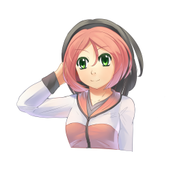
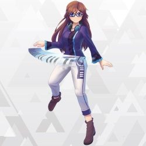
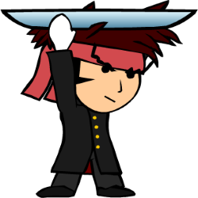
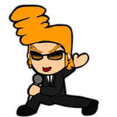
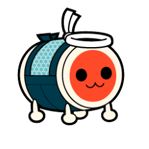

[Filmik o maskotkach](https://www.youtube.com/watch?v=mJF2cAs_MrI)

# Maskotki osu!

## Pippi

#### Imię
Pippi

#### Pseudonimy
* Pippi
* Pippidon

#### Urodziny
?

#### Wzrost
?

#### Występowanie
* osu! (oficjalna maskotka)
* Taiko (jako Pippidon)
* Yandere Simulator (jako NPC (easter egg))

#### Twórcy
* Sarumaru (oryginalny koncept i wygląd)
* Daru (obecny wygląd)
* crystalsuicune (pippidon)

#### Płeć
Kobieta

#### Data dołączenia
22/06/2008

#### Waga
?

#### Dane biograficzne
(niedostępne)

## Yuzu

#### Imię
Yuzu

#### Pseudonimy
Yuzu

#### Urodziny
10/04/2000

#### Wzrost
172cm

#### Występowanie
Catch the Beat

#### Twórcy
* Daru (Wygląd)
* ztrot (wygląd jako Łapacz, koncept)

#### Płeć
Mężczyzna

#### Data dołączenia
22/06/2014

#### Waga
65kg

#### Dane biograficzne
[Przedstawienie (ang.)](https://osu.ppy.sh/news/89483664163) (niedostępne)

## Maria

#### Imię
Maria

#### Pseudonimy
Maria

#### Urodziny
?

#### Wzrost
?

#### Występowanie
Mania

#### Twórcy
* Daru (Wygląd)

#### Płeć
Kobieta

#### Data dołączenia
03/04/2016

#### Waga
?

#### Dane biograficzne
[Przedstawienie (ang.)](https://osu.ppy.sh/news/143103453693) (niedostępne)

# Cameos

## Ryūta Ippongi

#### Imię
一本木龍太 (Ryūta Ippongi)

#### Pseudonimy
Ryuuta

#### Urodziny
?

#### Wzrost
?

#### Występowanie
* Catch the Beat (jako chibi-Ryuuta) [zastąpiony przez Yuzu]
* Strona osu! (chibi-Ryuuta jako maskotka) [Zakończył karierę]
* [Skórka](https://osu.ppy.sh/community/forums/topics/190357/)
* Yandere Simulator (jako NPC (easteregg))

#### Twórcy
iNiS Corporation

#### Płeć
Mężczyzna

#### Data dołączenia
2008 [Zakończył karierę w 2014]

#### Waga
?

#### Dane biograficzne
Jest liderem zagrzewającego składu. Ma dobre serce i pomaga tym, którzy są nieszczęśliwi, poprzez wspieranie ich i zagrzewanie do walki!

## Agent J

#### Imię
Agent J

#### Pseudonimy
BA-2 (Beat Agent-2), J

#### Urodziny
?

#### Wzrost
?

#### Występowanie
* Strona osu! (chibi-J jako maskotka) [Zakończył karierę]
* [Skórka](https://osu.ppy.sh/community/forums/topics/190357/)

#### Twórcy
iNiS Corporation

#### Płeć
Mężczyzna

#### Data dołączenia
2008 [Zakończył karierę:2014]

#### Waga
?

#### Dane biograficzne
Jako ekspert w wielu stylach tańca (od hip-hopu po balet), J potrafi oczarować każdego.

## Don

#### Imię
和田どん (Wada Don)

#### Pseudonimy
Don, Don-chan

#### Urodziny
?

#### Wzrost
48cm

#### Występowanie
* Taiko (Skin)
{Oficjalna skórka dost. [w opcjach](Options#Skin "wikilink")}

#### Twórcy
* Yukiko Yokoo (横尾有希子) [Wygląd]
* Narahashi Miki (楢橋 美紀) [Głos]

#### Płeć
Mężczyzna

#### Data dołączenia
Maj 2008

#### Waga
100+ kg

#### Dane biograficzne
Don jest protagonistą serii Taiko no Tatsujin. Jest bębenkiem taiko z białymi krawędziami, czterema nogami, czerwoną twarzą (która może się pojawiać jako łagodny pomarańczowy) oraz jasnoniebieskim (w Catch the Beat) lub ciemnoniebieskim (w Taiko) ciałem. Marzeniem Dona jest dzielenie się pięknem Taiko ze światem. Minęły 3 lata odkąd przeniósł się do Wada House i stał się popularny w mieście. Ma potworny apetyt, czasem robi też drogie zakupy w Wada House, co może się dla niego kiedyś źle skończyć. Zazwyczaj kończy swoje zdania z „Ta-don", co po japońsku oznacza „Ba-dum".

## Don

# Galeria zdjęć

[Kliknij, aby przejść do galerii zdjęć.](Mascots/Gallery "wikilink")
