# Maskotki

::: alert-note
**Zobacz także:** [Galeria](/wiki/Mascots/Gallery)
:::

Ten artykuł przedstawia różne maskotki osu! wraz z ich krótkimi opisami. Film pokazujący maskotki osu! można obejrzeć na YouTubie [tutaj](https://youtu.be/mJF2cAs_MrI).

## Oficjalne maskotki

###  pippi

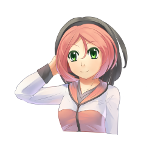

pippi (pisane z małej litery) jest maskotką trybu osu!, która dołączyła w sierpniu 2007 roku. W osu!taiko jest znana również jako pippidon. Oryginalna grafika koncepcyjna została stworzona przez ::{ flag=US }:: [Sarumaru](https://osu.ppy.sh/users/9427), grafika pippidon jest autorstwa ::{ flag=HK }:: [crystalsuicune](https://osu.ppy.sh/users/9974), a obecny wygląd został zaprojektowany przez ::{ flag=US }:: [Daru](https://osu.ppy.sh/users/32480).

###  Yuzu

::: alert-note
Aby dowiedzieć się wiecej, zobacz [Meet Yuzu!](https://osu.ppy.sh/home/news/2014-06-21-meet-yuzu) oraz [Introducing Yuzu's New Look](https://osu.ppy.sh/home/news/2019-01-09-introducing-yuzu)
:::

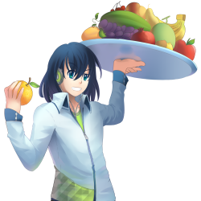

Yuzu jest maskotką osu!catch i dołączył 22 czerwca 2014 roku. Urodził się 10 kwietnia 2000 roku, ma 172 centymetry wzrostu i waży 65 kilogramów. Jego obecny wygląd został zaprojektowany przez ::{ flag=US }:: [Thievley](https://osu.ppy.sh/users/4717672). Jego oryginalny wygląd oraz ilustracja łapacza zostały stworzone przez [ztrot](https://osu.ppy.sh/users/6347), a grafika comboburst przez Daru.

###  Mani & Mari

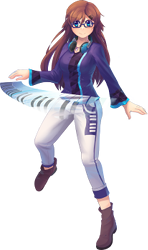

::: alert-note
Aby dowiedzieć się wiecej, zobacz [Introducing Mani and Mari, the New osu!mania Mascots.](https://osu.ppy.sh/home/news/2020-09-17-introducing-mani-mari-osumania)
:::

Zaprojektowani przez ::{ flag=ID }:: [xiemon](https://osu.ppy.sh/users/5203667) po odkryciu ich w [Most Manic Art Contest](https://osu.ppy.sh/community/contests/80). Zostali ogłoszeni jako oficjalne maskotki osu!manii 18 września 2020 roku. Mani i Mari są bliźniętami, które nie do końca wytrzymują swoje towarzystwo, ale są do siebie bardziej podobni, niż chcieliby przyznać.

Mani jest w pewnym stopniu indywidualistą, zawsze gotowym odkrywać nowe style i rzeczy. Jego siostra Mari (dawniej znana jako Maria) jest z kolei nieugiętą perfekcjonistką i pianistką, świetnie czującą się w blasku reflektorów. Są dla siebie jak olej i woda.

###  Mocha

::: alert-note
Aby dowiedzieć się wiecej, zobacz [The new osu!taiko mascot is here!](https://osu.ppy.sh/home/news/2017-05-25-the-new-osutaiko-mascot-is-here)
:::

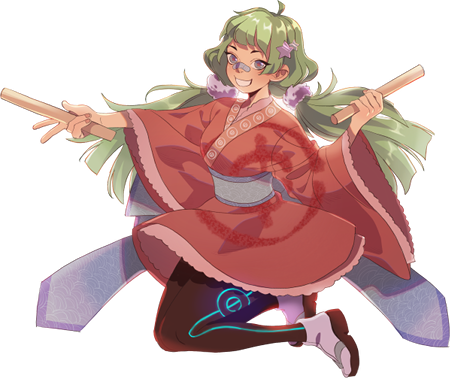

Mocha jest maskotką osu!taiko. Została pierwotnie zaprojektowana podczas [szóstego konkursu fanartów](https://osu.ppy.sh/community/contests/2) przez by ::{ flag=US }:: [Crowie](https://osu.ppy.sh/users/6894067). Zajęła wtedy w głosowaniu dwudzieste pierwsze miejsce.

## Cameo

### Ryūta Ippongi

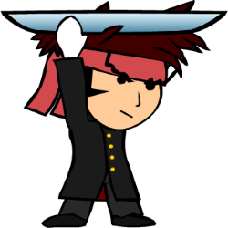

> Jest porywczym liderem grupy cheerleaderskiej. Ma dobre serce i pomaga tym, którzy są nieszczęśliwi stając dla nich do walki!

一本木龍太 (Ryūta Ippongi) był chibi-łapaczem owoców, który dołączył w 2008 roku, lecz został zastąpiony przez [Yuzu](#yuzu) w 2014 roku. Został stworzony przez [iNiS](https://en.wikipedia.org/wiki/INiS) i był pierwotnie częścią starej strony internetowej.

Ryuuta pojawił się również w skórce autorstwa ::{ flag=US }:: [LuigiHann](https://osu.ppy.sh/users/1079), [Elite Beat osu! HD (1.0 Complete!)](https://osu.ppy.sh/community/forums/topics/190357).

### Agent J

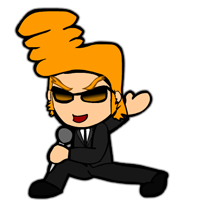

> Jako ekspert w wielu stylach tańca (od hip-hopu po balet), J potrafi oczarować każdą żywą istotę.

Agent J, znany także jako BA-2 (Beat Agent-2) lub J, był jedną z maskotek osu! w 2008 roku, jednak opuścił skład w 2014 roku. Został stworzony przez iNiS i był pierwotnie częścią starej strony internetowej.

Agent J pojawił się również w skórce autorstwa ::{ flag=US }:: [LuigiHann](https://osu.ppy.sh/users/1079), [Elite Beat osu! HD (1.0 Complete!)](https://osu.ppy.sh/community/forums/topics/190357).

### Don

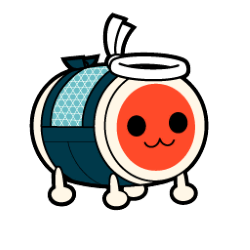

> Don jest protagonistą serii [Taiko no Tatsujin](https://en.wikipedia.org/wiki/Taiko_no_Tatsujin). Jest bębnem taiko z białymi krawędziami, czterema nogami, czerwoną twarzą (która może wyglądać ciemnopomarańczowo) oraz jasnoniebieskim tułowiem. Marzeniem Dona jest dzielić się pięknem Taiko z całym światem. Minęły trzy lata odkąd przeprowadził się do Domu Wada i stał się dość popularny w mieście. Ma wilczy apetyt i czasem chodzi na ogromne zakupy do Domu Wada, co może mieć katastrofalne skutki. Zwykle kończy swoje wypowiedzi przy użyciu "Ta-don", co po japońsku oznacza "Ba-dum".

和田どん (Wada Don), znany również jako Don lub Don-chan, był jedną z maskotek osu! dla trybu osu!taiko i dołączył w maju 2008 roku. Ma 48 centymetrów wzrostu i waży ponad 100 kilogramów. Pojawia się w skórce osu!taiko. Jego grafika została stworzona przez Yukiko Yokoo (横尾有希子), a głosu użyczyła mu Narahashi Miki (楢橋 美紀).

## Maskotki społeczności

### Aiko

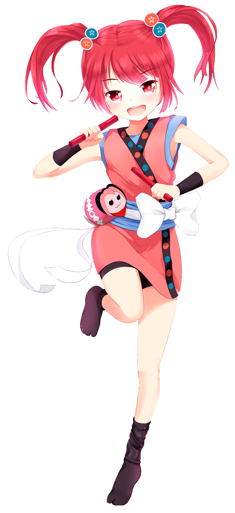

Zaprojektowana przez ::{ flag=ID }:: [JMC](https://osu.ppy.sh/users/774010), Aiko była jedną z postaci nadesłanych w konkursie na maskotkę osu!taiko. Jest energiczną dziewczyną, której pasją jest osu!taiko, mimo że gra nie idzie jej zbyt dobrze! Pełna wigoru, ubrana w tradycyjne buty Tabi oraz całą masę akcesoriów ze wzorem pippidon wprost emanuje energią dawnych lat. Jest dość niska (mierzy jedynie 154 centymetrów wzrostu) i urodziła się 6 kwietnia 1999 roku.

### Alisa

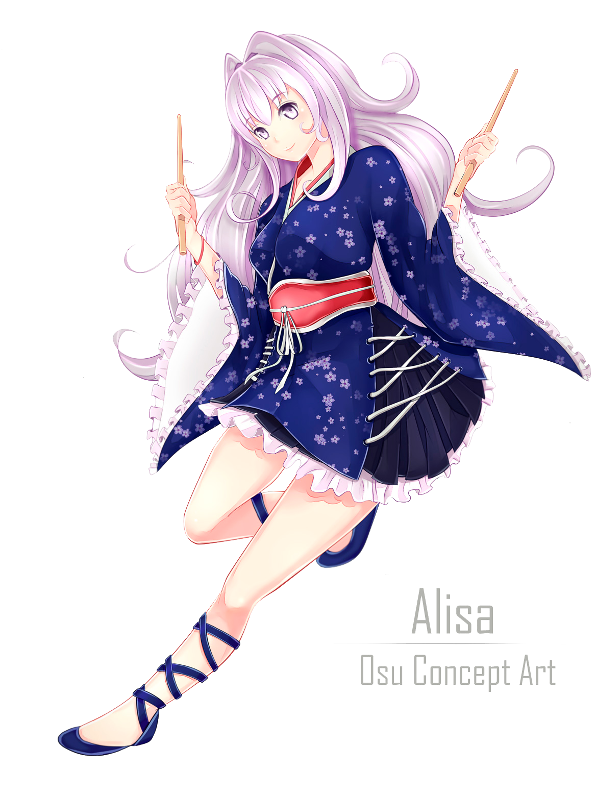

Zaprojektowana przez ::{ flag=AE }:: [\[ Glitch \]](https://osu.ppy.sh/users/3781400), Alisa była jedną z postaci nadesłanych w konkursie na maskotkę osu!taiko. Gra w osu!taiko odkąd była małym dzieckiem. Ma zamiłowanie do muzyki i bardzo lubi grać różne piosenki dla innych. Jeśli nie śpi albo nie je to gra w osu!taiko albo w gry retro dla zabawy!

### Chirou

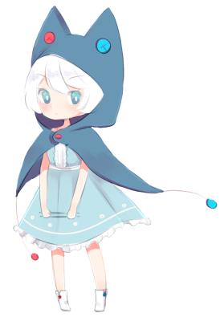

Zaprojektowana przez ::{ flag=US }:: [pyun](https://osu.ppy.sh/users/981534), Chirou była jedną z postaci nadesłanych w konkursie na maskotkę osu!taiko. Jest bardzo surową i wymagającą perfekcjonistką. Nie lubi popełniać błędów — szczególnie podczas gry w osu!taiko. Jeśli jednak uda ci się przedostać przez jej nieprzyjazną fasadę, potrafi być miła i urocza. Ma 14 lat, urodziła się 25 października i posiada grupę krwi AB. Ma 149 centymetrów wzrostu i waży 45 kilogramów. Jej ulubionym zajęciem jest granie na bębnie, grzanie się w cieple swojego płaszcza oraz kolekcjonowanie kamieni i klejnotów. Chirou czasami pojawiała się w różnych fanartach nadesłanych przez użytkowników.

### Taikonator

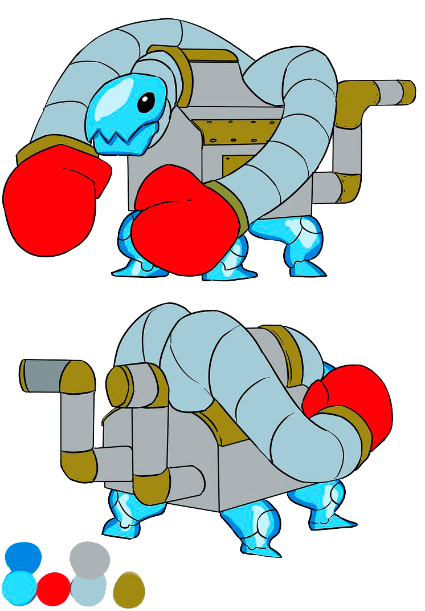

Zaprojektowany przez ::{ flag=PL }:: [Lemia-Chan](https://osu.ppy.sh/users/8506749), Taikonator (znany również jako Taikonator 3000) był jedną z postaci nadesłanych w konkursie na maskotkę osu!taiko. Zyskał trochę popularności jako żart w niektórych kręgach społeczności z niewiadomych powodów. Jego pochodzenie pozostaje zagadką. Pomimo tego, jest o wiele bardziej unikalny niż pozostałe propozycje maskotek osu!taiko i wielokrotnie pojawił się w różnych fanartach nadesłanych przez użytkowników.

### Tama

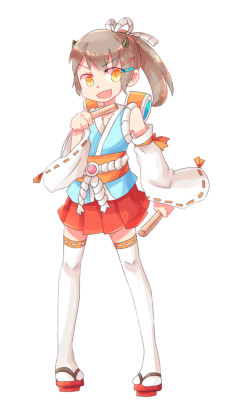

Zaprojektowana przez ::{ flag=HK }:: [crystalsuicune](https://osu.ppy.sh/users/9974), Tama była jedną z młodszych postaci nadesłanych w konkursie na maskotkę osu!taiko, mając jedynie 15 lat (ale czy na pewno?). Jej wielką pasją jest granie na bębnach taiko. I burze. A szczególnie festiwale, na których podbiera wszystkie takoyaki, jakie wpadną jej w ręce. Zawsze gotowa do nowych wyzwań, Tama skrywa dość tajemniczą przeszłość za swoją młodzieńczą aparycją.
