# Mascotes

*Veja também: [Mascots/Gallery](/wiki/Mascots/Gallery)*

Um vídeo do YouTube mostrando as mascotes do osu! pode ser visto em [Mascot Showcase](https://youtu.be/mJF2cAs_MrI).

## Oficial

###  pippi

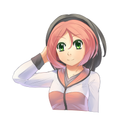

pippi, estilizado em letra minúscula "p", é a mascote do osu! que se juntou em 2008-07. Ela também é conhecida como pippidon no osu!taiko e apareceu em [Yandere Simulator](https://yanderesimulator.com) como uma NPC. A arte conceitual inicial foi criada por [Sarumaru](https://osu.ppy.sh/users/9427), a sprite da pippidon for criada por [crystalsuicune](https://osu.ppy.sh/users/9974), e a arte atual foi projetada por [Daru](https://osu.ppy.sh/users/32480).

###  Yuzu

*Para os posts de notícias, veja: [Meet Yuzu!](https://osu.ppy.sh/home/news/2014-06-21-meet-yuzu) e [Introducing Yuzu's New Look](https://osu.ppy.sh/home/news/2019-01-09-introducing-yuzu)*

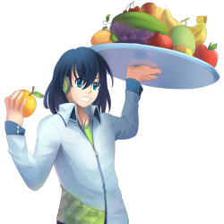

Yuzu é a mascote do osu!catch que se juntou em 2014-06-22. Nascido em 2000-04-10, ele tem 172 centímetros de altura, e pesa 65 quilogramas. A sua arte atual foi projetada por [Thievley](https://osu.ppy.sh/users/4717672). Enquanto que o projeto de sua arte inicial e sprites de catcher foram feitas por [ztrot](https://osu.ppy.sh/users/6347); Daru criou sua arte de comboburst.

###  Maria

*Para o post de notícias, veja: [Meet Maria - osu!mania’s new mascot!](https://osu.ppy.sh/home/news/2016-04-20-meet-maria-osumanias-new-mascot)*

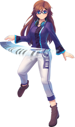

Maria é a mascote de osu!mania que se juntou em 2016-03-04. Sua arte foi projetada por Daru.

###  Mocha

*Para o post de notícias, veja: [The new osu!taiko mascot is here!](https://osu.ppy.sh/home/news/2017-05-25-the-new-osutaiko-mascot-is-here)*

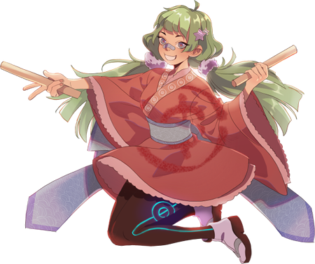

Mocha é a mascote de osu!taiko. Ela foi inicialmente projetada durante a [sexta competição de fanart](https://osu.ppy.sh/community/contests/2) por [Crowie](https://osu.ppy.sh/users/6894067), que foi qualificada em 21ª nas votações.

## Cameos

### Ryūta Ippongi

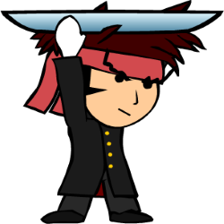

> Ele é o líder sangue quente da torcida. Ele tem um bom coração e ajuda os outros ao seu redor que estão em apuros através de se levantar e lutar por eles!

一本木龍太 (Ryūta Ippongi) era o fruta-chibi catcher do osu!catch que se juntou em 2008, mas foi substituído por [Yuzu](#yuzu) em 2014. Ele foi criado pela [iNiS Corporation](https://en.wikipedia.org/wiki/INiS) e já fez parte do antigo website. Ryuuta também apareceu em [Yandere Simulator](https://yanderesimulator.com) como um NPC.

Ryuuta também foi um destaque na skin de [LuigiHann](https://osu.ppy.sh/users/1079), [Elite Beat osu! HD (1.0 Complete!)](https://osu.ppy.sh/community/forums/topics/190357/).

### Agent J

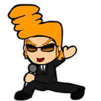

> Um expert em vários estilos de dança, variando desde hip-hop até balé, J consegue hipnotizar qualquer ser vivo.

Agent J, também conhecido como BA-2 (Beat Agent-2) ou J, era uma das mascotes do osu! em 2008 mas foi aposentado em 2014. Ele foi criado pela iNiS Corporation e já fez parte do antigo website.

Agent J também foi um destaque na skin de [LuigiHann](https://osu.ppy.sh/users/1079), [Elite Beat osu! HD (1.0 Complete!)](https://osu.ppy.sh/community/forums/topics/190357/).

### Don

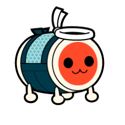

> Don é o protagonista da série [Taiko no Tatsujin](https://en.wikipedia.org/wiki/Taiko_no_Tatsujin). Ele é um tambor de taiko com uma borda branca e quatro pernas, uma cara vermelha (que aparenta ser moly orange), e um corpo azul claro. O sonho de Don é compartilhar a beleza de Taiko para o mundo. Três anos se passaram desde que ele se mudou para a Casa Wada, e ele acabou tornando-se popular pela cidade. Ele tem um apetite monstruoso e as vezes tem compras caras na Casa Wada, que possa se assumir o pior. Ele geralmente termina suas frases com "Ta-don", significando o som de um tambor "Ba-dum" em Japonês.

和田どん (Wada Don), também conhecido como Don ou Don-chan, era uma das mascotes do osu! em osu!taiko que se juntou em 2008-05. Ele tem 48 centímetros de altura e pesa mais de 100 quilogramas. Ele aparece na skin do osu!taiko. Sua arte original foi projetada por Yukiko Yokoo (横尾有希子) e foi dublado por Narahashi Miki (楢橋 美紀).

## Comunidade

### Aiko

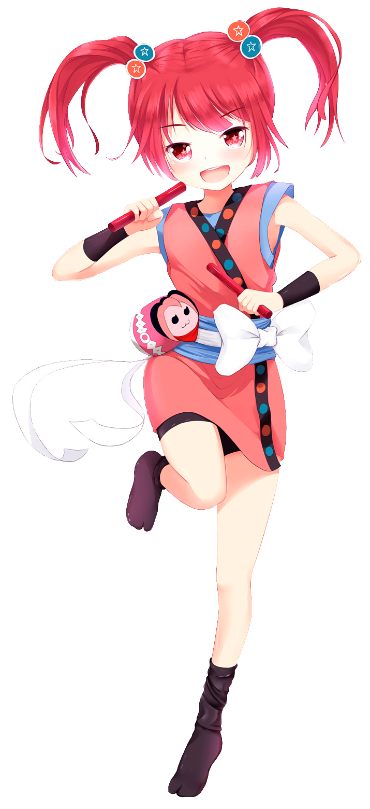

Projetada por [JMC](https://osu.ppy.sh/users/774010), Aiko era uma das participantes na competição de design de mascotes para osu!taiko. Ela é uma garota energética com paixão pelo osu!taiko, mesmo que ela não seja a melhor nisso! Vestindo um par estiloso de sapatos "Tabi" e um acompanhamento de acessórios da pippidon, a mascote de outrora vive nessa garota corajosa. Ela é bem baixa, medindo apenas 154 centímetros, e nascida em 1999-04-06.

### Alisa

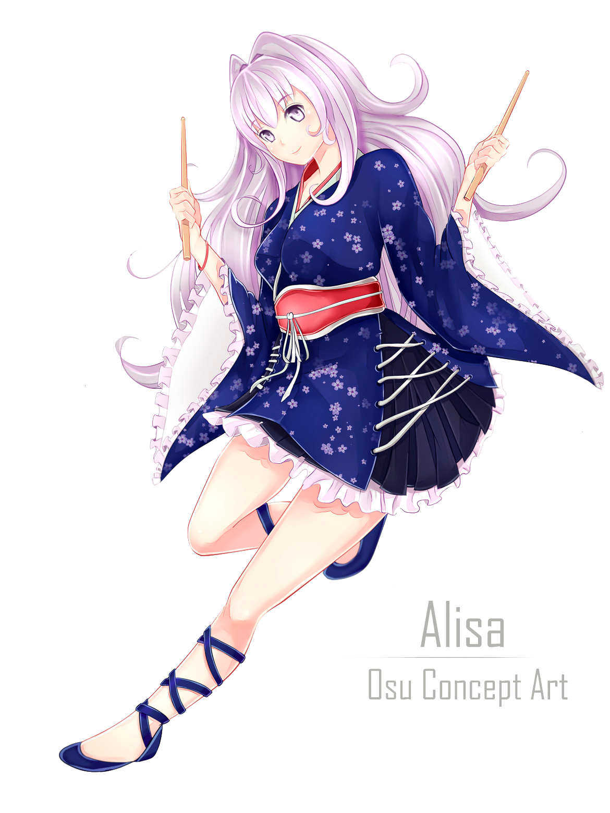

Projetada por [\[ Glitch \]](https://osu.ppy.sh/users/3781400), Alisa era uma das participantes na competição de design de mascotes para osu!taiko. Ela vem jogado osu!taiko desde sua infância. Apaixonada em jogar músicas para os outros, ela é bem orientada musicalmente, e quando ela não está dormindo ou comendo, ela está jogando osu!taiko, ou jogando jogos retrô por diversão!

### Chirou

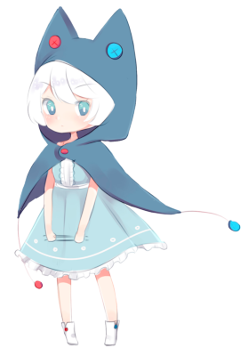

Projetada por [pyun](https://osu.ppy.sh/users/981534), Chirou era uma das participantes na competição de design de mascotes para osu!taiko. Ela é bem rigorosa e exigente, uma perfeccionista, e não gosta de errar, especialmente em suas beats no osu!taiko. Mas deixando sua perspectiva forte de lado, se você chegar em seu ponto fraco, ela pode ser bem fofinha. Ela tem 14 anos de idade, nascida em 25 de Outubro e tendo seu tipo sanguíneo AB. Ela também mede 150 centímetros e pesa 45 quilogramas. Seus hobbies incluem batucar, se aquecer em sua capa, e coletar gemas ou pedras. Chirou também apareceu em vários envios de fanarts de usuários.

### Taikonator

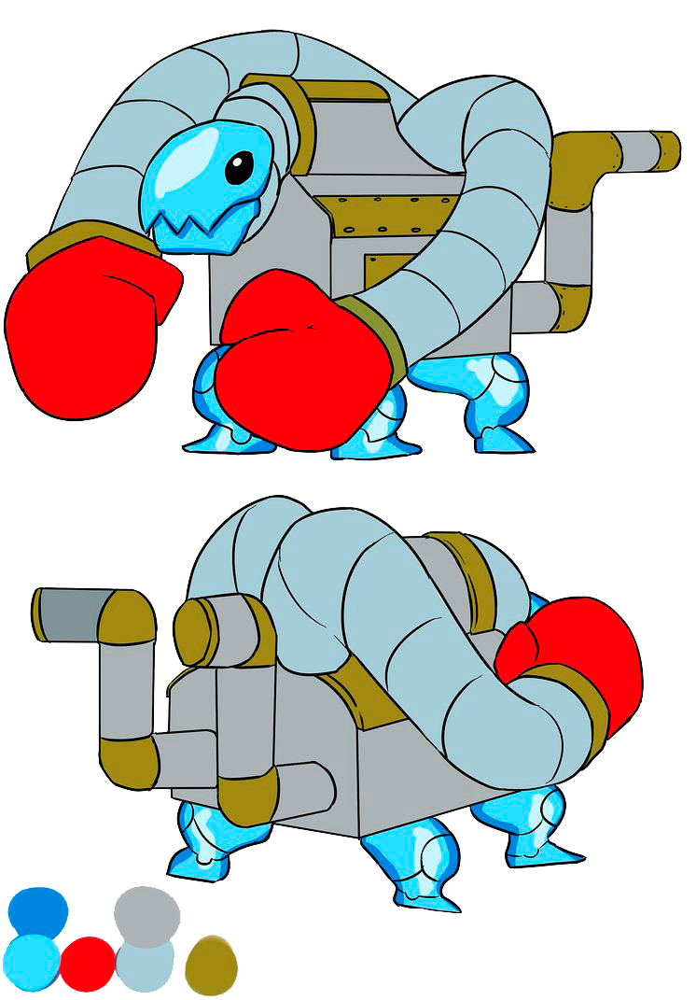

Taikonator, também conhecido como Taikonator 3000, era um dos participantes na competição de design de mascotes para osu!taiko. Ele ganhou certa popularidade como uma piada interna por razões desconhecidas. Suas origens continuam sendo um mistério; apesar disso, ele é bem mais único do que outros designs de mascote para osu!taiko e também apareceu bastante em vários envios de fanarts de usuários.

### Tama

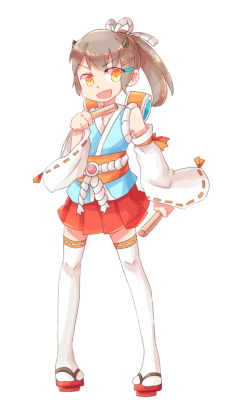

Projetada por [crystalsuicine](https://osu.ppy.sh/users/9974), Tama era uma das mais novas participantes na competição de design de mascotes para osu!taiko com apenas 15 anos de idade (ou será que não?), Tama tem uma enorme paixão em batucar taiko. E tempestades. E especialmente festivais, onde ela pega qualquer takoyaki que ela possa achar. Sempre à altura do desafio, Tama esconde um passado particulamente misterioso atrás de seu comportamento juvenil.
