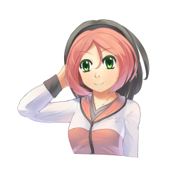
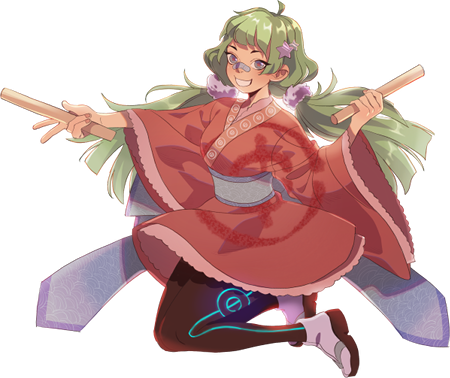
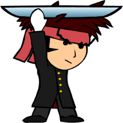
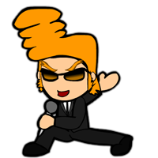
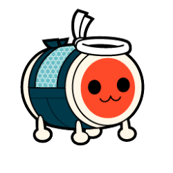
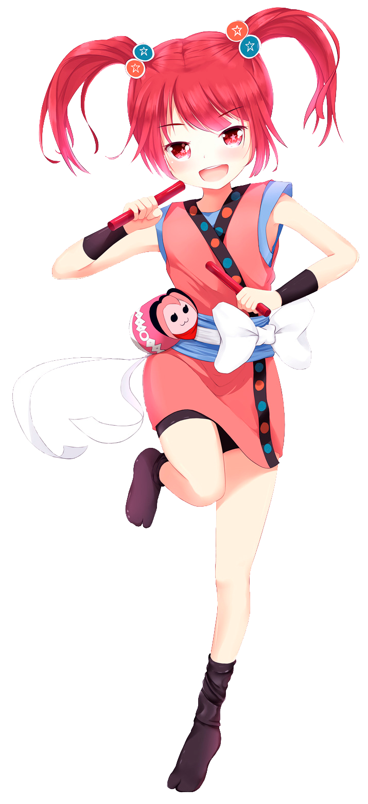
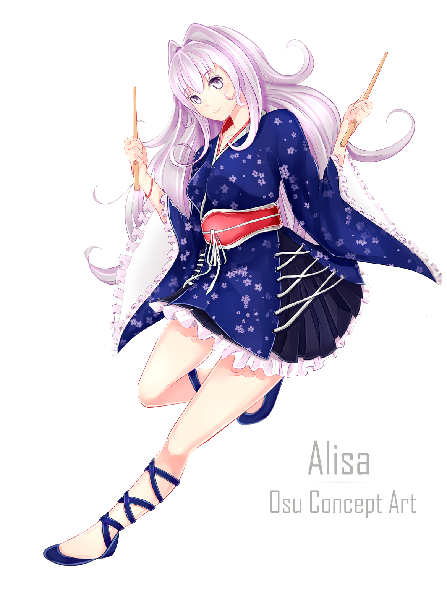
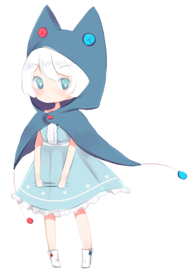
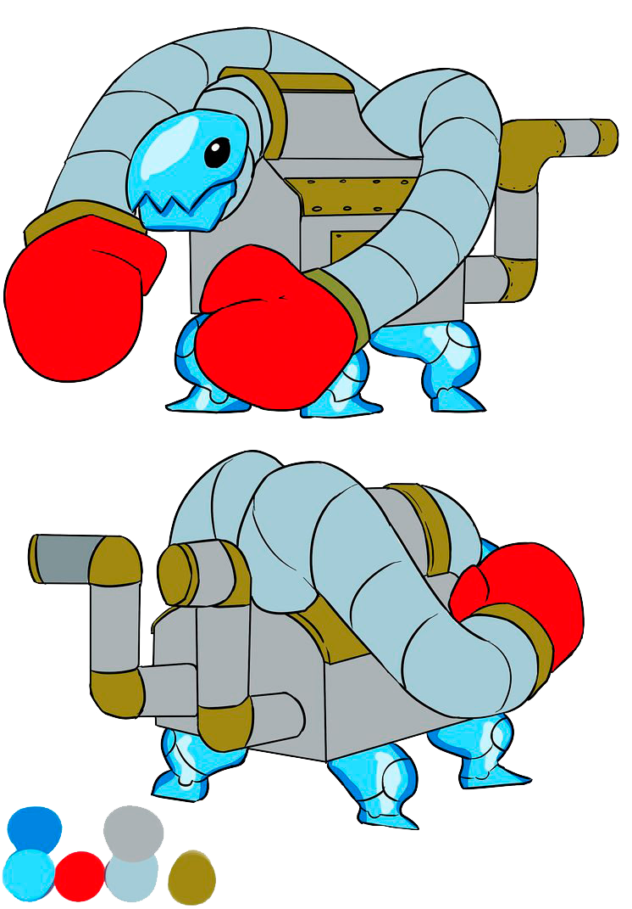
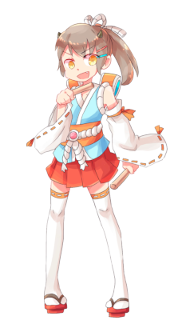

# Mascots

*ดูเพิ่ม: [Mascots/Gallery](/wiki/Mascots/Gallery)*

บทความนี้รวบรวม mascot หลายตัวของ osu! พร้อมสรุปสั้น ๆ สามารถดูวิดีโอ YouTube ที่แนะนำ mascot ของ osu! ได้[ที่นี่](https://youtu.be/mJF2cAs_MrI)

## Official

###  pippi

pippi ซึ่งเขียนด้วยตัว "p" เล็ก เป็น mascot ของโหมดเกม osu! ที่เข้ามาในเดือน 2008-07 เธอยังเป็นที่รู้จักในชื่อ pippidon ใน osu!taiko ด้วย concept art แรกเริ่มสร้างโดย ::{ flag=US }:: [Sarumaru](https://osu.ppy.sh/users/9427), sprite pippidon สร้างโดย ::{ flag=HK }:: [crystalsuicune](https://osu.ppy.sh/users/9974) และ art ปัจจุบันออกแบบโดย ::{ flag=US }:: [Daru](https://osu.ppy.sh/users/32480)

###  Yuzu

*สำหรับ news post ดูที่: [Meet Yuzu!](https://osu.ppy.sh/home/news/2014-06-21-meet-yuzu) และ [Introducing Yuzu's New Look](https://osu.ppy.sh/home/news/2019-01-09-introducing-yuzu)*

Yuzu เป็น mascot ของ osu!catch ที่เข้ามาเมื่อ 2014-06-22 เขาเกิดวันที่ 2000-04-10 สูง 172 เซนติเมตร และหนัก 65 กิโลกรัม art design ปัจจุบันของเขาออกแบบโดย ::{ flag=US }:: [Thievley](https://osu.ppy.sh/users/4717672) ส่วน art design แรกเริ่มและ sprite ของ catcher ทำโดย ::{ flag=US }:: [ztrot](https://osu.ppy.sh/users/6347); Daru เป็นผู้สร้าง art ของ comboburst

###  Mani & Mari

*ดูข้อมูลเพิ่มเติมได้ที่: [Introducing Mani and Mari, the New osu!mania Mascots.](https://osu.ppy.sh/home/news/2020-09-17-introducing-mani-mari-osumania)*

ออกแบบโดย ::{ flag=ID }:: [xiemon](https://osu.ppy.sh/users/5203667) หลังถูก scout จาก [Most Manic Art Contest](https://osu.ppy.sh/community/contests/80) และประกาศเป็น mascot อย่างเป็นทางการของ osu!mania เมื่อ 2020-09-18, Mani และ Mari เป็นฝาแฝดที่ไม่ค่อยจะถูกกัน แต่จริง ๆ แล้วคล้ายกันมากกว่าที่ทั้งคู่ยอมรับ

Mani เป็นพวก maverick ชอบสำรวจสไตล์และสิ่งใหม่ ๆ อยู่เสมอ ส่วน Mari น้องสาวของเขา (เดิมรู้จักกันในชื่อ Maria) เป็น perfectionist สายคลาสสิกที่เข้มงวดและชอบอยู่ใน spotlight ทั้งสองเข้ากันได้แบบน้ำกับน้ำมัน

###  Mocha

*สำหรับ news post ดูที่: [The new osu!taiko mascot is here!](https://osu.ppy.sh/home/news/2017-05-25-the-new-osutaiko-mascot-is-here)*

Mocha เป็น mascot ของ osu!taiko เธอถูกออกแบบครั้งแรกระหว่าง [sixth fanart contest](https://osu.ppy.sh/community/contests/2) โดย ::{ flag=US }:: [Crowie](https://osu.ppy.sh/users/6894067) ซึ่งได้อันดับที่ 21 จากผลโหวต

## Cameos

### Ryūta Ippongi

> เขาเป็นหัวหน้าหน่วยเชียร์เลือดร้อน เขามีจิตใจดีและช่วยเหลือคนรอบตัวที่กำลังเดือดร้อนด้วยการลุกขึ้นสู้เพื่อพวกเขา!

一本木龍太 (Ryūta Ippongi) เคยเป็น catcher chibi-fruit ของ osu!catch ที่เข้ามาในปี 2008 ก่อนถูกแทนที่โดย [Yuzu](#yuzu) ในปี 2014 เขาถูกสร้างโดย [iNiS Corporation](https://en.wikipedia.org/wiki/INiS) และเคยเป็นส่วนหนึ่งของเว็บไซต์เก่า

Ryuuta ยังเคยปรากฏในสกินของ ::{ flag=US }:: [LuigiHann](https://osu.ppy.sh/users/1079) ชื่อ [Elite Beat osu! HD (1.0 Complete!)](https://osu.ppy.sh/community/forums/topics/190357)

### Agent J

> ผู้เชี่ยวชาญด้านการเต้นหลายสไตล์ ตั้งแต่ hip-hop ไปจนถึง ballet, J สามารถสะกดทุกสิ่งมีชีวิตได้

Agent J หรือที่รู้จักกันในชื่อ BA-2 (Beat Agent-2) หรือ J เคยเป็นหนึ่งใน mascot ของ osu! ในปี 2008 แต่ retire ไปในปี 2014 เขาถูกสร้างโดย iNiS Corporation และเคยเป็นส่วนหนึ่งของเว็บไซต์เก่า

Agent J ยังเคยปรากฏในสกินของ ::{ flag=US }:: [LuigiHann](https://osu.ppy.sh/users/1079) ชื่อ [Elite Beat osu! HD (1.0 Complete!)](https://osu.ppy.sh/community/forums/topics/190357)

### Don

> Don เป็นตัวเอกของซีรีส์ [Taiko no Tatsujin](https://en.wikipedia.org/wiki/Taiko_no_Tatsujin) เขาเป็นกลอง taiko ที่มีขอบสีขาว ขาสี่ข้าง หน้าสีแดง (ดูคล้ายสี moly orange) และลำตัวสีฟ้าอ่อน ความฝันของ Don คือการแบ่งปันความงดงามของ Taiko ให้กับโลก ผ่านมาสามปีหลังจากเขาย้ายเข้า Wada House และเขาก็เริ่มเป็นที่นิยมมากในเมือง เขากินจุมาก และบางครั้งก็ช้อปของแพงที่ Wada House จนเรื่องอาจแย่ลงได้ เขามักลงท้ายประโยคด้วย "Ta-don" ซึ่งแปลว่า "Ba-dum" ในภาษาญี่ปุ่น

和田どん (Wada Don) หรือที่รู้จักกันในชื่อ Don หรือ Don-chan เคยเป็นหนึ่งใน mascot ของ osu! สำหรับ osu!taiko ที่เข้ามาในเดือน 2008-05 เขาสูง 48 เซนติเมตร และหนักมากกว่า 100 กิโลกรัม เขาปรากฏอยู่ในสกินสำหรับ osu!taiko art ของเขาออกแบบโดย Yukiko Yokoo (横尾有希子) และให้เสียงโดย Narahashi Miki (楢橋美紀)

## Community

### Aiko

ออกแบบโดย ::{ flag=ID }:: [JMC](https://osu.ppy.sh/users/774010), Aiko เป็นหนึ่งในผลงานที่ส่งเข้าประกวดออกแบบ mascot ของ osu!taiko เธอเป็นเด็กสาวพลังล้นที่หลงใหล osu!taiko แม้จะไม่ได้เก่งที่สุดก็ตาม! เธอสวมรองเท้า "Tabi" สุดเท่และมีเครื่องประดับ pippidon มากมาย mascot ในอดีตยังคงมีชีวิตอยู่ในเด็กสาวสุดแก่นคนนี้ เธอค่อนข้างเตี้ย สูงเพียง 154 เซนติเมตร และเกิดวันที่ 1999-04-06

### Alisa

ออกแบบโดย ::{ flag=AE }:: [\[ Glitch \]](https://osu.ppy.sh/users/3781400), Alisa เป็นหนึ่งในผลงานที่ส่งเข้าประกวดออกแบบ mascot ของ osu!taiko เธอเล่น osu!taiko มาตั้งแต่เด็ก เธอชอบเล่นเพลงให้คนอื่นฟัง มีความเป็นสายดนตรีสูงมาก และถ้าไม่ได้หลับหรือกินอยู่ เธอก็จะเล่น osu!taiko หรือเล่นเกม retro เพื่อความสนุก!

### Chirou

ออกแบบโดย ::{ flag=US }:: [pyun](https://osu.ppy.sh/users/981534), Chirou เป็นหนึ่งในผลงานที่ส่งเข้าประกวดออกแบบ mascot ของ osu!taiko เธอเข้มงวดและเรียกร้องสูง เป็น perfectionist และไม่ชอบทำพลาด โดยเฉพาะ beat ของเธอใน osu!taiko แต่หลังภาพลักษณ์ที่แข็งแกร่งนั้น ถ้าคุณเข้าถึงมุมอ่อนโยนของเธอได้ เธอก็นุ่มฟูและน่ารักได้เหมือนกัน เธออายุ 14 ปี เกิดวันที่ 25 ตุลาคม กรุ๊ปเลือด AB สูง 4 ฟุต 11 นิ้ว และหนัก 100 ปอนด์ งานอดิเรกของเธอคือฝึกตีกลอง ทำตัวให้อุ่นในผ้าคลุม และสะสมอัญมณีหรือหิน Chirou เคยปรากฏในผลงาน fanart ของผู้ใช้หลายชิ้น

### Taikonator

ออกแบบโดย ::{ flag=PL }:: [Lemia-Chan](https://osu.ppy.sh/users/8506749), Taikonator หรือที่รู้จักกันในชื่อ Taikonator 3000 เป็นหนึ่งในผลงานที่ส่งเข้าประกวดออกแบบ mascot ของ osu!taiko เขาเริ่มเป็นที่สนใจในฐานะมุกวงใน และได้รับความนิยมด้วยเหตุผลที่ไม่ชัดเจน ต้นกำเนิดของเขายังคงเป็นปริศนา ถึงอย่างนั้น เขาก็มีเอกลักษณ์มากกว่าผลงาน mascot osu!taiko อื่น ๆ และเคยปรากฏใน fanart ของผู้ใช้จำนวนมาก

### Tama

ออกแบบโดย ::{ flag=HK }:: [crystalsuicune](https://osu.ppy.sh/users/9974), Tama เป็นหนึ่งในผู้เข้าประกวดที่อายุน้อยกว่าใน contest ออกแบบ mascot ของ osu!taiko ด้วยอายุเพียง 15 ปี (หรือจริง ๆ แล้วไม่ใช่?) และเธอหลงใหลการตีกลอง taiko มาก รวมถึงพายุฝนฟ้าคะนอง และโดยเฉพาะงานเทศกาลที่เธอจะคว้าทาโกยากิทุกชิ้นที่หาได้ Tama พร้อมรับความท้าทายเสมอ และซ่อนอดีตที่ค่อนข้างลึกลับไว้เบื้องหลังท่าทีอ่อนเยาว์ของเธอ
