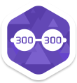

# Medaillen

**Medaillen**, auch früher bekannt als **Achievements** (dt. Erfolge oder Errungenschaften), sind kleine Embleme auf der Profilseite, welche anzeigen, dass jemand eine triviale Herausforderung gemeistert hat. Zur Zeit sind sie in 5 Hauptgruppen unterteilt: **Beatmap Packs**, **Skill**, **Dedication**, **Hush-Hush** und **Mod Introduction**.

## Beatmap Packs

**Beatmap Packs** Erfolge können erlangt werden, indem aus jedem Mapset eines [Theme Beatmap Packs](https://osu.ppy.sh/p/packlist?t=t) eine beliebige Schwierigkeitsstufe gespielt wird. Die Beatmaps müssen im [osu!](/wiki/Game_Modes/osu!/) Modus von osu! gespielt werden.

Zur Zeit gibt es 16 dieser Erfolge, welche sich nochmal in 4 Untergruppen aufteilen lassen:

-   Video Game Pack
-   Anime Pack
-   Internet! Pack
-   Rhythm Game Pack

Jede dieser Untergruppen besteht aus 4 Teilen.

### Anforderungen und Hinweise, um Embleme zu erhalten

#### Anforderungen:

- Spiele eine beliebige Schwierigkeitsstufe von jeder Beatmap eines [Theme Beatmap Packs](https://osu.ppy.sh/p/packlist?t=t)
- Der Spielmodus muss der [osu!](/wiki/Game_Modes/osu!/) Modus sein.
- Entpacke das `Theme Beatmap Pack` und packe alle Beatmaps in den osu! Song Ordner. Starte osu! und spiel die Maps. Das ist alles.
  - Sollte die Beatmap als `.zip` Datei vorliegen, dann verschieb sie als `.zip` in den osu! Song Ordner und erstelle nicht einen neuen Ordner dafür.
  - Die Beatmaps können auch einzeln heruntergeladen und gespielt werden.
- Beatmaps vom selben Lied aber anderen Erstellern zählen nicht. Ausschließlich die aufgelistete Beatmap wird gewertet.
- Man muss mit seinem Account im Spiel angemeldet sein. Nur auf der Webseite angemeldet zu sein, reicht nicht aus.
- Mods können nach Belieben benutzt werden, außer Mods wie `Relax`, ansonsten wird der erspielte Rekord nicht gezählt.

#### Hinweise:

- Nach Erhalten des Erfolges können die dafür benötigten Beatmaps wieder gelöscht werden. Der Erfolg, Ranked Score und die Genauigkeit bleiben erhalten. Falls man jedoch seinen Ranked Score oder die Genauigkeit verbessern möchte, dann sollte man die Beatmaps jedoch behalten oder neu herunterladen.
- Falls man sich fragt, warum man einen der Theme Pack Erfolge nicht erhalten hat und eventuell das Gefühl hat, dass eine Map fehlt, dann kann man zu jeder Zeit die [Theme Pack Liste](https://osu.ppy.sh/p/packlist?t=t) überprüfen. Jede geschaffte Map hat ein dickgedrucktes **CLEARED** neben sich.
- Das Emblem wird erst ausgehändigt, wenn alle Lieder aus dem Pack geschafft wurden.
  - Der Rekord muss hochgeladen worden sein. Ansonsten kann es sein, dass die Beatmap ein weiteres Mal gespielt werden muss.
- Bei alten Maps ist das Timing/Offset oftmals falsch. Mit dem `Offset Wizard` in den Einstellungen kann das Timing/Offset korrigiert werden.

#### Trivial

- 16 Packs. (4 Themen x 4 Teilen)
  - 1 Stunde 20 Minuten = 1 Pack (Durchschnittliche Zeit, um ein Pack zu vervollständigen)
- 211 Lieder (206 + 3  Ranked, 1  Approved und 1 Pending)
- 662 Schwierigkeitsstufen (660  Ranked, 1  Approved und 1 Pending)
- 1.39 GB (zipped), 1.47 GB (importiert)
- 3 Minuten 33 Sekunden. (Importierungszeit für alle 16 Packs)

| Video Game Pack | Anime Pack | Internet! Pack | Rhythm Game Pack |
| :-------------: | :--------: | :------------: | :--------------: |
|  |  |  |  |
|  |  |  |  |
|  |  |  |  |
|  |  |  |  |

## Skill

Es gibt derzeit 4 Komboerfolge, indem man eine bestimmte [Kombo](/wiki/Glossary) im osu! Standard Modus auf einer beliebigen Ranked/Approved Beatmap erreicht bzw. überschreitet. Das Erreichen der Kombo in anderen Spielmodi zählt nicht.

Neben den Komboerfolgen gibt es noch weitere 20 Erfolge für jeden Spielmodi (osu!, osu!taiko, osu!catch und osu!mania), die in 3 Gruppen aufgeteilt sind: **Rank**, **Pass** und **Perfect**.

Die 4 **Rank** Erfolge können erlangt werden, indem man im Ranking aufsteigt. Der erste Erfolg ist bereits mit Rank 50.000 erhältlich. Der letzte Erfolg benötigt einen Rank von mindestens 1.000.

Bei den 8 **Pass** und 8 **Perfect** Erfolgen muss eine beliebige Ranked/Approved Beatmap gespielt werden. Um ein Erfolg freischalten zu können, muss die Beatmap in einem bestimmten Schwierigkeitgradbereich liegen. Die Schwierigkeit der Beatmap wird durch **Star Difficulty** angegeben. Beim ersten Erfolg muss beispielsweise eine Beatmap gespielt werden, dessen **Star Difficulty** Wert zwischen 1 und 2 liegt. Für den letzten Erfolg muss eine Beatmap mit einem **Star Difficulty** Wert von 8 oder höher gespielt werden.

**Wichtig**: Die **Pass** und **Perfect** Erfolge sind nur einzeln freischaltbar. Bei **Pass** Erfolgen ist es nur nötig die Beatmap zu schaffen. Die Genauigkeit, Scorepunkte, etc. spielen keine Rolle. Bei **Perfect** Erfolgen muss die Beatmap jedoch mit einem vollem Kombo abgeschlossen werden, ansonsten bleibt der Erfolg verschlossen. Wenn man also theoretisch einen maximalen Kombo von 1337 erlangen kann, dann muss man am Ende der Beatmap auch ein Kombo von 1337 haben.

| Kombo | Rank | Pass | Perfect |
| :---: | :-------------: | :---: | :---: |
| ") |  |  | |
| ") |  |  | |
| ") |  |  | |
| ") |  |  | |
|  |  |  | |
|  |  |  | |
|  |  |  | |
|  |  |  | |

## Dedication

**Dedication** (dt. Hingabe) Erfolge können erreicht werden, indem man viele Runden im [osu!](/wiki/Game_Modes/osu!/) Modus spielt / Früchte in [osu!catch](/wiki/Game_Modes/osu!catch/) sammelt / Noten in [osu!taiko](/wiki/Game_Modes/osu!taiko/) trifft / viele Tasten in [osu!mania](/wiki/Game_Modes/osu!mania/) drückt.

| osu! | osu!taiko | osu!catch | osu!mania |
| :------: | :---: | :------------: | :---: |
| ") |  |  |  |
| ") |  |  |  |
| ") |  |  |  |
| ") |  |  |  |

## Hush-Hush

**Hush Hush** (dt. streng geheim) Erfolge sind nicht leicht zu erlangen. Der Spieler muss selbst herausfinden, wie man sie bekommt. Der Titel von jedem dieser Erfolge soll ein Hinweis darstellen, um sie zu bekommen.

|  |  |  |  | |  |
| :---: | :---: | :---: | :---: | :---: | :---: |
|  |  |  |  | |  |
|  |  |  |  | | |
|  |  |  |  | |  |
|  |  | | | | |
|  |  | | | | |
|  |  | | | | |

## Mod Introduction

**Mod Introduction** (dt. Mod Einführung) Erfolge können mit dem jeweiligen Mod (Double Time, Half Time, Hard Rock, Hidden, etc.) freigeschalten werden.

|  |  |  |  |
| :---: | :---: | :---: | :---: |
|  |  |  | |
|  |  |  |
