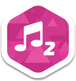
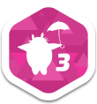
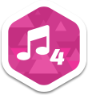
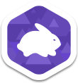
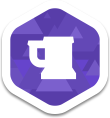

# Logros

Los **Logros** ***(Achievements)*** son pequeñas insignias en el perfil de alguien que indican que alguien ha llevado a cabo un objetivo excepcional. Actualmente, están divididos en 5 grupos.

## Beatmap Packs

**Los Beatmap Packs** son logros pueden ser obtenidos por **Jugar cada beatmap a al menos una vez en cualquier dificultad** Dentro de un [Theme Beatmap Pack](https://osu.ppy.sh/p/packlist?t=t). Deberá jugar en Modo [osu! Standard](/wiki/Game_Modes/osu!) para calificar a **CLEARED (Completado)** en el [Beatmap Pack Listing](https://osu.ppy.sh/p/packlist?t=t) y ganar la insignia.

Actualmente hay 16 logros de este grupo, que se dividen en 4 secciones:-

-   Video Game Pack
-   Anime Pack
-   Internet! Pack
-   Rhythm Game Pack

Cada una de estas secciones tiene actualmente 4 volúmenes a ellos.

### Requisitos y notas sobre la obtención de la insignia.

#### Requisitos:
- Jugar cada beatmap una vez en cualquier dificultad dentro de una [Theme Beatmap Pack](https://osu.ppy.sh/p/packlist?t=t) es suficiente.
- El modo debe ser [osu! Standard](/wiki/Game_Modes/osu!).
- Extraer el Theme pack, Coloque todos los beatmaps del .zip en osu.! Ejecutar tu osu! y comenzar a jugar. Eso es todo.
  - Si el beatmap se encuentra en .zip, debe extraerlo como .zip y no ir a hacer carpetas para ellos. Si se hacen las carpetas para ellos, es posible que no obtenga el logro y el estado "**CLEARED (Completado)**" en su [Beatmap Pack Listing](https://osu.ppy.sh/p/packlist?t=t)
  - Alternativamente, usted puede descargar las canciones manualmente de uno en uno, sigue siendo valido.
- Cualquier variación (como creador diferentes) De la canción no es contado. Debe ser esa canción específica y el creador específico en ese Beatmap.
- Su cuenta en cuestión debe estar logeado en osu!. Tener Sección iniciada en el Sitio web de osu! pero no el juego, no cuentan.
- Los Mods pueden utilizarse pero no mods que pueden jugar sin clasificar (como Auto-Piloto). Use los mods sabiamente a su favor.

#### Notas:
- Después de completar su logro, usted puede borrar las canciones del tema. Su achievement (Logro), ranked score y accuracy (Precisión) Se guardaran. Si lo que quieres es mejorar tu ranked score (Puntuación) y la accuracy (Precisión) de los beatmap, puede hacerlo personalmente y jugar el beatmap de nuevo.
- Si usted se pregunta ¿por qué usted no tiene la insignia? y se siente como si no fuera una canción, usted puede comprobar el [Beatmap Pack Listing](https://osu.ppy.sh/p/packlist?t=t) aqui. La canción que se haya terminado, se marcará **CLEARED** en negrita.
- la insignia se le dará después de completar todas las canciones de ese tema en cuestión.
  - Sea paciente y asegúrese de que su puntuación se presenta y se clasifican correctamente primero. ¿No querrá repetir que la canción beatmap otra vez sobre todo si es difícil para usted?
- Como los beatmaps son bastante antiguos puede ser posible que deba hacer uso del "Off-set Wizard", ya que los Hit-Circles pueden aparecer mal sincronizados. (Antes/Después, del tiempo correcto)

#### Trivia
- 16 packs. (4 temas x 4 volumenes)
  - 1 hora 20 minutos = 1 pack (Estimación del tiempo requerido para completar un beatmap pack)
- 211 canciones (206 + 3  rankeadas, 1  aprobadas y 1 pendiente)
- 662 dificultades (660  rankeadas, 1  aprobadas y 1 pendiente)
- 1.39 GB (zipped), 1.47 GB (importado)
- 3 minutos 33 segundos. (Estimación de tiempo de importación de todos los 16 packs)

| Video Game Pack | Anime Pack | Internet! Pack | Rhythm Game Pack |
| :-------------: | :--------: | :------------: | :--------------: |
|  |  |  |  |
|  |  |  |  |
|  |  |  |  |
|  |  |  |  |

## Combo

Los Logros de **Combo** Se puede obtener al adquirir un determinado [Combo](/wiki/Glossary) en el modo osu! Standard y se puede completar con cualquier canción.
Lograr el mismo combo en Taiko, Catch the Beat u osu!mania NO es valido para conseguir el logro.

Para el logro de 1,000 y 2,000 combo, Debe ser un beatmap en estado "Aprobado". No busque beatmaps sin Aprobar o de otra forma no podra conseguir el logro.

| Combo | The High Ranker |
| :---: | :-------------: |
| ") |  |
| ") |  |
| ") |  |
| ") |  |

## Dedicación (Dedication)

Los logros por **Dedicación (Dedication)** pueden ser obtenidos por (Jugando continuamente en modo Standard / Recoger muchas frutas en modo [Catch the Beat (CTB)](/wiki/Game_Modes/osu!catch) / golpear un montón de golpes los tambores en modo [Taiko](/wiki/Game_Modes/osu!taiko) / presionando muchas teclas en [osu!mania](/wiki/Game_Modes/osu!mania)).

| Standard | Taiko | Catch the Beat | Mania |
| :------: | :---: | :------------: | :---: |
| ") |  |  |  |
| ") |  |  |  |
| ") |  |  |  |
| ") |  |  |  |

## Hush-Hush

Los logros de este tipo tienen una forma clara de llegar a ellos. El propio jugador debe descubrir lo que tiene que hacer para desbloquear el logro.
Spoilear El método para desbloquear estos logros concretos "tendrá como resultado el Baneo de tu cuenta. " (Era la regla antes del 16 de Agosto 2017. Esto ya es permitido)

`El propio título es una pista sobre como obtener estos logros.`

|  |  |  |  |
| :---: | :---: | :---: | :---: |
|  |  |  |  |
|  |  |  |  |
|  |  |  |  |
|  |  | | |
|  |  | | |
|  |  | | |
|  |  | |  |

## Link Externo

-   peppy's Achievement Graphics [1](https://osu.ppy.sh/community/forums/topics/80448)
