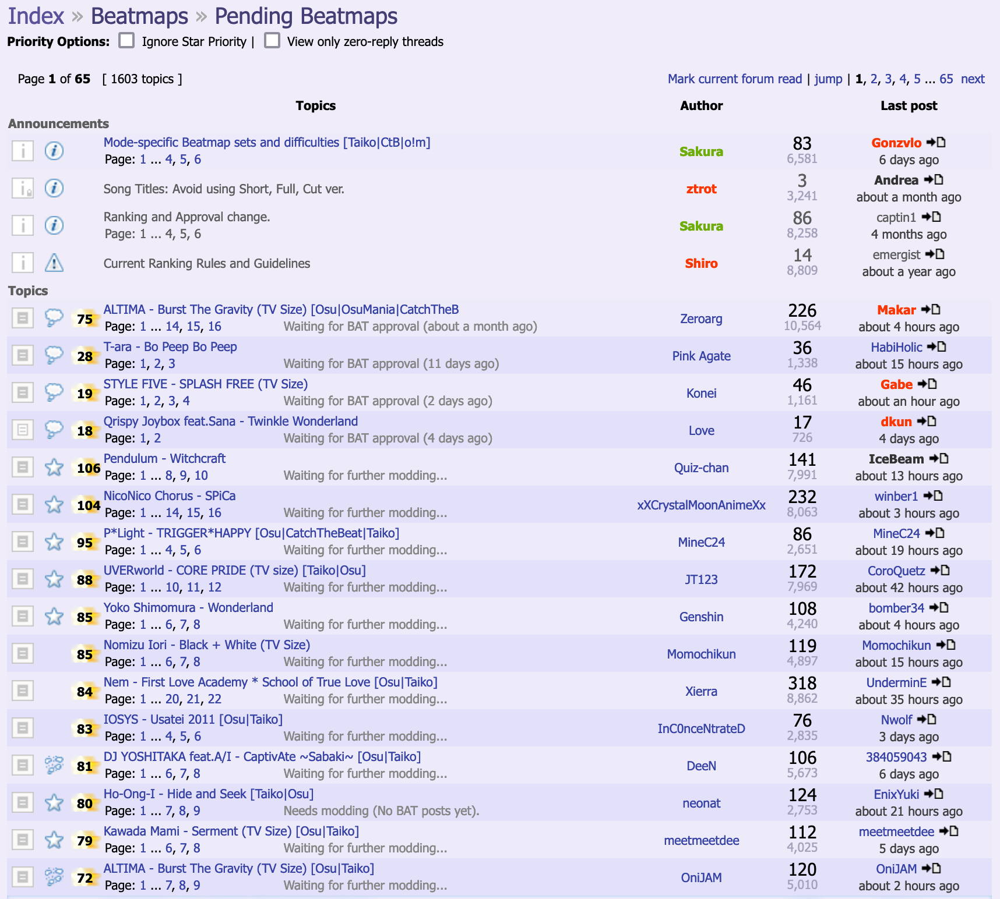

---
tags:
  - bubble pop
  - full bubble
---

# Bubble

**Bubble** () คือไอคอนโพสต์ฟอรัมที่สมาชิกของทีม modding ต่อไปนี้ใช้ใน [ขั้นตอน ranking บีตแมป](/wiki/Beatmap_ranking_procedure):

- [Beatmap Appreciation Team](/wiki/People/Beatmap_Appreciation_Team) (*BAT*)
- [Mapping Assistance Team](/wiki/People/Mapping_Assistance_Team) (*MAT*)
- [Beatmap Nominators](/wiki/People/Beatmap_Nominators) (*BN*)
- [Quality Assurance Team](/wiki/People/Quality_Assurance_Team) (*QAT*)

ในฐานะขั้นตอนถัดไปของ [ระบบ ranking เก่า](/wiki/Modding/Forum_modding) หลังจาก [proto-bubble](/wiki/Modding/Proto-bubble) bubble ปกติหมายความว่า [บีตแมป](/wiki/Beatmap) พร้อมจะถูก ranked ในมุมมองของ modder บีตแมปที่ได้รับ bubble จะถูกตรวจโดยสมาชิก BAT หรือ BN อีกคนในภายหลัง และจะได้ [ranked](/wiki/Beatmap/Category#ranked) หรือ [approved](/wiki/Beatmap/Category#approved) ตราบใดที่แมปต้องการการแก้ไขเพียงเล็กน้อย

ใน [ขั้นตอน ranking บีตแมป](/wiki/Beatmap_ranking_procedure) สมัยใหม่ สิ่งที่เทียบเท่ากับ bubble คือ [nomination](/wiki/Beatmap_ranking_procedure#nominations) ครั้งแรกที่มอบโดย [beatmap nominator](/wiki/People/Beatmap_Nominators)

## ประวัติ

*ดูเพิ่มเติม: [Mapping and modding timeline](/wiki/History_of_osu!/Mapping_and_modding_timeline)*

Bubble ถูกนำเข้ามาโดย ::{ flag=AU }:: [peppy](/wiki/People/peppy) เมื่อวันที่ 29 ตุลาคม 2007 สำหรับ "beatmaps that are being considered for ranked play (pending further moderator's feedback)" การตั้งไอคอนกระทู้บีตแมปเป็น bubble เป็นวิธีที่สมาชิก BAT ใช้บอกว่าบีตแมปมีคุณภาพดีและทำตาม [ranking criteria](/wiki/Ranking_criteria)<!-- internal reference: https://osu.ppy.sh/community/forums/topics/619 -->

วันที่ 4 ตุลาคม 2010 MAT ได้รับสิทธิ์ใช้ไอคอน bubble ร่วมกับ BAT<!-- internal reference: https://osu.ppy.sh/community/forums/topics/38403 --> สิ่งนี้ทำให้ [proto-bubbles](/wiki/Modding/Proto-bubble) แทบเลิกใช้งานไป และทั้งสองทีมก็ใช้ bubble ปกติเป็นหลักตั้งแต่นั้นมา

หลังจาก [ระบบ beatmap discussion](/wiki/Beatmap_discussion) ถูกนำมาใช้เต็มรูปแบบและกลายเป็น interface หลักสำหรับ modding ในเดือนพฤศจิกายน 2017 ระบบควบคุมบีตแมปแบบฟอรัมก็ค่อย ๆ ถูกเลิกใช้ และ bubble ถูกแทนที่ด้วย nomination ตามธรรมชาติ

## กลไก

::: Infobox

:::

กระทู้ของบีตแมปที่ได้รับ bubble จะถูกแสดงในหน้าแรก ๆ ของ [ฟอรัม Pending Beatmaps](https://osu.ppy.sh/community/forums/6) โดยเรียงตาม [star priority](/wiki/Modding/Star_priority) และทำหน้าที่คล้ายกระทู้ปักหมุด

### ข้อกำหนด

- เพื่อให้ได้รับ bubble [star priority](/wiki/Modding/Star_priority) ของบีตแมปต้องมีอย่างน้อย 8 ต่อมา threshold นี้ถูกเพิ่มเป็น 12<!-- internal source: https://osu.ppy.sh/community/forums/posts/280845 -->
- ข้อกำหนดสำหรับบีตแมปที่จะถูกพิจารณาเข้า [Ranked](/wiki/Beatmap/Category#ranked) คือมี bubble หนึ่งอัน
- บีตแมปที่มุ่งไปยังหมวด [Approved](/wiki/Beatmap/Category#approved) ต้องมี bubble ต่อเนื่องสองอันจากสมาชิก BAT สองคนต่างกัน วันที่ 2 มิถุนายน 2017 threshold นี้ถูกเปลี่ยนเป็น bubble เดียว<!-- internal source: https://osu.ppy.sh/community/forums/topics/631077?start=6050796 -->

### Bubble pop

Bubble ที่มีอยู่สามารถถูก **popped** ได้:

- อัตโนมัติ โดย mapper เอง หากพวกเขาอัปเดตแมปหรือไฟล์ใด ๆ ของแมป
- ด้วยมือ โดยสมาชิก BAT หากบีตแมปต้องแก้เพิ่มเติมและยัง ranked ในสภาพปัจจุบันไม่ได้

ในทั้งสองกรณี ไอคอนกระทู้บีตแมปจะถูกตั้งเป็น popped bubble () หาก bubble ถูก pop ด้วยมือ จะถือว่าสมาชิก BAT หรือ MAT ที่วางไอคอนนั้นจะดูแลให้มีการแก้ไขที่จำเป็นก่อนที่แมปจะเดินต่อในขั้นตอน ranking

## ดูเพิ่มเติม

- *[the end of bubbles](https://www.youtube.com/watch?v=9Za-1_hxkxE)* ตอนหนึ่งของซีรีส์ YouTube [osu!mapping](/wiki/Community/Video_series/osu!mapping)
