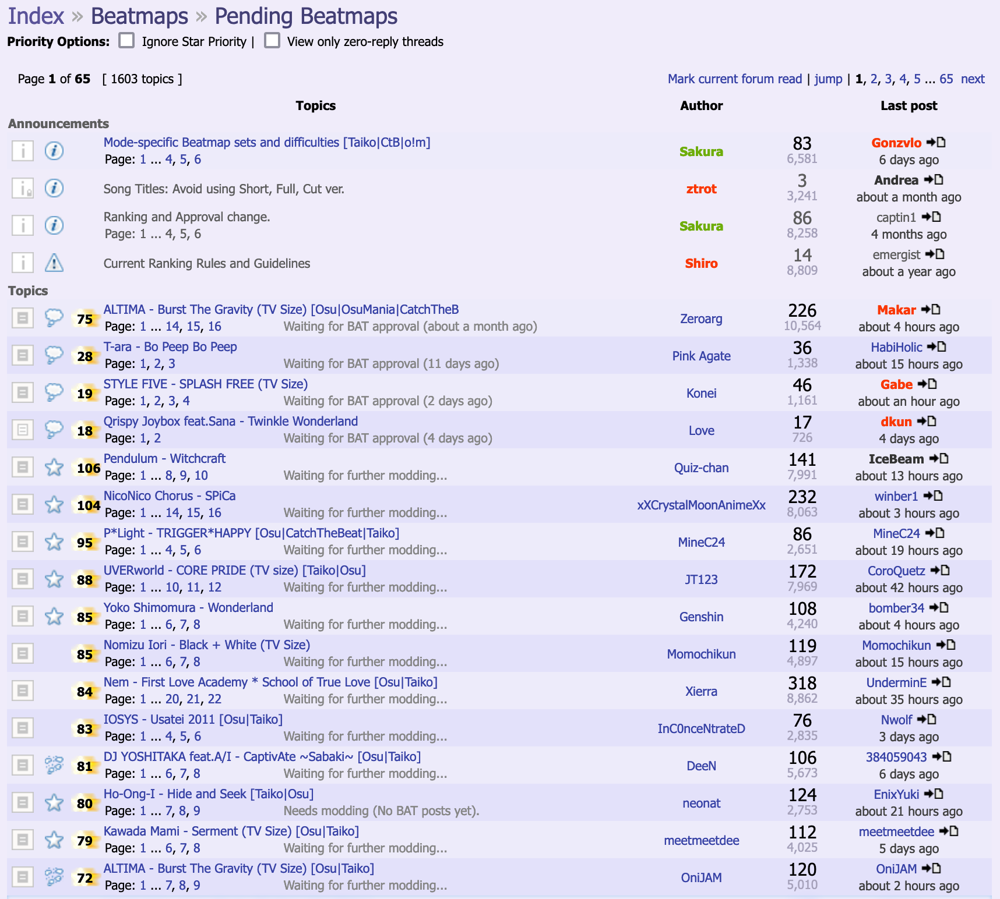

---
tags:
  - 戳泡
  - 泡图
  - 飞图
  - 谱面上架
  - 点图
---

# 泡泡

**泡泡** （）是论坛帖子的图标，可以由参与[谱面审核流程](/wiki/Beatmap_ranking_procedure)的摸图团队使用：

- [谱面评估团队 (BAT)](/wiki/People/Beatmap_Appreciation_Team)
- [谱面协助团队 (MAT)](/wiki/People/Mapping_Assistance_Team)
- [谱面审核成员 (BN)](/wiki/People/Beatmap_Nominators)
- [质量保证团队 (QAT)](/wiki/People/Quality_Assurance_Team)

在[旧版审核流程](/wiki/Modding/Forum_modding)中，[原型泡泡](/wiki/Modding/Proto-bubble)系统被取代后，如果摸图团队给予了一个普通泡泡，则表示他们认为谱面已经准备好上架了。最终，另一个 BAT 或者 BN 会检查被泡过的谱面。如果需要的话，他们会稍微修改谱面，即可将谱面推至[上架](/wiki/Beatmap/Category#ranked)或者[达标](/wiki/Beatmap/Category#approved)状态。

在当今的[谱面审核流程](/wiki/Beatmap_ranking_procedure)中，泡泡等于[谱面审核成员 (BN)](/wiki/People/Beatmap_Nominators) 给出的第一个[提名](/wiki/Beatmap_ranking_procedure#nominations)。

## 历史

*参见：[作图和摸图时间线](/wiki/History_of_osu!/Mapping_and_modding_timeline)*

泡泡最初由 ::{ flag=AU }:: [peppy](/wiki/People/peppy) 在 2007 年 10 月 29 日提出，用于“正在考虑上架游玩（等待摸图员的进一步反馈）”的谱面。他将讨论串的图标设为一个泡泡，并用于 BAT 成员表示谱面质量良好，符合[谱面上架标准 (RC)](/wiki/Ranking_criteria)。<!-- internal reference: https://osu.ppy.sh/community/forums/topics/619 -->

在 2010 年 10 月 4 日，MAT 获得了和 BAT 一样的泡图（给谱面赋予泡泡）权限。<!-- internal reference: https://osu.ppy.sh/community/forums/topics/38403 -->这基本上宣告了[原型泡泡](/wiki/Modding/Proto-bubble)系统的死亡。从那以后，两个团队都主要使用普通泡泡。

在 2017 年 11 月，[谱面讨论系统](/wiki/Beatmap_discussion)全面实装并成为摸图的主要界面后，基于论坛的谱面管理控制被逐步淘汰，泡泡系统也被提名系统所取代。

## 机制

::: Infobox

:::

被泡谱面的讨论串列在[待定 (Pending) 谱面论坛](https://osu.ppy.sh/community/forums/6)的第一页，并按照它们的[优先星](/wiki/Modding/Star_priority)排序。这能有效地将收到泡泡的谱面在论坛上置顶。

### 要求

- 如果谱面要收到泡泡，谱面的[优先星](/wiki/Modding/Star_priority)必须至少有 8 颗。后来，这个下限增加到 12 颗<!-- internal source: https://osu.ppy.sh/community/forums/posts/280845 -->。
- 如果谱面要进入[上架](/wiki/Beatmap/Category#ranked)状态，则必须有一个泡泡、
- 如果谱面要进入[达标](/wiki/Beatmap/Category#approved)状态，则必须收到来自于两个不同的 BAT 成员的泡泡。在 2017 年 6 月 2 日，这个下限减少到只需要一个泡泡<!-- internal source: https://osu.ppy.sh/community/forums/topics/631077?start=6050796 -->。

### 戳泡

发出去的泡泡也可能**被戳掉**：

- 如果谱师更新了谱面或者任何其中的文件，则会自动戳泡。
- 如果 BAT 成员认为谱面需要进一步的修改，目前的谱面达不到上架标准时，则可以手动戳泡。

在以上两种情况下，谱面讨论串的图标会变成一个破裂的泡泡 (）。如果是被手动戳泡，则代表戳泡的 BAT 或者 MAT 成员会要求谱面在审核流程之前，必须要在谱面某些地方作出改动。

## 参见

- *[泡泡的末路 (the end of bubbles)](https://www.youtube.com/watch?v=9Za-1_hxkxE)*，[osu! 作图](/wiki/Community/Video_series/osu!mapping) YouTube 系列的一集
