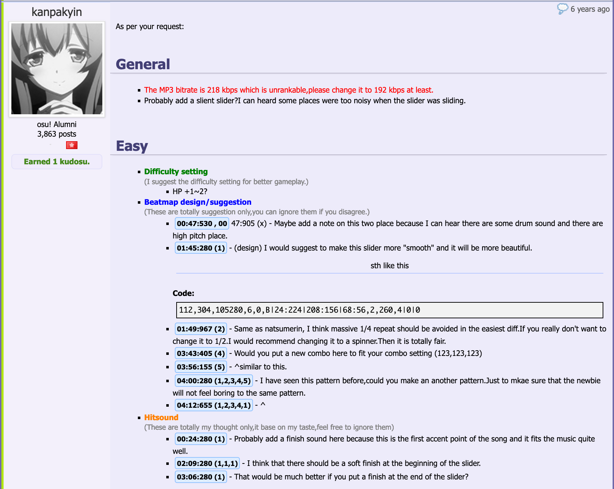
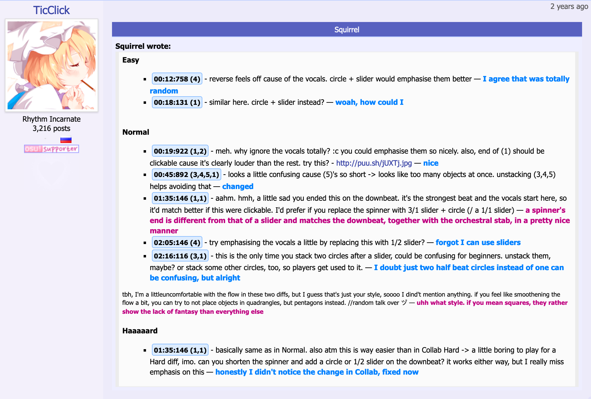

---
tags:
  - mv1
  - modding v1
  - moddingv1
  - forum-based modding
  - old modding system
  - sistem modding lama
  - modding berbasis forum
---

# Forum modding

**Forum modding**, yang juga dikenal dengan istilah *Modding v1*, merupakan sistem [modding](/wiki/Modding) dan ranking yang dahulu digunakan oleh osu!. Sistem ini berlaku dari awal osu! didirikan hingga tanggal [4 November 2017](https://osu.ppy.sh/community/forums/topics/650961?n=7) ketika seluruh [beatmap](/wiki/Beatmap) yang ada dipindahkan ke [sistem modding v2](/wiki/Beatmap_discussion).

Pada sistem forum modding, setiap beatmap memiliki utas forum untuk komunikasi dan pencatatan [prosedur ranking](/wiki/Beatmap_ranking_procedure).

## Utas beatmap

Pada saat suatu beatmap [diunggah](/wiki/Beatmapping/Beatmap_submission) untuk pertama kalinya, sistem osu! akan secara otomatis membuat sebuah utas beatmap yang dapat digunakan oleh para pengguna untuk saling berkomentar, bertukar *guest difficulty*, serta berbagi saran dan kritik. Utas tersebut berfungsi sebagai pusat diskusi antara semua pengguna yang tertarik dengan beatmap tersebut: pemain biasa, [beatmap host](/wiki/Beatmap/Beatmap_host), [guest mapper](/wiki/Beatmap/Guest_difficulty), [modder](/wiki/Modding/Modder), dan anggota tim ranking beatmap berikut ini:

- [Beatmap Appreciation Team](/wiki/People/Beatmap_Appreciation_Team) (*BAT*)
- [Mapping Assistance Team](/wiki/People/Mapping_Assistance_Team) (*MAT*)
- [Quality Assurance Team](/wiki/People/Quality_Assurance_Team) (*QAT*)
- [Beatmap Nominators](/wiki/People/Beatmap_Nominators) (*BN*)

Sebuah utas forum dapat dipindahkan secara otomatis antara bagian forum terkait [kategori beatmap](/wiki/Beatmap/Category):

- [Works In Progress/Help](https://osu.ppy.sh/community/forums/10)
- [Pending Beatmaps](https://osu.ppy.sh/community/forums/6)
- [Ranked Beatmaps](https://osu.ppy.sh/community/forums/14)
- [Beatmap Graveyard](https://osu.ppy.sh/community/forums/19)

### Star priority

*Artikel utama: [Star priority](/wiki/Modding/Star_priority)*

Pada setiap sub-forum, utas beatmap diurutkan berdasarkan star priority-nya yang memiliki beberapa tujuan:

- 12 star priority dibutuhkan sebelum sebuah beatmap dapat mendapatkan sebuah [bubble](/wiki/Modding/Bubble).
- Beberapa modder dan anggota BAT bergantung pada star priority ketika memutuskan map apa yang akan di-mod atau tinjau berikutnya.
- Star priority adalah ukuran kasar dari popularitas beatmap dikalangan modder dan mapper.

Prioritas beatmap dapat ditingkatkan dengan mod yang mendapatkan kudosu atau pengguna yang menembakkan kudosu starnya. Pada [diskusi beatmap](/wiki/Beatmap_discussion) modern, star priority memiliki ekuivalen dengan jumlah [hype](/wiki/Beatmap/Hype) beatmap.

### Ikon-ikon utas

Perkembangan sebuah beatmap dalam prosedur ranking ditampilkan melalui post yang dibuat oleh anggota tim ranking beatmap. Setiap post memiliki ikon unik yang juga menggantikan ikon utas forum untuk menunjukkan statusnya:

-  **[Star](/wiki/Disambiguation/Star)**: beatmap memiliki potensi untuk menjadi ranked.
-  **[Bubble](/wiki/Modding/Bubble)**: beatmap telah dicek oleh anggota MAT, BAT, atau BN dan mungkin dapat menjadi ranked setelah pengecekan berikutnya.
-  **[Bubble pop](/wiki/Modding/Bubble#bubble-pop)**: beatmap memiliki masalah yang membuat beatmap tersebut tidak dapat di-ranked setelah menerima sebuah bubble.
-     **Ikon mode permainan**: semua tingkat kesulitan [mode permainan](/wiki/Game_mode) dari beatmap telah dicek dan disetujui oleh seorang BN.
-  **[Heart](/wiki/Beatmap/Category#ranked)** or  **[flame](/wiki/Beatmap/Category#approved)**: beatmap telah mendapatkan status qualified, ranked, atau approved.
-  **Broken heart**: beatmap telah didiskualifikasi atau unranked karena beberapa masalah atau tidak mengikuti [ranking criteria](/wiki/Ranking_criteria).
-  **[Nuke](/wiki/Modding/Nuke)**: beatmap tidak dapat di-rank dengan kondisinya saat itu.

## Komunikasi

### Mod

::: Infobox

:::

Tidak seperti [diskusi beatmap](/wiki/Beatmap_discussion), sebuah forum mod post seringkali mencakup seluruh beatmap dan dapat berisi konten yang sangat banyak. Ketika pengguna dapat bebas mengekspresikan pendapatnya dalam bentuk apa saja, secara umum modder mengikuti sebuah struktur spesifik untuk membuat postnya menjadi lebih mudah dibaca:

- Mod dibagi menjadi beberapa bagian yang terdiri dari tingkat kesulitan dan setting umum beatmap.
- Setiap bagian berisi daftar [timestamp](/wiki/Modding/Timestamp) yang sering menunjuk [hit object](/wiki/Gameplay/Hit_object) secara spesifik.
- Setiap timestamp diikuti deskripsi singkat masalah pada timestamp tersebut dan terkadang diikuti oleh tangkapan layar untuk memperjelas hal tersebut.
- Berdasarkan tingkat keparahan masalah, beberapa modder menggunakan [colour coding](/wiki/BBCode#colour) pada postnya untuk menekankan masalah unrankable atau poin penting.

Sistem *review* modern dibuat untuk meniru forum modding pada diskusi beatmap.

### Balasan

::: Infobox

:::

Meskipun tidak diwajibkan, mapper diharapkan untuk membalas tiap mod yang masuk. Sebuah balasan biasanya berisi kutipan dari post utama dan diikuti oleh balasannya. Sama seperti mod post, mapper menggunakan dua atau lebih warna font untuk menyampaikan balasannya dan perbedaan warna dapat membantu dalam membedakan masukkan yang diterima dan ditolak.

### Kudosu

*Artikel utama: [Kudosu](/wiki/Modding/Kudosu)*

Jika mod post dianggap membantu, mapper atau anggota QAT/BAT/BN dapat memberikan kudosu pada post tersebut. Berdasarkan peraturan yang tak tertulis, hanya mod post pertama pengguna yang dapat diberikan kudosu. Tanpa memerdulikan berapa banyak masukkan dalam sebuah post atau seberapa berguna bagi mapper, jumlah kudosu yang diterima selalu sama:

- 1 kudosu untuk kondisi umum.
- 2 kudosu untuk kondisi utas beatmap yang telah tidak aktif lebih dari seminggu. Hal ini bertujuan untuk menggalakkan modding pada map-map tua.

Kudosu berfungsi sebagai ukuran aktivitas seorang modder. Kebanyakan pengguna menggunakan kudosunya untuk meningkatkan [star priority](/wiki/Modding/Star_priority) map yang disukai atau yang ingin dipromosikan.

## Pemberhentian sistem

Dalam praktiknya, sistem modding berbasis forum cenderung rawan terhadap berbagai cela dan kesalahan sebagai berikut:

- Umpan balik mapper dapat tenggelam di antara sekian banyak mod post yang ada.
- Mod dapat diabaikan secara sebagian atau keseluruhan, baik secara disengaja maupun tidak.
- Suatu map tetap dapat di-rank walaupun terdapat hal-hal yang tidak selayaknya ada di beatmap Ranked (*unrankables*) baik dengan atau tanpa seizin nominator yang bertanggung jawab

Perubahan-perubahan dibutuhkan untuk menyelesaikan masalah-masalah umum dimulai pada [26 April 2013](https://osu.ppy.sh/community/forums/topics/129625), saat [peppy](/wiki/People/peppy) mempresentasikan ide mengenai [sistem modding baru](/wiki/Beatmap_discussion) (yang nanti dikenal sebagai *Modding v2*). Pada [21 Agustus 2014](https://osu.ppy.sh/home/news/2014-08-21-restructuring-of-the-bat), kategori beatmap [Qualified](/wiki/Beatmap/Category#qualified) ditambahkan. Qualified menjadi penyangga antara beatmap pending dan ranked untuk membuat proses unrank menjadi lebih halus. Sebagai tambahan, tim [Quality Assurance Team](/wiki/People/Quality_Assurance_Team) (*QAT*) dibentuk untuk mengecek beatmap yang qualified dan mengontrol proses ranking.

Setelah itu, sistem diskusi beatmap dan [kode etik dalam modding dan mapping](/wiki/Rules/Code_of_conduct_for_modding_and_mapping) dikembangkan dan dirilis untuk merestrukturisasi modding dan menjadikan modding lebih menyenangkan untuk semua yang terlibat:

- [11 April 2016](https://osu.ppy.sh/community/forums/topics/442285): Diskusi beatmap diaktifkan untuk dua beatmap dan tersedia untuk dites oleh publik.
- [1 Februari 2017](https://osu.ppy.sh/community/forums/topics/552250): Setelah beberapa pengembangan berdasarkan umpan balik yang diterima, versi lanjutan sistem diskusi beatmap tersedia untuk publik dan lebih banyak beatmap.
- [4 November 2017](https://osu.ppy.sh/community/forums/topics/650961?n=7): Diskusi beatmap tersedia untuk seluruh beatmap yang baru di-submit atau beatmap yang belum mendapatkan balasan pada forum.
