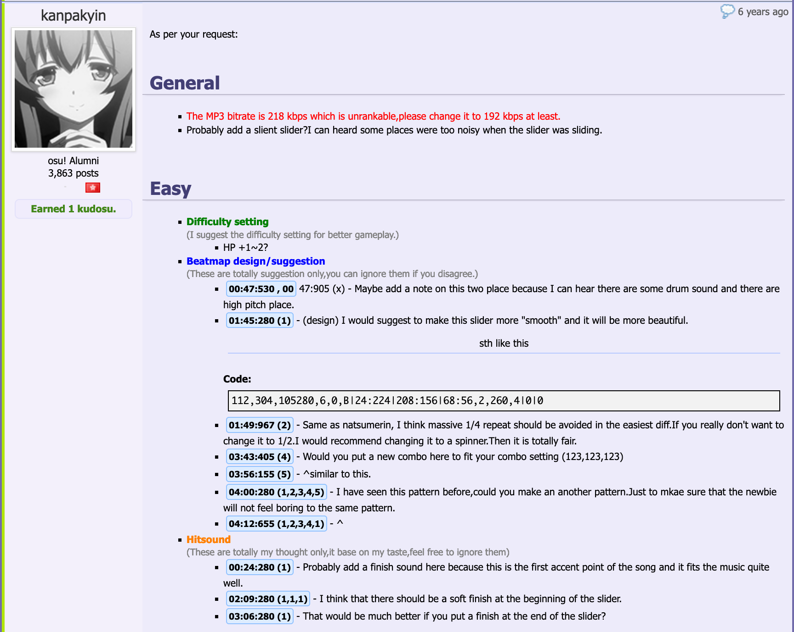
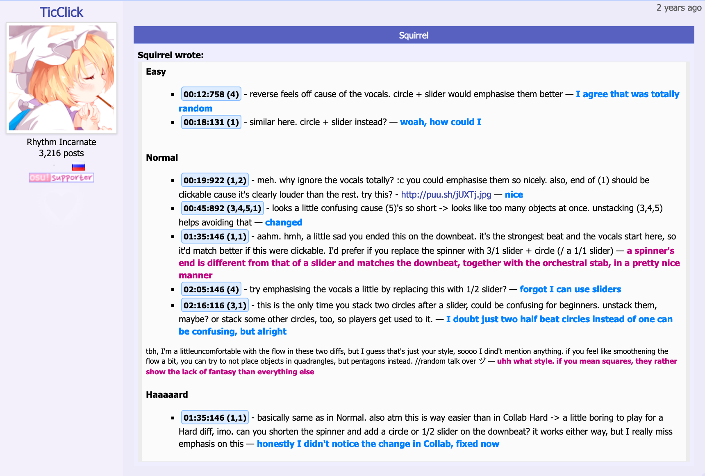

---
tags:
  - mv1
  - modding v1
  - moddingv1
  - forum-based modding
  - old modding system
---

# Forum modding

**Forum modding** หรือที่รู้จักกันในชื่อ *Modding v1* เป็นชื่อเรียกแบบพูดกันทั่วไปของระบบ [modding](/wiki/Modding) และระบบ ranking แบบใช้ฟอรัมเป็นหลัก ซึ่งถูกใช้งานเป็นหลักจนถึงวันที่ [4 พฤศจิกายน 2017](https://osu.ppy.sh/community/forums/topics/650961?n=7) เมื่อ [บีตแมป](/wiki/Beatmap) ใหม่ทั้งหมดและบีตแมปที่ไม่ active ถูกเปลี่ยนไปใช้ [beatmap discussions](/wiki/Beatmap_discussion) เป็นค่าเริ่มต้น

ในระบบ forum modding บีตแมปทุกอันจะมีกระทู้ฟอรัมสำหรับสื่อสารและบันทึก [ขั้นตอนการจัดอันดับ](/wiki/Beatmap_ranking_procedure)

## กระทู้บีตแมป

กระทู้ฟอรัมจะถูกสร้างให้บีตแมปตอน [submission](/wiki/Beatmapping/Beatmap_submission) ครั้งแรก และมีทั้งคอมเมนต์แบบอิสระ การโต้ตอบกับ guest difficulty และ feedback แบบมีโครงสร้างในรูปแบบโพสต์ mod กระทู้นี้เป็นศูนย์กลางหลักสำหรับการพูดคุยระหว่างผู้ใช้ทุกคนที่สนใจบีตแมปนั้น ไม่ว่าจะเป็นผู้เล่นทั่วไป [beatmap host](/wiki/Beatmap/Beatmap_host), [guest mapper](/wiki/Beatmap/Guest_difficulty), [modder](/wiki/Modding/Modder) และสมาชิกของทีม ranking บีตแมปเหล่านี้:

- [Beatmap Appreciation Team](/wiki/People/Beatmap_Appreciation_Team) (*BAT*)
- [Mapping Assistance Team](/wiki/People/Mapping_Assistance_Team) (*MAT*)
- [Quality Assurance Team](/wiki/People/Quality_Assurance_Team) (*QAT*)
- [Beatmap Nominators](/wiki/People/Beatmap_Nominators) (*BN*)

กระทู้ฟอรัมจะถูกย้ายอัตโนมัติระหว่างหมวดย่อยของฟอรัมที่เกี่ยวข้องคร่าว ๆ กับ [หมวดหมู่บีตแมป](/wiki/Beatmap/Category):

- [Works In Progress/Help](https://osu.ppy.sh/community/forums/10)
- [Pending Beatmaps](https://osu.ppy.sh/community/forums/6)
- [Ranked Beatmaps](https://osu.ppy.sh/community/forums/14)
- [Beatmap Graveyard](https://osu.ppy.sh/community/forums/19)

### Star priority

*บทความหลัก: [Star priority](/wiki/Modding/Star_priority)*

ในทุก subforum กระทู้บีตแมปจะถูกเรียงตาม star priority ซึ่งมีเป้าหมายหลายอย่าง:

- ต้องมี 12 star priority ก่อนที่บีตแมปจะได้รับ [bubble](/wiki/Modding/Bubble)
- modder และสมาชิก BAT บางคนใช้ star priority เพื่อเลือกว่าจะม็อดหรือตรวจแมปไหนต่อ
- star priority เป็นตัววัดแบบคร่าว ๆ ว่าบีตแมปได้รับความนิยมแค่ไหนในหมู่ modder และ mapper

Priority ของบีตแมปเพิ่มขึ้นได้จาก mod ที่ได้รับ kudosu หรือจากผู้ใช้ที่ยิง kudosu star ให้ ใน [beatmap discussions](/wiki/Beatmap_discussion) สมัยใหม่ star priority เทียบได้ใกล้เคียงกับจำนวน [hype](/wiki/Beatmap/Hype) ของบีตแมป

### ไอคอนกระทู้

ความคืบหน้าของบีตแมปในขั้นตอน ranking จะแสดงผ่านโพสต์ของสมาชิกทีม ranking บีตแมป แต่ละโพสต์มีไอคอนเฉพาะ ซึ่งจะเปลี่ยนไอคอนกระทู้ฟอรัมให้สะท้อนสถานะด้วย:

-  **[Star](/wiki/Disambiguation/Star)**: บีตแมปมีศักยภาพที่จะได้ ranked
-  **[Bubble](/wiki/Modding/Bubble)**: บีตแมปถูกตรวจโดยสมาชิก MAT, BAT หรือ BN แล้ว และอาจได้ ranked หลังจากตรวจอีกครั้ง
-  **[Bubble pop](/wiki/Modding/Bubble#bubble-pop)**: บีตแมปมีปัญหาที่ทำให้ ranked ไม่ได้หลังได้รับ bubble
-     **ไอคอนโหมดเกม**: difficulty ของ [โหมดเกม](/wiki/Game_mode) ที่เกี่ยวข้องของบีตแมปถูกตรวจและอนุมัติโดย BN แล้ว
-  **[Heart](/wiki/Beatmap/Category#ranked)** หรือ  **[flame](/wiki/Beatmap/Category#approved)**: บีตแมปได้ qualified, ranked หรือ approved แล้ว
-  **Broken heart**: บีตแมปถูก disqualified หรือ unranked เนื่องจากปัญหาด้านองค์ประกอบที่รุนแรง หรือไม่ทำตาม [ranking criteria](/wiki/Ranking_criteria)
-  **[Nuke](/wiki/Modding/Nuke)**: บีตแมปยังไม่สามารถถูกพิจารณาให้ rank ได้ในสภาพปัจจุบัน

## การสื่อสาร

### Mod

::: Infobox

:::

ต่างจากใน [beatmap discussions](/wiki/Beatmap_discussion) โพสต์ forum mod ทั่วไปมักครอบคลุมทั้งบีตแมปและมีเนื้อหาเยอะ แม้ผู้ใช้จะแสดงความคิดเห็นในรูปแบบใดก็ได้ตามต้องการ แต่ modder ส่วนใหญ่ยึดโครงสร้างบางอย่างเพื่อให้อ่านง่ายขึ้น:

- มีหลายส่วนที่สอดคล้องกับ difficulty แต่ละอัน และมีรายการ settings/issues ที่มีผลทั้งบีตแมป
- แต่ละส่วนมีรายการ [timestamp](/wiki/Modding/Timestamp) ซึ่งมักชี้ไปยัง [hit object](/wiki/Gameplay/Hit_object) ที่เฉพาะเจาะจง
- แต่ละ timestamp จะตามด้วยคำอธิบายสั้น ๆ ของปัญหา บางครั้งมี screenshot เพื่อช่วยให้เห็นข้อกังวลชัดขึ้น
- ตามระดับความรุนแรงของปัญหา modder บางคนใช้ [การใส่สี](/wiki/BBCode#colour) ในโพสต์เพื่อเน้นปัญหาที่ unrankable หรือจุดสำคัญ

ระบบ *review* สมัยใหม่ถูกสร้างขึ้นเพื่อเลียนแบบ forum modding ใน beatmap discussions

### การตอบกลับ

::: Infobox

:::

แม้จะไม่บังคับ แต่ mapper ถูกคาดหวังให้ตอบกลับทุก mod ที่ได้รับ โดยทั่วไปการตอบกลับจะมี quote ของโพสต์ต้นฉบับ และตามด้วยคำตอบของ mapper สำหรับแต่ละ suggestion เช่นเดียวกับโพสต์ mod mapper หลายคนใช้สีฟอนต์สองสีขึ้นไปเพื่อสื่อคำตอบและช่วยแยก suggestion ที่รับกับที่ปฏิเสธออกจากกัน

### Kudosu

*บทความหลัก: [Kudosu](/wiki/Modding/Kudosu)*

หากโพสต์ mod ถูกมองว่ามีประโยชน์ mapper หรือสมาชิก QAT/BAT/BN สามารถมอบ kudosu ให้ได้ ตามกฎที่ไม่ได้เขียนไว้ มีเพียงโพสต์ mod แรกของผู้ใช้เท่านั้นที่มีสิทธิ์ได้รับ kudosu ไม่ว่าในโพสต์จะมี suggestion กี่ข้อหรือมีประโยชน์กับ mapper แค่ไหน จำนวน kudosu ที่ได้รับจะคงที่:

- 1 kudosu ในสถานการณ์ส่วนใหญ่
- 2 kudosu หากกระทู้บีตแมป inactive เกินหนึ่งสัปดาห์ จุดประสงค์คือเพื่อส่งเสริมการม็อดแมปเก่า

Kudosu ใช้เป็นตัววัดกิจกรรมของ modder ผู้ใช้ส่วนใหญ่ใช้ kudosu ที่สะสมไว้เพื่อเพิ่ม [star priority](/wiki/Modding/Star_priority) ให้แมปที่ชอบหรือต้องการช่วยดัน

## การเลิกใช้

ในระบบ modding แบบใช้ฟอรัม หลายอย่างต้องทำด้วยมือ จึงมักเกิดข้อผิดพลาด ตัวอย่างเช่น:

- feedback ของ mapper อาจหายไป
- mod อาจถูกเมินบางส่วนหรือทั้งหมด ไม่ว่าจะตั้งใจหรือไม่
- แมปอาจได้ ranked ทั้งที่ยังมีปัญหา unrankable หรือยังไม่ได้รับอนุมัติจาก nominator เฉพาะโหมด

การเปลี่ยนแปลงที่จำเป็นเพื่อแก้ปัญหาทั่วไปส่วนใหญ่เริ่มต้นเมื่อวันที่ [26 เมษายน 2013](https://osu.ppy.sh/community/forums/topics/129625) เมื่อ [peppy](/wiki/People/peppy) เสนอไอเดียของ [ระบบ modding ใหม่](/wiki/Beatmap_discussion) (ภายหลังรู้จักกันในชื่อ *Modding v2*) วันที่ [21 สิงหาคม 2014](https://osu.ppy.sh/home/news/2014-08-21-restructuring-of-the-bat) มีการเพิ่มหมวดหมู่ใหม่คือ [Qualified](/wiki/Beatmap/Category#qualified) โดย Qualified ทำหน้าที่เป็น buffer ระหว่าง pending และ ranked beatmaps และช่วยให้การ unrank ราบรื่นขึ้น นอกจากนี้ยังมีการจัดตั้งทีมใหม่คือ [Quality Assurance Team](/wiki/People/Quality_Assurance_Team) (*QAT*) เพื่อตรวจ qualified beatmaps และควบคุมขั้นตอน ranking

หลังจากนั้น ระบบ beatmap discussion และ [code of conduct for modding and mapping](/wiki/Rules/Code_of_conduct_for_modding_and_mapping) ถูกพัฒนาและเปิดใช้งาน เพื่อปรับโครงสร้าง modding และทำให้เป็นประสบการณ์ที่ดีขึ้นสำหรับทุกคนที่เกี่ยวข้อง:

- [11 เมษายน 2016](https://osu.ppy.sh/community/forums/topics/442285): เปิดใช้ beatmap discussions กับบีตแมป 2 อัน และเปิดให้ทดสอบแบบสาธารณะ
- [1 กุมภาพันธ์ 2017](https://osu.ppy.sh/community/forums/topics/552250): หลังพัฒนาต่ออีกหลายเดือนตาม feedback ที่รวบรวมมา ระบบ discussion เวอร์ชันถัดไปถูกเปิดใช้กับบีตแมปชุดที่ใหญ่ขึ้น
- [4 พฤศจิกายน 2017](https://osu.ppy.sh/community/forums/topics/650961?n=7): เปิดใช้ beatmap discussions กับบีตแมปทั้งหมดที่ส่งใหม่หรือมีกระทู้ฟอรัมที่ยังไม่มี reply
