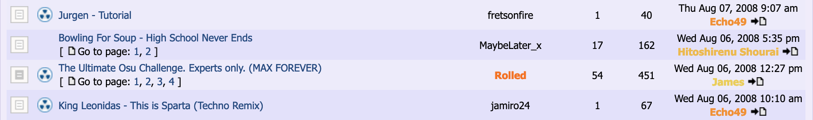

# Iconos nucleares

Los **iconos nucleares** fueron una herramienta de moderación para los [beatmaps](/wiki/Beatmap) en los primeros años de osu! y el sistema de [modding en los foros](/wiki/Modding/Forum_modding). Cualquier beatmap que se considerara que incumplía las reglas (o que el creador ignoraba el [código de conducta](/wiki/Rules/Code_of_conduct_for_modding_and_mapping)) podría ser destruido por el [Beatmap Appreciation Team (BAT)](/wiki/People/Beatmap_Appreciation_Team) o el [Global Moderation Team (GMT)](/wiki/People/Global_Moderation_Team).

Cuando un beatmap era destruido, aparecía un icono nuclear  en el hilo del beatmap. Este servía para indicarles a los demás miembros del BAT/GMT que el beatmap no se consideraría para ser [clasificado](/wiki/Beatmap_ranking_procedure#clasificados) hasta que se hubieran realizado cambios significativos. Si un beatmap hiciera los cambios correspondientes, el icono se eliminaría y podría continuar con el [proceso de clasificación](/wiki/Beatmap_ranking_procedure).

::: Infobox

:::

Los beatmaps podían verse afectados por varias razones, pero las más comunes eran:

- No seguir los conceptos básicos de los [criterios de clasificación](/wiki/Ranking_criteria).
  - Contener secciones mal temporizadas
  - Contener [objetos](/wiki/Gameplay/Hit_object) colocados aleatoriamente en la rejilla y/o línea de tiempo
  - Beatmaps extremadamente difíciles o poco convencionales (por ejemplo, que consistan en un único [spinner](/wiki/Gameplay/Hit_object/Spinner)).
- No seguir el [código de conducta](/wiki/Rules/Code_of_conduct_for_modding_and_mapping).

Técnicamente, los iconos nucleares todavía existen en los foros, pero con la adición del [Modding v2](/wiki/Beatmap_discussion) y los [vetos](/wiki/People/Beatmap_Nominators/Beatmap_Veto) han sido efectivamente reemplazados y no tienen uso en el sistema actual del modding.
