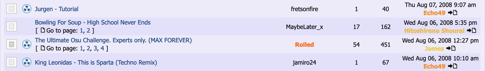

# Nuke

**Nuke** เป็นเครื่องมือ moderation สำหรับ [บีตแมป](/wiki/Beatmap) ในยุคแรก ๆ ของ osu! และระบบ [forum modding](/wiki/Modding/Forum_modding) บีตแมปใดก็ตามที่ถูกมองว่าไม่สนใจกฎ (หรือผู้สร้างไม่สนใจ [Code of Conduct](/wiki/Rules/Code_of_conduct_for_modding_and_mapping)) สามารถถูก nuke ได้โดย [Beatmap Appreciation Team (BAT)](/wiki/People/Beatmap_Appreciation_Team) หรือ [Global Moderation Team (GMT)](/wiki/People/Global_Moderation_Team)

เมื่อบีตแมปถูก nuke จะมีสัญลักษณ์กัมมันตรังสี  บนกระทู้บีตแมปของมัน สิ่งนี้ส่งสัญญาณให้สมาชิก BAT/GMT คนอื่นรู้ว่าแมปนี้ยังไม่ควรถูกพิจารณาให้ [rank](/wiki/Beatmap_ranking_procedure#rank) จนกว่าจะมีการแก้ไขสำคัญ หากบีตแมปแก้ไขตามที่เกี่ยวข้องแล้ว ไอคอนจะถูกเอาออกและสามารถเดินต่อใน [ขั้นตอน ranking](/wiki/Beatmap_ranking_procedure) ได้

::: Infobox

:::

บีตแมปสามารถถูก nuke ได้จากหลายสาเหตุ แต่สาเหตุที่พบบ่อยที่สุดคือ:

- ไม่ทำตามพื้นฐานของ [Ranking Criteria](/wiki/Ranking_criteria)
  - มีส่วนที่ timed ผิด
  - มี [hit object](/wiki/Gameplay/Hit_object) วางแบบสุ่มบน grid และ/หรือ timeline
  - เป็นบีตแมปที่ท้าทายมากหรือแปลกจากปกติอย่างสุดโต่ง (เช่น มี [สปินเนอร์](/wiki/Gameplay/Hit_object/Spinner) เพียงอันเดียว)
- ไม่ทำตาม [Code of Conduct](/wiki/Rules/Code_of_conduct_for_modding_and_mapping)

ในทางเทคนิค nuke ยังมีอยู่บนฟอรัม แต่เมื่อมี [Modding v2](/wiki/Beatmap_discussion) และ [veto](/wiki/People/Beatmap_Nominators/Beatmap_Veto) เข้ามา มันก็ถูกแทนที่ในทางปฏิบัติและไม่มีการใช้งานในระบบ modding ปัจจุบันแล้ว
