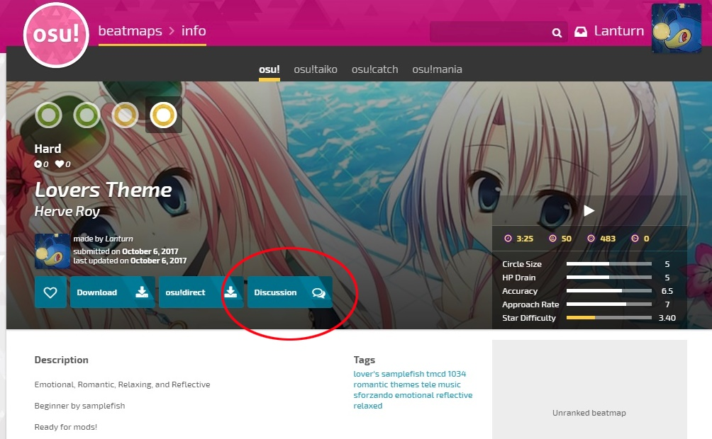
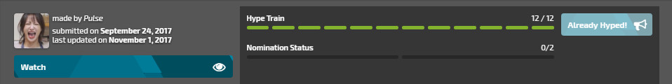
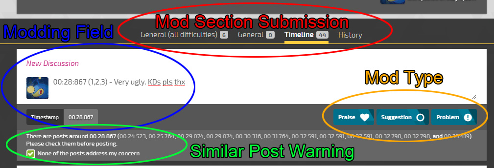

# v2

Modding v2 is now live on Stable (Latest), Beta, and Cutting Edge!

## Submitting a beatmap for Modding v2

### New beatmaps

New beatmaps submitted via the Beatmap Submission System will use Modding v2. This currently excludes Stable (Fallback).

### Old beatmaps

A staff member has to move the beatmap manually to use Modding v2. [Ephemeral](/users/102335) is currently in charge of transferring beatmapsets.

### Returning to the old modding system

You can access the old modding page by clicking on the speech bubble in the song select and selecting `Beatmap Topic` or `Quick Reply` in the beatmap editor via the `Web` menu, then clicking any selection from the list. You can also find it by looking in the creator's post history via their profile.

## Accessing the Modding v2 page

### Through new.ppy.sh:

Click `Discussion` on the beatmap page.

### Through osu.ppy.sh:

Clicking Modding/Discussion on the beatmap's page will take you to the page, if it's currently in the Modding v2 system.

## Modding v2 page

### Mode selection

Changes the game mode between osu!standard, osu!taiko, osu!catch, and osu!mania. Only modes the beatmapset has a difficulty for will show up.

### Beatmap Page / Difficulty Selection

Clicking on the Artist/Title of the beatmap will take you back to the Beatmap Information page. You can select a difficulty to mod using the dropdown menu. Make sure you are on the correct difficulty before submitting mods to the beatmap!

### Modding Status

All of the mods below are for the selected difficulty. Clicking any of these will show the specific mods in the timeline and in the Discussion section.

- Mine: Mods you have contributed.
- Resolved: Mods the creator has responded to and marked as resolved.
- Pending: Mods that haven't been replied to or marked as resolved.
- Praises: Mods that have been submitted as a Praise
- All: Every Suggestion, Problem, and Praise posted on the beatmap's difficulty and the beatmapset's general section.

### Modding Timeline

Displays all of the mods made for the difficulty that has a timestamp. Clicking on these will take you down to the mod posted at that current time.

### Beatmap Status

#### Beatmap Creator

The creator who submitted the beatmap, and shows the submission date, and the date the beatmap was updated last.

#### Watch/Unwatch

This replaces beatmap subscription. You can track the beatmap's status and open issues. You can access this page via the website's Home Page by clicking on modding watchlist located near the top of the page.

#### Hype Train

Similar to the old Star Priority system. A user can submit Praise to the beatmap and it will add to the beatmap's Hype Train. Quote: "Adding praise ❤ will raise this beatmap's hype, making it more visible for nomination and ranking!"

Note: the creator can't Hype up their own beatmap. Praise must be done in the General (All Difficulties) section to add Hype. It will not work through the General or the Timeline tabs.

#### Nomination

Once a beatmap has accumilated 12 Hype, the beatmap is eligible for Nomination. This works as it did with the old modding system. The beatmap requires 2 nominations by the Beatmap Nominators to move into the qualified state.

### Mod Submission Field

#### Mod Section Submission

This is what section of the beatmap you will be submitting your concerns to.

- General (all difficulties): General issues with the beatmap such as metadata and general discussion on the beatmapset as a whole. You can also add Hype to a beatmap here by posting a comment with Praise.
- General: General issues with the difficulty such as beatmap settings and general discussion on the specific difficulty.
- Timeline: Issues at certain points in the beatmap. Must contain a timestamp. The majority of mods will end up in this section.
- History: Shows when issues were marked as resolved. You can click on any issue to jump to the post.

#### Modding Field

This is where you type your mod. If you use the Timeline section, you must include a timestamp in the post. The first timestamp placed will be the timestamp shown in the Discussion section. The General sections do not require timestamps, but may include them.

#### Similar Post Warning

If your timestamp submitted through the Timeline section is close to another mod already posted, you will have to confirm that the mod doesn't address the issue you are currently submitting. Please check the discussion field before checking the box!

#### Mod Type
This is where you submit your mod. You can choose between Praise, Suggestion, or Problem. Each is fairly self-explanatory. Clicking on this will submit your mod. If you made any mistake or need to make an edit to your mod, find the post in the Discussion section.. You can add Hype to the Beatmap by submitting Praise in the General (All Difficulties) section.

### Mod Discussion Field

#### Functions

- Collapse/Expand All and the ^ arrow: These will show/hide posts.
- Thumbs Up/Down: Like/Dislike the mod. Everyone but the mod submitter can use this.
-  Timeline: Shows the timestamp the issue addresses. Only available in the Timeline section.
-  CREATOR icon: Displays responses/submissions from the user who made the beatmapset.
-  permalink, edit, delete: Permalink grabs a direct link to the post. Edit allows the submitter to edit their  submission. Delete allows the submitter to remove their submission.
-  Respond: Reply to the submission. Pressing Enter or clicking Reply afterwards will submit your response.
-  Mark as Resolved: The creator may select this when the issue has been addressed and either accepted or denied.
-  Reopen a Discussion: If the submission needs further discussion, the creator or mod submitter may reopen the  submission by responding and unchecking Resolved.

## Reminders

- Submit your beatmap through Stable (Latest), Beta, or Cutting Edge to use Modding v2. Fallback submits to the old system.
- Choose the correct mode and difficulty you wish to mod!
- Select the proper section you are submitting your mod to.
- Only post ONE issue at a time. Do not submit multiple issues in a single post!
- The Timeline section requires at least one timestamp before you can submit your post.
- Check to see if the issue has already been addressed when the similar post warning pops up.
- Do you like the beatmap? Give it some Praise in the General (All Difficulties) section to increase the amount of Hype on the Hype Train. This helps the beatmap move closer to nomination.

## Tips

- You can filter the mods by using the buttons on the Beatmap Information's Mod Status. You can for example, look at only pending posts.
- You can edit or delete your posts if you submitted a post and found a mistake.
- As the creator, you may reopen any previously resolved issue by responding to the post and unchecking Resolved.
- You can edit your Beatmap description by using the old threads like before. You do not have to submit your beatmap each time.

## Step by step guide to posting a mod

1. Select the proper game mode at the top of the beatmap's page you wish to mod (Standard, Taiko, Catch, Mania)
2. Select the difficulty you wish to mod in the drop down menu. (Easy, Normal, Hard, Insane, etc)
3. Select the section you wish to post your mod in (General (all difficulties), General, or Timeline)
4. Type your mod out in the discussion field. Use a timestamp if you are using the Timeline section. One issue per post!
5. Select the type of mod you are making (Praise, Suggestion, Problem)

Your post will be submitted! Start over at step 3 if you wish to continue modding the same difficulty. Don't forget to Hype the beatmap if you want to help move it forward for nomination.

## FAQ

### Is Kudosu! available in ModdingV2?

Kudosu! is not yet implemented in Modding v2. You will not recieve any for submissions you make in the Discussion section. However, It is unknown if current submissions will receive Kudsou! when it is finally implemented.

### How are beatmaps nominated?

Modding v2 follows the same procedure as its predecessor. 2 Beatmap Nominators are required to nominate the Meatmapset for qualification. Star Priority has been replaced with Hype and requires 12 Hype before it can be nominated.

### Will I be able to mod with the older system after Modding v2 releases?

You should mod with the system the creator has chosen. If they focus on V2, mod with V2. Otherwise your mod may go unnoticed.

### I don't like Modding v2! How do go back to the older system?

A thread of the old beatmap is still created through Beatmap Submission. If the creator wishes to return to the older system, they can access it simply through the speech bubbles in the song select screen, through the web menu in the editor, or in the creator's post history. Make sure to create a link in the description of the beatmap for ease of accessibility. The "Modding / Discussion" link will take you to the MV2 page if your beatmap was submmitted to MV2.

## Trivia

- Original forum post: [Modding V2 Guide](/community/forums/topics/650961) by [Lanturn](/users/1446665)
- pishifat's Video on Modding v2: [osu!mapping: moddingv2](https://www.youtube.com/watch?v=gZxsB98HGq0)
