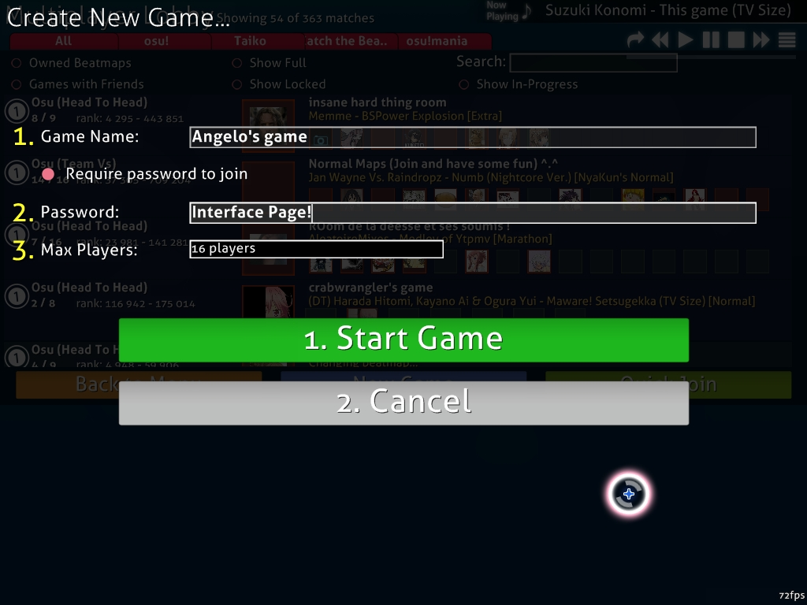
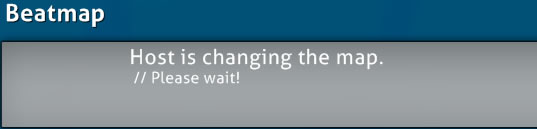
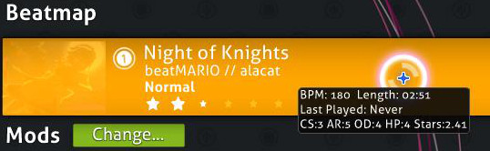
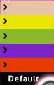
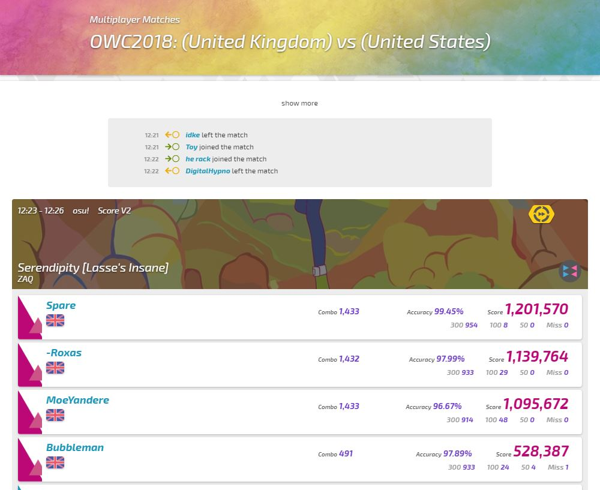
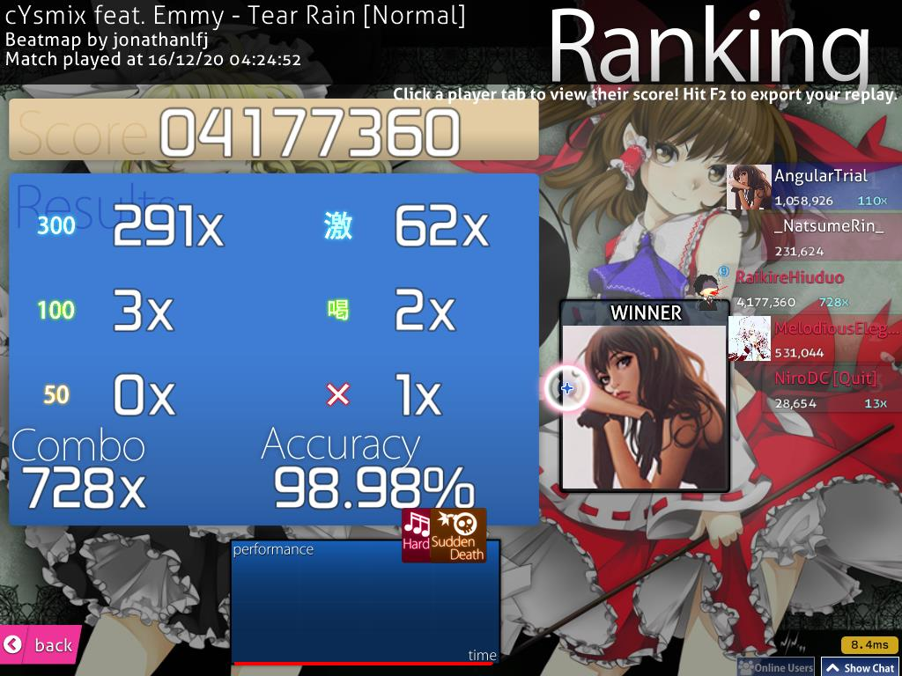
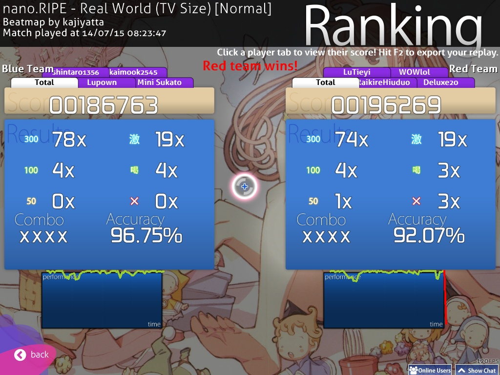

<!-- TODO: needs a thorough review for writing style and organisation, this is one of the more awkward articles on the site -->

# Multi

Multi (also known as _Multiplayer_) was implemented on 03 June 2008 (2008-06-03) under osu! Public Release b335, and is a game mode in which up to sixteen(16) players can compete against each other on a single map decided by the host.

The [osu!academy](/wiki/osu!academy) covered this topic in [Episode 6 (6:52)](https://www.youtube.com/watch?v=cyYRl-a5xII) along with the [Online Users Panel](/wiki/Chat_Console#extended-chat-console).

## How to enter

### Minimum requirements

- Decent online connection.
- An osu!account signed in to Bancho (should be done automatically during in-game osu!account sign-in)
- Knowing [how to transfer beatmaps without leaving the Match Setup.](/wiki/Beatmaps).

### Ways to enter

From the main menu:-

- Press `Play` then `Multi`; or
- Press `P` then `M`. (from Keyboard)

If the connection request with Bancho was successful, the player will be directed to the **lobby**, the core of the Multi-play.

### Notes

- Keep in mind that downloading times can range from a few seconds to few minutes onwards depending on the player's connection speed.
- Losing connection to Bancho will direct the player back to main menu.
  - When playing a match, a "Quit" will be given on the player box.
  - To re-enter the Lobby, wait until the reconnection to Bancho was successful and click on `Multi` again.
    - If the connection problem persists, the player should rectify the connection device used to proper working order.
- If the player is in the **cuttingedge** build, the in-game osu!account must have an active [osu!supporter](/wiki/osu!supporter) tag to enter.
- To access the Options screen while in a Match Setup, `Ctrl`+`O`.

## Lobby

The lobby will show all the currently available Match Setup in Bancho.

At the top contains the filter options at the left and the jukebox at the right.

The filter options provided are shown below; reading from left-to-right, top-to-bottom:-

Title | Description
:-: | :--
`All`/`osu!`/`osu!taiko`/`osu!catch`/ `osu!mania` | Self-explanatory; show only Match Setup with the **currently specified game mode**.
`Owned Beatmaps` | Show only Match Setup which the player **has the beatmap** when enabled.
`Show Full` | Show Match Setup with **full slots**. Do note that the Match Setup cannot be entered as long as there are no available slots in the Match Setup.
`Search` | Click on the searchbar and type in the title/beatmap used for the Match Setup or the host/player name to **find the Match Setup with the specified search term**. When using the searchbar, all filters will be ignored temporarily except `Show In-progress` (the only available filter option when the searchbar was used) until the searchbar is empty.
`Games with Friends` | **Only show Match Setup hosted/entered by the friends of the player** when enabled. This filter option will overwrites all other filter options when enabled.
`Show Locked` | Show **locked** Match Setup when enabled. Do note that to enter the Match Setup, a proper password must be given.
`Show In-progress` | Show **currently-playing** Match Setup when enabled. If the Match Setup contains empty slots, it is possible to enter the Match Setup. The player should wait patiently until the currently-playing match concludes and prepare for the next match instead. The Match Setup text colour will change to grey with `(In progress)` appended to the back of the title until the match ends.

---

At the middle are rows of available Match Setup after being filtered.

Each row contains a Match Setup, with the explanation split between left and right side for easier reading:-

- On the left side, there is the game mode symbol, game mode name with (Team Mode) enclosed in brackets, number of players inside over number of players allowed, and rank difference from highest to lowest
- On the right side, there is a large host profile image and smaller players profile image placement in the Match Setup along with the Match Setup's name and the beatmapset's name with \[beatmap/difficulty\] enclosed in square brackets to be played for this match.
  - Red colour means the slot is taken (by a player).
  - Green colour means the slot is available.
  - No colour means the slot is locked.

To enter a Match Setup, click on one of the desired row.

**Note:** If the game mode symbol contains a lock icon, clicking on it will prompt an empty text box to enter the Match Setup password.
The player should enter the correct password to access the locked Match Setup.
Alternatively, the player can request an invite from the Match Setup's host directly to bypass the locked password requirement.

---

The three buttons above the Chat Console are special commands a player can use while in the Lobby, reading from left-to-right:-

Title | Description
:-: | :--
`Back to Menu` | Self-explanatory; **leave the lobby and return to the main menu**.
`New Game` | **Preparation to create a new Match Setup**
`Quick Join` | Place the player to an **available Match Setup** _randomly_ based on **current pp rank range**.

The [Chat Console](/wiki/Chat_Console) will be available at the bottom of the screen and connected to `#lobby` by default.

## New game

Title | Description
:-: | :--
**Game Name** | **Name of the Match Setup.** Default to `{accountname}`'s game. To make the Match Setup private, enable the `Require Password to join` button.
**Password** | **Password to enter the Match Setup.** Only appears if the `Require Password to join` button was enabled. Match Setup game mode symbol will be shown with a lock.
**Max players** | **Total number of players allowed to join the Match Setup.** Default to 8 players, with range from 2 to a total of 16 players, including the player as host. It can be adjusted later by locking/unlocking the slots.

Press the `1. Start Game` button to **create the Match Setup** with the **player as the host** of the Match Setup and the **beatmap playing in the jukebox as the match's beatmap/difficulty**.

## Match Setup

<!-- One/Two image here? Subsections of the images later like what was done in Interface of the old osu! wiki for Song Selection? -->

")

The top section at the left display the name of the screen, status in the Match Setup (either host or player), player box at the middle based on current game mode played, and a pause button to pause the beatmap's song (if the player has the beatmap) located at the right side.

---

The bottom section is the [Chat Console](/wiki/Chat_Console).
A new tab called `#multiplayer` will be opened, with [BanchoBot](/wiki/BanchoBot) providing the match history link in the first line.
The link is `https://osu.ppy.sh/community/matches/x` (replace "x" with digits generated by Bancho for this Match Setup).

After a concluded match, the result will be displayed at another tab called `#userlog` privately (only applies to Head to Head Team Mode) by [BanchoBot](/wiki/BanchoBot) with content, `You placed #{placement} of {total} players in multiplayer on {beatmapset} [difficulty] <game mode>.`

---

For the middle section, it will be split into two parts; the left side (Current Players list) and the right side (Match Settings).

### Current Players list

On the left side, it shows the current slots available and players in this Match Setup.
The bracket shows the number of available players in the Match Setup over the total allocated for this Match Setup.

Players can move around the unlocked white slots except the locked black slots and other players' slots while waiting, or change their flag colour to blue/red if it is a team play.
Hovering above a player bar will show the level, nation and accuracy of the player in question.
If `Free Mods` was enabled, it will also shows the mods used by the player.

For the host side, the host can transfer its host rights to one of the players, kick players out, or unlock/lock the slots.

There are four important states to take note of:-

Colour (State) | Description
:-- | :--
**Red (No Map)** | **The player does not have the beatmap**. A `[no map]` notice will be appended at the end of player's name until the beatmap was downloaded, extracted, and ready to play (which the player will enter to white state). All players will enter this state or White (Not Ready) state when the host changed the beatmap. This player will not be affected by the Force Start effect.
**White (Not Ready)** | **The player has the beatmap but does not click the Ready button**. Game modifiers can be changed in this state, and must be confirmed for the game modifier change to take effect. All players will enter this state or Red (No Map) state when the host changed the beatmap. This player will be affected by the Force Start effect regardless of Ready state.
**Green (Ready)** | **The player is ready**. Game modifiers cannot be changed in this state. A player can press Not Ready button to return to white state but for a host, it is usually a one-way trip unless there were no players except the host, which a return to white state by pressing the Not Ready button will be allowed.
**Light Blue (Playing)** | **The player is playing**. A `[playing]` notice will be appended at the end of player's name until the match ended, in which the player will return to white state.

### Match Settings

On the right side are the key settings of the Match Setup.
Do note that only the host can change these settings except for the game modifiers used by the players when `Free Mods` was enabled.

#### Game Name and Change Password

Starting from the top is the Game Name which is self-explanatory; the name of the Match Setup/Game.
The host can change the name or create/change the Match Setup's password by pressing the `Change Password` button.

#### Beatmap

The middle section is the Beatmap section.

The section shows the beatmap to be played for this match.
When not hovered over, the beatmap will show the image, game mode symbol, the title, artist of the song, beatmapper, difficulty/beatmap selected and the star rating.

If the player does not have the beatmap, some information will be shown, and one of these will occur:-

Beatmap status | Effect
:-- | :--
**Ranked/Approved/Pending/Graveyard** | The player will be directed to the **beatmap page by player's default web browser** on click. If the player has **osu!direct**, it will be **downloaded and extracted automatically upon click**.
**Not uploaded or not up-to-date** | The player will **not be linked to the beatmap page** on click. The host should find the link (in the Beatmap Listing) for the player if the issue persists.
**Cannot update the beatmap** | The [host is probably playing a modified version.](https://osu.ppy.sh/community/forums/topics/135726 "ppy's reply on a bug report.")

#### Mods

 mods options")

 mods options \(with Free Mods enabled\)")

The lower left section is the Mods section.
This section will show the [game mods](/wiki/Game_Modifiers) used for this match.

For host-side, the host can enable `Free Mods` to allow players to use any mods _except_ Speed ([Double Time (DT)](/wiki/Game_Modifiers#double-time)/[Nightcore (NC)](/wiki/Game_Modifiers#nightcore) or [Half Time (HT)](/wiki/Game_Modifiers#half-time)) mods.
Host-selected mods other than the Speed mods will not be enforced upon players.

#### Team Mode, Win Condition, Tag Colour

The lower right section will shows how the beatmap will be played in the match (Team Mode) and the Win Condition.

##### Team Mode

Team Mode contains four ways of how a match will be played:-

Team Mode | Description
:-- | :--
`Head to Head` | Compete against each other to reach the top spot of the match leaderboard.
`Team Vs` | Compete against Red/Blue team for match supremacy.
`Tag Coop` [osu! only, UNRANKED] | Team up to complete the beatmap, one combo at a time together.
`Tag Team Vs` [osu! only, UNRANKED] | Tag Coop, with Red Team and Blue Team match competition.

**Note:** The winner's avatar will be shown at the grade screen for Head to Head Team Mode only.

##### Win Condition

Win Condition contains four ways of how a match will be decided:-

Title | Description
:-: | :--
`Score` | Player with **highest score** wins.
`Accuracy` | Player with the **highest accuracy** wins. If there are two players with 100.00%, the player with the highest score (from spinners) wins. Unconfirmed, if there were no spinners.
`Combo` | Player with the **highest combo count** _at the end of the beatmap_ wins. If combo count is the same, player with the highest score wins. **Maximum combo not counted**.
`Score v2` | Player with **highest _standardised_ score** wins.

##### Tag Colour (Tag Coop/Tag Team Vs only)

If Team Mode was set to _Tag Coop/Tag Team Vs_, a **Tag Colour:** `(combo colour)` section will be shown which **allows fixed combo colour when it is the player's turn**.
The `Default` option will use the original beatmap's combo colour for the combo instead.

### Match Setup buttons

Lastly, there are two buttons coloured brownish-orange `Leave Match` at the left and blue `Ready!`/`Not Ready`/`Start Game!`/`Force Start Game!` button at the right respectively.

The `Leave Match` button is self-explanatory; leave the Match Setup and return to the Lobby.

For the blue button, it can change depending on action taken and host/player privilege.
The different effects of the blue button can be seen below:-

Title | Description
:-: | :--
`Ready!` | Click to **enter Ready state (green state)**. Button will change to `Not Ready` for players; either `Start Game!` or `Force Start Game!` for host if there are players in the Match Setup, `Not Ready` otherwise.
`Not Ready` | Click to **return to Not Ready state (white state)**. Button will change to `Ready!`
`Start Game!` | Host-only button; **starts the match**. Appears with a distinctive ring when all players in the Match Setup in Ready! state (green state) including the host. Will switch to `Force Start Game!` when at least one player pressed the `Not Ready` button or new players coming in.
`Force Start Game! (x/y)` | Host-only button; **forcefully ready all players with the beatmap** and **starts the match**. Appears when host press the `Ready!` button but not all players in the Match Setup pressed the `Ready!` button (where `x` is the number of players in Ready state, and `y` is the total players in the Match Setup).

### Match History

**Note**: The link provided by BanchoBot at the first line of the `#multiplayer` tab in Chat Console (specifically, the `here` keyword) will direct the player to the Match History for the Match Setup in the player's default web browser.

## Team Mode

### General

#### The Esc key

In general, pressing the `Esc` (Escape) key in keyboard now _does not pause the match_; in fact, it will trigger a warning at the lower-right to press `Esc` key again to quit.
To quit the match and return to lobby, press it _again_.

#### Visual Settings

Some time will be given to use the Visual Settings below the beatmap during the loading phase of the beatmap.
If `Free Mods` was used, the game modifiers used applies to per player's interface and score differences may occur depending on game modifiers used.
Other players' interface may vary.

#### Health bar

When a player's health bar has been depleted completely, the player's beatmap play is considered failed.
Entering failed state at least once will consider the score and accuracy of this match to not be counted as ranked entry.
However, the failed player can continue playing and can be revived upon reaching full health.

If [Sudden Death (SD)](/wiki/Game_Modifiers#sudden-death)/[Perfect (PF)](/wiki/Game_Modifiers#perfect) was used, revival from failed state is impossible.

#### Result, Retry, and Replay

Despite no online score leaderboard below the results screen, ranked score will still be counted as legitimate ranked entry.
Result will not be shown at the Local leaderboard.
The only way to see it is by Online Ranking leaderboard (assuming the Multi's score is higher).

**No direct retry allowed** but the replay can be exported by pressing `F2` key in keyboard (will not contain any Multi-play elements and will not be saved in the osu! backend).
Do note that this does not apply to Tag Coop and Tag Team Vs (both are unrankable), where score will not be recorded and replay cannot be saved.

#### Multi's leaderboard

The leaderboard now shows the players in the match with live changes based on Win Condition as shown below:-

**Head to Head / Team Vs:*

- If Score/Score v2: Score, hit score and combo multiplier are shown in real-time.
- If Accuracy: Accuracy, hit score and combo multiplier are shown in real-time.
- If Combo: Combo count are shown in real-time. Maximum combo count not shown.

**Tag Coop / Tag Team Vs:*

- If Score/Score v2: Team's score and hit score are shown in real-time.
- If Accuracy: Team's accuracy percentage and hit score are shown in real-time.
- If Combo: Team's current combo count, score and hit score are shown in real-time.
- If _Failed_: Match ends and \[Tag Coop\] return to the Match Setup or \[Tag Team Vs\] automated win for the surviving team.
  - The failed players will not contribute towards the team score until revived back upon reaching full health.
- If _Quit_: [Auto](/wiki/Game_Modifiers#auto) will take over the _Quit_ player.
  - If all members of the same colour team left the match, the match will end with the win on the other colour team.

A failed or quitted player will be placed at the bottom of the leaderboard separately from other alive players, and placement changes can still occur among failed/quitted players.

#### Player box colour

<!-- A player box reference here? Old images in img/Playerbox -->
<!-- Special player box note: Skipped (has its own special callout), Failed (red text), and Quit (red text with [Quit] appended) -->

Status/Colour | Description
:-: | :--
**Normal/Blue** | **Player has _more_ than half of health**, usually at full. The concentration of blue colour will grow brighter if the player's health bar is increasing to full and bleed to red by losing the health bar more than half of the health bar length.
**Danger/Purple-Red** | **Player has _less_ than half of health**. The concentration of red colour will grow brighter if the player's health bar is decreasing to empty and diminished to blue by filling the health bar more than half the health bar length.
**Failed/Grey** | **Player unable to reserve the final sliver of health/no health left in the health bar**. The player can continue playing and if [Sudden Death (SD)](/wiki/Game_Modifiers#sudden-death)/[Perfect (PF)](/wiki/Game_Modifiers#perfect) was not used, refilling the health bar completely will "revive" the player from the failed status to normal. Also, score will not be contributed towards the team score at this state. Text colour will be changed from white to red.
**Tag/Green** | _Tag Coop and Tag Team Vs only_. **This is a permanent colour scheme for the match to all and will not change based on health bar status**. There will be a green arrow pointing to the current player playing the beatmap with a subtle white glow.
**Skipped/White** | **A request notice from the player to skip the start-up rest if the beatmap/difficulty has a start-up rest**. Players that press the `Skip` button at the lower-right of the screen will be given a small yellow box at the lower right on their box with white Skipped text. **All players must do so for the Skip to take effect**.
**Quit/Varies** | **Player quit the match**. Two possible ways to enter this state: (1) hitting `Esc` twice, or (2) disconnected from Bancho. Text colour will be changed from white to red, with `[Quit]` appended at the end. Box colour signify the status before quitting the game.

### Head to Head

#### Interface

Head to Head is a team mode where players duke it all out in a free-for-all Match Setup for the top spot at the leaderboard.
The default team mode to be selected and does not have any special characteristics in play; just go for the top spot.

#### Result

At the end of the match, first place player's avatar image will be shown at the Winner section.

The grade image is now placed behind the result like a watermark.
Other players' results can be checked by pressing the player's respective player box.

Each players will receive personalised match result placement privately under `#userlog` tab of the Chat Console.

### Team Vs

#### Interface

Team Vs mode pit two teams (Blue/Red) against each other based on Win Condition set.
Fulfill the Win Condition criteria as closely as possible to reach the top spot in the team and compete with the other team by team total.

Blue team members are placed at left side, red team members are placed at right side, and a crown at the center shows the current team supremacy.
It will move left and right depending on which team fulfill the Win Condition most closely.

When this mode was selected, all players in the Match Setup will receive either red or blue flag.
The players can click on it to change from blue to red or vice versa.

It is entirely possible to start a match with one colour team only, and there is no handicap bonus for the other team with lesser members.
Placement of the players prior to the match does not matter; all blue members will be grouped to blue team and all red members will be grouped to red team.
There is no role (like "Leader" or "Captain") distinction in the team; just compete for both the team top spot and beating the other team score in total as a team.

The surviving highest scoring member of either team will be shown as `1st` at their respective team.
Members in failed state will be located at the bottom of the team leaderboard and will not contribute to the team total as long as the members are in failed state.

#### Result

In the results screen, declaration of match winner will be based on team total and announced at the center in winner's colour, with blue team total at the left and red team total at the right.

**Only surviving members of the team's score will be counted**; it is possible for red team to be declared winner of the match when blue team has the superiority _just because_ some blue team members providing the superiority were in failed state or all members in the blue team failed.

The `Total` tab will show the total amount of hit score (300, 100, etc) done by the whole team and the average of the accuracy of the team.
Combo will not be counted in the team's `Total` tab.
Grade will not be shown on `Total` tab but will be shown at player's result screen as watermark (if passed).

### Tag Coop / Tag Team Vs

#### Interface

_Only available in osu! mode. **UNRANKED**_

Tag Coop makes all players in the Match Setup work together to pass the beatmap, one combo at a time.
Tag Team Vs is just Tag Coop with red and blue team competition.

Do note that this team mode is only available in **osu! only** and _unranked_ (meaning, it will not be counted to ranked score).

In this mode, player's slot placement starting from top-to-bottom is important as it will determine when it is the player's turn.

A green arrow will show the player who is currently playing the beatmap's combo.
The player's name will be shown at the lower right of the screen.
There will be warning arrows when it is the player's turn and the combo will be in colour until the combo ends.
The player can adjust for fixed combo colour at Match Setup under **Tag Colour**.

**All players must spin the spinner**.
Refusal or unable to complete the spinner will break the current combo count.

If a player quits during the match, [Auto](/wiki/Game_Modifiers#auto) will take over for the player that left.

For Tag Coop, all players will share the same health bar.
If the health bar was depleted completely (failed state), the match ends and all players return to the Match Setup immediately without result.

For Tag Team Vs, each team has its own respective health bar that are visible to teammates only.
If the health bar was depleted completely (failed state), the match ends by giving victory to the other team.

If [Easy (EZ)](/wiki/Game_Modifiers#easy) game modifier was used, the two health bar refill provided by the game modifier will still occur but will be depleted completely immediately after _just_ to fail the beatmap.

Players using [Sudden Death (SD)](/wiki/Game_Modifiers#sudden-death)/[Perfect (PF)](/wiki/Game_Modifiers#perfect) game modifier will have a different interface than other players, especially when it comes to the effects.
If the teammate does **not** use that game modifier and made a small mistake enough to trigger the mod effect, the beatmap will continue as normal, and players using the mod will have their health bar interface drained and stuck to empty with no ill effect (meaning, visual effect only).
If the player _using_ the mod made a mistake and triggered it, the actual effect will occur and failed state will be triggered immediately.

When playing in windowed mode, do note that the cursor will **not** be bounded to the osu! window during the break/not the player's turn yet.

#### Result

As stated before, score will not be counted for ranked score and performance points calculation because it is an _unranked_ play.

For Tag Coop, the result shown is the total score, hit score and accuracy of the team.
Individual results will not be shown, and can only be seen in Match History.
The result screen only appear if the beatmap was cleared successfully.

For Tag Team Vs result screen, refer to Team Vs's result screen explanation.

## Trivia

### History

")

- Match Setup used to only allows up to a total of 8 players only.
- osu!mania game mode was noted as `3` in Lobby for players that have not yet updated their osu! to the latest release patch (which enables osu!mania mode with no ranking support yet).
- No Video was the _only_ game modifier allowed for the players to use; however, it was removed in favour of its placement in the Visual Settings.
