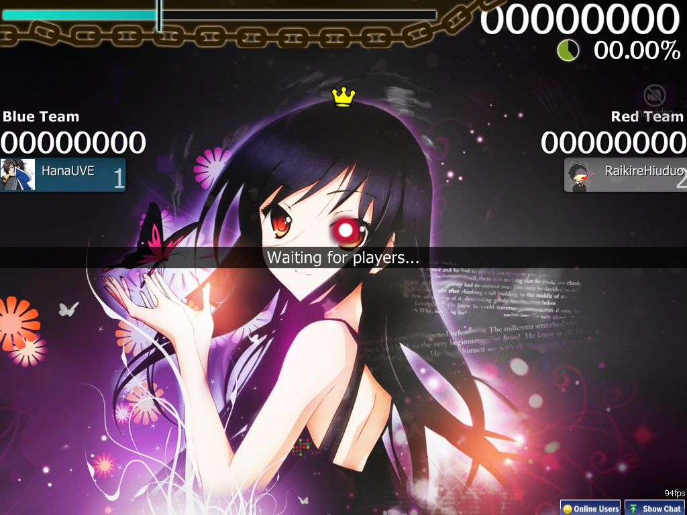

<!--Wiki links used-->
[osu!academy wikilink]: /wiki/Announcements/osu!academy/en.md "osu!academy"
[Chat_Console#Extended_Chat_Console wikilink]: /wiki/Chat_Console/en.md#extended-chat-console "Extended chat console"
[Beatmaps2 wikilink]: /wiki/Beatmaps/en.md#how-to-get-beatmaps-on-osu- "How to get beatmaps from osu!"
[osu!supporter wikilink]: /wiki/osu!supporter/en.md "osu!supporter"
[Standard wikilink]: /wiki/Game_Modes/osu!en.md "osu! game mode"
[Taiko wikilink]: /wiki/Game_Modes/osu!taikoen.md "osu!taiko game mode"
[Catch the Beat wikilink]: /wiki/Game_Modes/osu!catchen.md "osu!catch game mode"
[osu!mania wikilink]: /wiki/Game_Modes/osu!maniaen.md "osu!mania game mode"
[Sudden Death wikilink]: /wiki/Game_Modifiers/en.md#sudden-death "Sudden Death game modifier"
[Perfect wikilink]: /wiki/Game_Modifiers/en.md#perfect "Perfect game modifier"
[Auto wikilink]: /wiki/Game_Modifiers/en.md#auto "Auto game modifier"

<!-- External links used -->
[Release b335]: https://osu.ppy.sh/forum/p/26660 "osu! Public Release b335 announcement forum page."
[osu!academy Ep6]: https://www.youtube.com/watch?v=cyYRl-a5xII "osu!academy Episode 6 youtube link."

<!-- Image links used -->
[Multi_flowchart image]: ./Multi_flowchart.png "Multiplay Flowchart."
[Beatmaps_peppy image]: ./Beatmaps_peppy.jpg "Official image on beatmap extraction."
[Multi_lobby image]: ./Multi_lobby.jpg "Example of a typical day in the Multiplayer Lobby"
[Multi_new_game image]: ./Multi_new_game.jpg "Setting up configuration for a New Game"
[Multi_roomhost image]: ./Multi_roomhost.jpg "Example of Host Match Setup"
[Multi_roomplayer image]: ./Multi_roomplayer.jpg "Example of Player Match Setup (With &quot;Free Mods&quot; on)"
[Multi_mods_host image]: ./Multi_mods_host.jpg "Host (osu!) mods options"
[Multi_mods_player image]: ./Multi_mods_player.jpg "Player (osu!) mods options (With &quot;Free Mods&quot; on)"
[Multi_host_song_change image]: ./Multi_host_song_change.jpg "When the Host is changing songs, this bar will become a temporary placeholder."
[Multi_SS image]: ./Multi_SS.jpg "Example of how the Song Selection will look like for host."
[Multi_mh_single image]: ./Multi_mh_single.jpg "Example of Match History."
[Multi_mh_team image]: ./Multi_mh_team.jpg "Example of Team Match History."
[osu! icon link]: /wiki/shared/Osu.gif
[osu!taiko icon link]: /wiki/shared/Taiko.gif
[osu!catch icon link]: /wiki/shared/Ctb.gif
[osu!mania icon link]: /wiki/shared/Mania.gif
[Multi_PB_B image]: ./Multi_PB_B.jpg "Blue"
[Multi_PB_R image]: ./Multi_PB_R.jpg "Purple-Red"
[Multi_PB_F image]: ./Multi_PB_F.jpg "Failed/Grey"
[Multi_PB_TAG image]: ./Multi_PB_TAG.jpg "Tag/Green"
[Multi_PB_SKIP image]: ./Multi_PB_SKIP.jpg "Skipped"
[Multi_PB_QUIT image]: ./Multi_PB_QUIT.jpg "Quit"

<!--Title-->
# Multiplayer
![Flowchart of a multi game][Multi_flowchart image]

## Introduction
Multiplayer was implemented on the 3rd of June 2008 (3.6.08) under [osu! Public Release b335][Release b335], and is a game mode in which up to sixteen players can compete against each other on a single map decided by the host.

[osu!academy][osu!academy wikilink] covered this page in [Episode 6 (6:52)][osu!academy Ep6] along with [Online Users Panel][Chat_Console#Extended_Chat_Console wikilink].

## How to enter
### Minimum requirements
- Decent online connection.
- osu!account logged into Bancho (should be done automatically)
- Have a fair amount of beatmaps in your Songs folder (unless you prefer to download as you go)
- Knowing [how to transfer beatmaps without leaving the room.][Beatmaps2 wikilink] [Picture example here.][Beatmaps_peppy image]
- Logical thinking (knowing when to ask about something you don't understand)

### Ways to enter
From Main menu,
- Press "**Play**" then "**Multi**"; or
- Press "**P**" then "**M**". (from Keyboard)

You will be directed to the "**lobby**", the core of the Multi-play.

### Notes
- Keep in mind that downloading times can range from a few seconds to 15mins depending on your internet connection.
- Losing connection to Bancho will send you back to Main Menu until connection is recovered to Bancho. This will force you to be considered "Quit" when playing a match.
- "Quit" when playing a match.
- Requires [osu!supporter][osu!supporter wikilink] in cuttingedge build.

## Lobby
![Example of Multiplayer Lobby][Multi_lobby image]

This is a (waiting) Multiplayer Lobby.
-   Here is a list of things that a player can do in the lobby:-
	-   Press one of the tabs above to sort out the game style they want.
	-   Selecting the few options below the tab to sort out the list.
	-   Creating a new "room" by pressing "New Game"
	-   Press "Quick Join" to randomly join a room based on the beatmap you have.
	-   Press one of the "room" to enter that "room" group.
	-   Talk with other players using the chat console which are opened by default. Please be at your best behavior at all time.
		-   You will be connected to \#lobby by default.
	-   Check out the players logged into lobby by looking at the right of the screen.
	-   Select and playing your jukebox songs at the upper-right of the screen.

## New game
![New Game setup screen][Multi_new_game image]

Title | Description
:---: | :---
**Game Name** | **Name of the "room"**. You can use foreign languages (Unicode).   Enable the "Require Password to join" button to make your "room" private.
**Password** | Will only appear if the button is enabled. **The Password to enter the room.**   Your "room" sign will be shown with a lock.
**Max players** | **The number of players that can join your "room".** Default to "8 players" with range from 2-16 players, including self as a player, and can be adjusted later by locking/unlocking the slots.

After you are done, you can press the "Start Game" to create the "room" with you as the host of the room. You will be directed to **Match Setup**

## Match Setup
`Nicknamed "(game) room"`

Image | Description
---|:---
![Host room view][Multi_roomhost image] | Host room view
![Player room view][Multi_roomplayer image] | Player room view
![Host mods view][Multi_mods_host image] | Host game mode view
![Player mods view][Multi_mods_player image] | Player game mode view (Free Mode ON)

<!-- Reason: Long list readibility -->
<table>
	<thead>
		<tr>
			<th>Title</th>
			<th>Description</th>
		</tr>
	</thead>
	<tbody>
		<tr>
			<th>Match Setup</th>
			<td><strong>The status of player in the room.</strong> It is either host or player only.</td>
		</tr>
		<tr>
			<th>Player bar</th>
			<td><strong>Your player bar.</strong> Currently, it is based on <a href="/wiki/Performance_Points" title="Performance Points">pp</a>. Changes depending by the currently playing game mode.</td>
		</tr>
		<tr>
			<th>Pause button</th>
			<td><strong>Pause the beatmap's song selected by host.</strong> Will not work if player does not have the beatmap.</td>
		</tr>
		<tr>
			<th>Current Players</th>
			<td>
				<strong>The players inside the room.</strong> Player can move around the placing if they want.
				<ul>
					<li><strong>Note:</strong> Flag = Small Rectangle , Bar = Long rectangle</li>
					<li><strong>Flag Colour legend:</strong>
						<ul>
							<li>Upon click(Team):Change Team colour</li>
							<li>White: Player has the beatmap but did not press the Ready button.</li>
							<li>Green: Player is ready.</li>
							<li>Red: Player does not have the beatmap needed. (Team) Player in Red Team.</li>
							<li>Blue: (Team) Player in Blue Team </li>
							<li>Black: Locked place. Only the host can unlock it.</li>
							<li>Light Blue: Player is playing.</li>
						</ul>
					</li>
					<li><strong>Bar Colour legend:</strong>
						<ul>
							<li>Cursor on bar: Shows Level, Nation and Accuracy of the player.</li>
							<li>White: Player has the beatmap but did not press the Ready button.</li>
							<li>Light Green: Player is ready.</li>
							<li>Red: Player does not have the beatmap needed.</li>
							<li>Black: Locked place. Only the host can unlock it.</li>
							<li>Light Blue: Player is playing.</li>
							<li>Mods symbols: (Free Mods) Mods used by the player.</li>
						</ul>
					</li>
					<li><strong>Picture legend:</strong>
						<ul>
							<li>Crown: Player is the host.</li>
							<li>Lock: Determine whether the place is locked or not.</li>
							<li>Kick: Host command. Kick the player and lock the place of kicking.</li>
						</ul>
					</li>
				</ul>
			</td>
		</tr>
		<tr>
			<th>Game Name</th>
			<td><strong>The name of the game.</strong> Only the Host can change the name and create/change the room password.</td>
		</tr>
		<tr>
			<th>Beatmap with symbol</th>
			<td>
				<strong>Beatmap selected by host to be played. The symbol signify the Game Mode.</strong>
				<ul>
					<li>If the beatmap is ranked/approved/pending/graveyard, player will be directed to the beatmap page by player's web browser.</li>
					<li>If the beatmap is not uploaded or not up to date, it will not link to the beatmap. The host should find the link (Beatmap Listing) for the player if the issue persists.</li>
					<li>If you can't update, the <a href="http://osu.ppy.sh/forum/t/135726">host is probably playing a modified version.</a></li>
					<li>Scrolling over the beatmap will show the <a href="./Multi_beatmapinfo.jpg">BPM, Length, Last Played, CS, AR, OD, HP, and Stars.</a></li>
				</ul>
			</td>
		</tr>
		<tr>
			<th>Mods</th>
			<td>
				<strong><a href="/wiki/Game_Modifiers">Game Modifiers</a>.</strong> When "Free Mods" is enabled, host-selected mods (except Speed mods) will not be forced upon players.
				<ul>
					<li><strong>Free Mods:</strong> Host's special command. When enabled, players are allowed to use any mods except Speed (<a href="/wiki/Game_Modifiers" title="Double Time">DT</a>/<a href="/wiki/Game_Modifiers" title="NightCore">NC</a>,<a href="/wiki/Game_Modifiers" title="Half-Time">HT</a>) mods, in which, is determined by the host. Host-selected mods other than Speed mods will not be forced upon players.</li>
				</ul>
			</td>
		</tr>
		<tr>
			<th>Game Type</th>
			<td><a href="#game-type" title="Multi's Game Type"><strong>Settings for the room.</strong></a></td>
		</tr>
		<tr>
			<th>Ready!</th>
			<td><strong>Press this button to prove you are ready.</strong> All player must press it and the final decision is decided by the host.
				<ul>
					<li><strong>Start Game!:</strong> Host command. Start the game with all the players.</li>
					<li><strong>Force Start Game! (x/#):</strong> Host command. Start the game with players(x) that have the beatmap. Players without the beatmap (Red) will be ignored.</li>
				</ul>
			</td>
		</tr>
		<tr>
			<th><a href="/wiki/Chat_Console" title="Chat Console">Chat Console</a></th>
			<td><strong>The first line given by BachoBot at #multiplayer, &quot;Match history available <a href="http://osu.ppy.sh/mp/x">here</a>&quot; is known as match history.</strong> The link is <a href="http://osu.ppy.sh/mp/x">http://osu.ppy.sh/mp/x</a> (Replace &quot;x&quot; with numbers). The data will be removed after one month.
			<ul>
				<li>Also, it is worth noting that <a href="./Multi_userlog.jpg" title="Private userlog results">your result will be displayed at #userlog after a match privately.</a> Currently, it is applied to &quot;Head-To-Head&quot; game style only.</li>
			</ul>
			</td>
		</tr>
		<tr>
			<th>Leave Match</th>
			<td><strong>Leave the room and head back to the lobby.</strong></td>
		</tr>
		<tr>
			<th>(Tag Co-Op/ Tag Team VS) 
			Combo colour</th>
			<td><strong>Combo colour adjustment when it is your turn.</strong></td>
		</tr>
	</tbody>
</table>

Image | Description
---|:---
![host song change][Multi_host_song_change image] | When the Host is changing songs, this bar will become a temporary placeholder."
![host song selection][Multi_SS image] | Example of how the Song Selection will look like for host.
![match history single][Multi_mh_single image] | Example of Match History (Single).
![match history team][Multi_mh_team image] | Example of Match History (Team).

**When all players is ready** (there should be a second sound to show that everyone is ready) and **the host give the final call (Start Game!/Force Start Game!) to start the match, the game will start.**

## Game Type
`Only the host can determine the Game Type. Players should make requests to the host if they want something.`

### Play Mode
The game style you wish the map to be played. Can only be changed at "Song Select" by Host. Do note that the game style's leitmotif will be shown at the lobby of your "room".

-	![osu! icon][osu! icon link] [osu!][Standard wikilink]
-	![osu!taiko icon][osu!taiko icon link] [osu!taiko][Taiko wikilink]
-	![osu!catch icon][osu!catch icon link] [osu!catch][Catch the Beat wikilink]
-	![osu!mania icon][osu!mania icon link] [osu!mania][osu!mania wikilink]

### Team Mode
<!-- Rules -->
#### General rules (applies to all unless stated otherwise)
**_Beatmap progress rule_**
- Head-To-Head / Team VS: Continue until the end of the beatmap.
- Tag Co-Op / Tag Team VS: Discontinued when HP bar is completely drained.

**_Failed rule_** (Does not apply to Tag Co-Op / Tag Team VS)
- **The score and accuracy will not be counted as ranked entry.**
- The colour of the player bar determines his/her HP bar status. Grey means HP is fully drained, thus "Failed".
- Your object colour will all turn gray regardless of the original colour scheme.
- You can keep playing and can be revived upon reaching full HP. If [SD][Sudden Death wikilink]/[PF][Perfect wikilink] is used, revival is impossible (if you do revived, consider it a bug or ignore it)

**_Gameplay rule_**
- **Pressing [ESC] twice will result in "Quitting" the match, not pausing the game.**
- You may have some time to use the "Visual Settings" below the beatmap during the loading phase of the beatmap.
- When "Free Mods" is applied, the mods used by you only applies to your Interface. Other members' Interface may vary.

**_Tag Co-Op / Tag Team VS_**
- **Only available in osu! Standard mode.**
- **Player placing is important, as it will determine when it is your turn.**
- Everyone shares a lifebar / Each team have it's own respective lifebar that are visible to teammates only.
	- **If "Failed", everyone will be sent back to the "room" again.**
- An arrow will show the player who is currently playing the beatmap. Their name will be shown at the lower right of the screen.
	- There will be warning arrows when it is your turn and the combo will be in colour until your combo ends.
	- You can adjust your own combo colour at Match Setup.
- **Everyone must do the spinner regardless whether it's their turn or not.**
	- Refusal or unable to complete the spinner will break the current combo count.
- If a player quits, [Auto][Auto wikilink] will take over the "Quit" player.
- When you use [SD][Sudden Death wikilink]/[PF][Perfect wikilink], your Interface's HP bar will seem drained out to oblivion because of your teammate's mistake.
	- If the teammate in question did not use [SD][Sudden Death wikilink]/[PF][Perfect wikilink], the beatmap will continue.
	- If the user(assume you) of [SD][Sudden Death wikilink]/[PF][Perfect wikilink] made a mistake, the _actual effect will happen_, causing everyone to be kicked to results screen immediately.

<!-- Gameplay difference. Reason: colspan, rowspan -->
<table>
	<tr>
		<th colspan="5">Team Modes</th>
	</tr>
	<tr>
		<th>Interface</th>
		<td width="25%"></td>
		<td width="25%"></td>
		<td width="25%"></td>
		<td width="25%"></td>
	</tr>
	<tr>
		<th>Team Mode</th>
		<td><strong>Head-to-Head</strong></td>
		<td><strong><em>UNRANKED</em></strong> <strong>Tag Co-Op</strong></td>
		<td><strong>Team VS</strong></td>
		<td><strong><em>UNRANKED</em></strong> <strong>Tag Team VS</strong></td>
	</tr>
	<tr>
		<th>Rankboard</th>
		<td colspan="5">
			<strong><em>Head-To-Head / Team VS only</em></strong>
			<ul>
				<li>If Score/Score v2: Their score, hit score and combo multiplier are shown in real-time.</li>
				<li>If Accuracy: Their accuracy, hit score and combo multiplier are shown in real-time.</li>
				<li>If Combo: Their combo count are shown in real-time. Maximum combo count is not shown.</li>
			</ul>
			<strong><em>Tag Co-Op / Tag Team VS only</em></strong>
			<ul>
				<li>If Score/Score v2: Team's score and hit score are shown in real-time.</li>
				<li>If Accuracy: Team's accuracy percentage and hit score are shown in real-time.</li>
				<li>If Combo: Team's current combo count, score and hit score are shown in real-time.</li>
				<li>If "Failed": Beatmap stops and automated win for the surviving team.</li>
				<li>If "Quit": <a href="/wiki/Game_Modifiers" title="Autoplay">Auto</a> will take over the "Quit" player.</li>
			</ul>
		</td>
	</tr>
	<tr>
		<th rowspan="2">Notable differences</th>
		<td rowspan="2">
			<ul>
				<li>At the left of the screen is the list of players. The numberings is based on player's placement in the Match Setup, with Host as "--".</li>
				<li>The colour of the player bar determines his/her HP bar status. Grey means HP is fully drained, thus "Failed".</li>
				<li>At the lower-right of the screen is your position(1st, 2nd and so on) in the group. If you fail the song, you will received a "Failed" statement instead.</li>
			</ul>
		</td>
		<td rowspan="2">
			<ul>
				<li>(Refer to General rule "Tag Co-Op / Tag Team VS")</li>
			</ul>
		</td>
		<td colspan="2">
			<ul>
				<li>The team members placing is split into two sides.
					<ul>
						<li>Blue Team members is placed at Left side.</li>
						<li>Red Team members is placed at Right side.</li>
						<li>A crown at center shows the current situation. It will move left and right depending on score superiority.</li>
					</ul>
				</li>
				<li>Total score of the team is shown above each of the team's name.</li>
				<li>There is no "Leader" (or "Captain") in the team.</li>
				<li>Handicap is possible (16 vs 0)</li>
			</ul>
		</td>
	</tr>
	<tr>
		<td>
			<ul>
				<li>The surviving highest scoring member of either team will be shown as 1st at their respective team.</li>
				<li>The "Failed" players will not contribute towards the team score as long as they are in the state of "Failed".</li>
			</ul>
		</td>
		<td>
			<li>(Refer to General rule "Tag Co-Op / Tag Team VS")</li>
		</td>
	</tr>
</table>

<!-- Play colour -->
#### Player box colour
Picture | Name/Colour | Description
:---|:---:|:---
![Blue player box][Multi_PB_B image] | Blue | Player has more than half of health, usually at full.
![Red player box][Multi_PB_R image] | Purple-Red | Player has less than half of health. The concentration of red colour will grow brighter if player is near failing and diminished to blue by filling up the lifebar more than half.
![Failed/Grey player box][Multi_PB_F image] | Failed/Grey | Player unable to reserve the final sliver of health. Player can continue playing and if [SD][Sudden Death wikilink]/[PF][Perfect wikilink] is not used, player can be "revived" from the failed status by refilling the lifebar completely. Also, score will not be contributed towards the team score at this state. Text colour will be changed from white to red.
![Tag/Green player box][Multi_PB_TAG image] | Tag/Green | Tag Co-Op and Tag Team VS only. There will be an arrow (play-warningarrow) pointing the current player playing the beatmap and given a small white glow. This is a permanent colour scheme and will not change based on lifebar status.
![Skip player box][Multi_PB_SKIP image] | Skipped | If the beatmap has a start-up rest, players that press the Skip button at the lower-right of the screen will be given the name on their box. Everyone must do so for the Skip to take effect.
![Quit player box][Multi_PB_QUIT image] | Quit | [1] Hitting ESC twice. [2] Disconnected from Bancho. Text colour will be changed from white to red, with '[Quit]' appended at the end. Box colour signify the play status before quitting the game.

### Win Condition
The condition to determine the winner. The winner's avatar will be shown at the grade screen (Head-To-Head only).

Title | Description
:---:|:---
**Score** | Player with **highest score** wins.
**Accuracy** | Player with the **highest accuracy** wins. If there are two players with 100.00%, the player with the highest score (from spinners) wins. Unconfirmed, if there are no spinners.
**Combo** | Player with the **highest combo count** _at the end of the beatmap_ wins. If combo count is the same, player with the highest score wins. **Maximum combo is not counted**.
**Score v2** | Player with **highest _standardised_ score** wins.

## Multiplayer Results
Players will be directed here after the beatmap is completed unless stated otherwise.

### Overall result rule
- **If you received a "Failed" statement, your score and accuracy will automatically not be counted as ranked score at all even after "revival".**
- **If "Free Mod" was enabled by Host, score differences may occur depending on mods used.**
- **Despite there is no Online score leader-board, your ranked score will still be counted as legitimate ranked entry.**
- Your result will not be shown at the Local scoreboard. The only way to see it is by Online Ranking scoreboard (assuming Multi's score is higher)
	- The exception to the rule is Tag Co-Op and Tag Team VS (Both are unranked), where your score is considered unrankable.
- You cannot retry the beatmap but you can export your replay by pressing \[F2\] (Will not contain the Multi-play elements).
	- The exception to the rule is Tag Co-Op and Tag Team VS (Both are unranked), where the replay cannot be saved.

<!-- Reason: colspan -->
<table>
	<tr>
		<th colspan="5">Team Modes</th>
	</tr>
	<tr>
		<th>Interface</th>
		<td width="25%"></td>
		<td width="25%"></td>
		<td width="25%"></td>
		<td width="25%"></td>
	</tr>
	<tr>
		<th>Team Mode</th>
		<td><strong>Head-to-Head</strong></td>
		<td><strong><em>UNRANKED</em></strong> <strong>Tag Co-Op</strong></td>
		<td><strong>Team VS</strong></td>
		<td><strong><em>UNRANKED</em></strong> <strong>Tag Team VS</strong></td>
	</tr>
	<tr>
		<th>Notable differences</th>
		<td>
			<ul>
				<li>Player can check other player's results by pressing their player tab.</li>
				<li>First place player's avatar picture will be shown at the "Winner" section. If the player do not have one, it will simply be blank.</li>
				<li>Grades are now put inside the record like a watermark.</li>
				<li>Your score placement in the team will be privately sent to you under #userlog.</li>
			</ul>
		</td>
		<td>
			<ul>
				<li><strong>Your score will not be counted because it is an unranked play.</strong></li>
				<li>The result shown is the total score, hit score and accuracy of the team.</li>
				<li>You cannot see individual results.
					<ul>
						<li>If you want to see it, you have to go to the match history of your room from BanchoBot's link at the first line of sentence in #multiplayer.</li>
					</ul>
				</li>
			</ul>
		</td>
		<td colspan="2">
			<ul>
				<li>Here, the final ranking of the score/accuracy is shown.
					<ul>
						<li>The result is split into two sides. Blue at Left and Red at Right.</li>
						<li>Player can check other player's results by pressing their player tab.</li>
						<li>The center text will tell which team won the match.
							<ul>
								<li>Only surviving members of the team's score will be counted.</li>
							</ul>
						</li>
						<li>The "Team" tab will show the total amount of hit score (300,100,etc) done by the whole team and the average of the accuracy of the team. Combo are not counted.</li>
					</ul>
				</li>
				<li>Grade are not shown on "Team" tab but is shown at player's tab as watermark (if passed).</li>
			</ul>
		</td>
	</tr>
</table>

<!--   {{Contents}} [] -->
