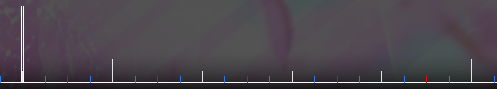

# Beat

A **beat** is a repeating unit of time in music, in particular the pulse of the music to which the listener taps to. In osu!, you can compare them to the white ticks in the [editor timeline](/wiki/Beatmap_Editor/Timelines) which form the backbone of the rhythm of the song.

