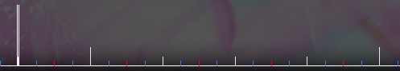

---
tags:
  - beats
  - white line
  - white lines
  - white tick
  - white ticks
  - whole beat
  - whole beats
---

# Beat

**Beat** คือเหตุการณ์หรือหน่วยเวลาที่เกิดซ้ำในดนตรี ซึ่งสร้าง rhythm ที่คนฟังมักเคาะตามหรือพยักหน้าตามได้

Beats มักมีความยาวเท่ากับ quarter note (ขึ้นอยู่กับตัวส่วนของ [time signature](/wiki/Music_theory/Time_signature)) และอยู่ระหว่างเส้นสีขาวสองเส้นที่ติดกันบน[ไทม์ไลน์ beatmap editor](/wiki/Client/Beatmap_editor/Timelines) Beats จำนวนเท่ากันจะถูกรวมเป็น [measures](/wiki/Music_theory/Measure) ซึ่งเริ่มจาก [downbeats](/wiki/Music_theory/Downbeat) ที่แสดงด้วย white ticks ขนาดใหญ่ เวลาระหว่างแต่ละ beat ขึ้นอยู่กับ [tempo](/wiki/Music_theory/Tempo)

โน้ตอื่น ๆ ถูกอธิบายผ่าน beat ด้วยการหารหรือคูณความยาวของมัน [Beat snap divisor](/wiki/Client/Beatmap_editor/Beat_snap_divisor) ของ beatmap editor ทำสิ่งนี้ให้แมปเปอร์โดยอัตโนมัติ ทำให้เปลี่ยนความละเอียดเชิงเวลาได้ทันที

เนื่องจาก beat snap divisor 1/1 ตรงกับ whole beat หนึ่ง beat จึงมักถูกเรียกว่า "1/1" เช่นกัน ครึ่ง beat (eighth note) เรียกว่า "1/2", หนึ่งในสี่ของ beat (sixteenth note) เรียกว่า "1/4" และต่อไปเรื่อย ๆ
