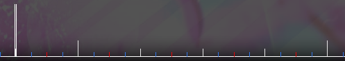

---
tags:
  - beats
  - white line
  - white lines
  - white tick
  - white ticks
  - whole beat
  - whole beats
  - 节拍
  - 白线
  - 整拍
---

# 节拍

**节拍** 是音乐中重复的事件或时间单位，它构成了人们在听歌时会打出或跟着点头的节奏。

节拍的长度通常与四分音符相同（由[拍号](/wiki/Music_theory/Time_signature)分母决定），后者处于[谱面编辑器时间线](/wiki/Client/Beatmap_editor/Timelines)中的相邻白线之间。等量的节拍组成[小节](/wiki/Music_theory/Measure)，小节从[下拍](/wiki/Music_theory/Downbeat)开始，由大白线表示。节拍之间的时间由[曲速](/wiki/Music_theory/Tempo)决定。

其他音符则是对节拍长度进行乘除运算得来。谱面编辑器的[音符时值](/wiki/Client/Beatmap_editor/Beat_snap_divisor)会自动进行这一操作，让谱师能够实时调整时间细分的程度。

1/1 音符时值对应一整拍，因此一拍也常被称作“1/1”，半拍（一个八分音符）被称作“1/2”，四分之一拍（一个十六分音符）被称作“1/4”，诸如此类。
