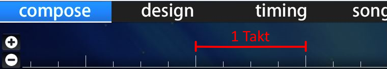

# Takt

Ein **Takt** beschreibt in der Musiktheorie eine einzelne Zeiteinheit, die eine bestimmte Anzahl an [Beats](/wiki/Music_theory/Beat) (vorgegeben von der [Taktart](/wiki/Music_theory/Time_signature)) enthält und in einem bestimmten [Tempo](/wiki/Music_theory/Tempo) gespielt wird.

In der [Zeitleiste des Beatmap-Editors](/wiki/Client/Beatmap_editor/Timelines) entspricht ein Takt der Lücke zwischen zwei großen weißen Strichen.
