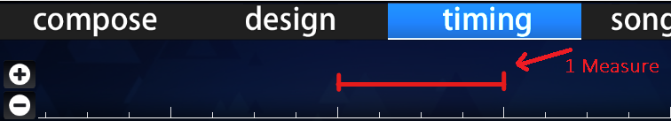

# Compás

Un **compás** en teoría musical se refiere a una sola unidad de tiempo que incluye un número específico de [pulsos](/wiki/Music_theory/Beat) (determinado por la [signatura de compás](/wiki/Music_theory/Time_signature)) tocados a un [tempo](/wiki/Music_theory/Tempo) particular.

En la [línea de tiempo del editor de beatmaps](/wiki/Client/Beatmap_editor/Timelines), un compás se puede identificar como el espacio entre dos marcas blancas grandes.
