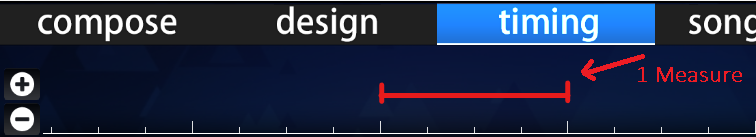

# Measure

**Measure** (หรือ **bar**) ในทฤษฎีดนตรีหมายถึงหน่วยเวลาหนึ่งหน่วยที่มีจำนวน [beats](/wiki/Music_theory/Beat) เฉพาะ (กำหนดโดย [time signature](/wiki/Music_theory/Time_signature)) และเล่นที่ [tempo](/wiki/Music_theory/Tempo) หนึ่ง

ใน[ไทม์ไลน์ beatmap editor](/wiki/Client/Beatmap_editor/Timelines) measure สามารถสังเกตได้จากช่องว่างระหว่าง white ticks ขนาดใหญ่สองจุด
