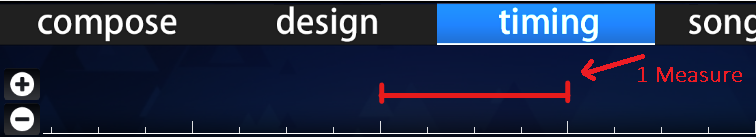

# 小节

在乐理中，一**小节**（**measure**，又称 **bar**）指的是包含一定数量[节拍](/wiki/Music_theory/Beat)（由[拍号](/wiki/Music_theory/Time_signature)决定），并以特定[曲速](/wiki/Music_theory/Tempo)演奏的时间单位。

在[谱面编辑器时间轴](/wiki/Client/Beatmap_editor/Timelines)中，一小节可被看作两条大白线间的间隔。
