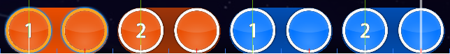

# Syncope

La **syncope** est l'accentuation ou la mise en valeur régulière de notes qui ne le seraient pas normalement. La [signature temporelle](/wiki/Music_theory/Time_signature) d'un morceau de musique indique un [rythme](/wiki/Music_theory/Rhythm) régulier composé de temps forts et de temps faibles, tandis qu'un rythme syncopé va à l'encontre de cette attente en plaçant les accents en dehors des temps forts ou sur les temps faibles. Dans le [beatmapping](/wiki/Beatmapping), la syncope dans une musique peut généralement être observée lorsque les [objets](/wiki/Gameplay/Hit_object) touchés sont régulièrement placés hors du temps plutôt que sur le temps, comme sur les ticks rouges ou bleus de la timeline.

À titre d'exemple, [la difficulté Insane de fanzhen0019 de *Chasers - Lost*](https://osu.ppy.sh/beatmapsets/151114#osu/372628) contient des patterns de [slider](/wiki/Gameplay/Hit_object/Slider) avec des [sliderheads](/wiki/Gameplay/Hit_object/Slider/Sliderhead) à la fois sur le temps et en dehors du temps.

Certains patterns de slider, comme le tout premier, suivent la mélodie du synthétiseur qui est syncopée avec les coups de grosse caisse, se posant sur les ticks rouges de la timeline :

Ceci est contraire aux patterns de slider de la même beatmap qui suivent la percussion, se posant sur des ticks blancs de la timeline :

