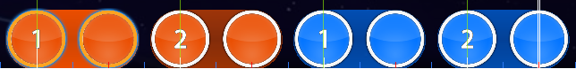

# Syncopation

**Syncopation** คือการใส่ accent หรือเน้นโน้ตอย่างสม่ำเสมอในจุดที่ปกติไม่น่าถูกเน้น [Time signature](/wiki/Music_theory/Time_signature) ของชิ้นดนตรีจะบอกภาพรวมของ pattern [rhythm](/wiki/Music_theory/Rhythm) ปกติที่มี beats แข็งและอ่อน ส่วน rhythm แบบ syncopated จะขัดกับความคาดหวังนี้ด้วยการวาง accents แบบ off-beat หรือบน weak beats ใน[การ beatmapping](/wiki/Beatmapping) syncopation ในเพลงมักเห็นได้เมื่อ [hit objects](/wiki/Gameplay/Hit_object) ถูกวาง off the beat เป็นประจำแทนที่จะอยู่บน beat เช่น บน red หรือ blue timeline ticks

ตัวอย่างง่าย ๆ คือระดับความยาก Insane ของ *Chasers - Lost* โดย [fanzhen0019](https://osu.ppy.sh/beatmapsets/151114#osu/372628) มี patterns [สไลเดอร์](/wiki/Gameplay/Hit_object/Slider) ทั้งแบบ [sliderheads](/wiki/Gameplay/Hit_object/Slider/Sliderhead) ที่อยู่ on-beat และ off-beat

Slider patterns บางชุด เช่นชุดแรกสุด ตาม synth melody ซึ่ง syncopated กับ drum kicks และลงบน red timeline ticks:

สิ่งนี้ตรงข้ามกับ slider patterns ในบีตแมปเดียวกันที่ตาม percussion และลงบน white timeline ticks:

