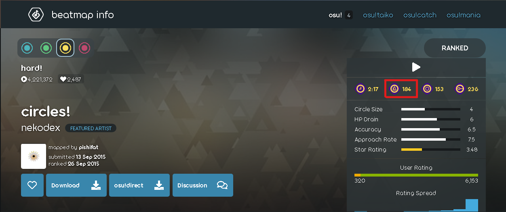

# Tempo

Le **tempo** est la vitesse à laquelle une partie de la musique est jouée et communiquée, mesurée en [beats](/wiki/Music_theory/Beat) par minute (BPM).

Le BPM de la musique d'une beatmap peut-être trouvé sur sa page d'information à côté du symbole de métronome.
