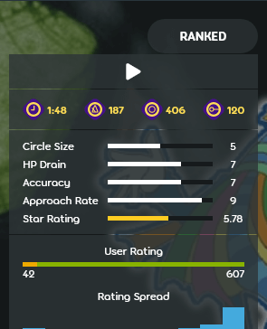

# Tempo

*Voir également : [Timing](/wiki/Beatmapping/Timing)*

::: Infobox

:::

Le **tempo** fait référence à la vitesse d'une musique. Il est généralement mesuré en **battements par minute** (***BPM***), c'est-à-dire le nombre de [battements musicaux entiers](/wiki/Music_theory/Beat) dans une minute. Par exemple, un tempo de 60 battements par minute signifie 1 battement par seconde, tandis qu'un tempo de 120 battements par minute est deux fois plus rapide, signifiant 2 battements par seconde. Le tempo affecte directement de nombreux aspects du jeu, comme le [slider velocity](/wiki/Gameplay/Hit_object/Slider/Slider_velocity), ou la pulsation du [kiai time](/wiki/Gameplay/Kiai_time). Les pages d'information sur la beatmap affichent le tempo à côté du symbole [métronome](https://fr.wikipedia.org/wiki/Métronome), un appareil utilisé par les musiciens pour les aider à jouer en suivant une pulsation régulière.

## Gameplay

De nombreux éléments d'osu! se basent sur le tempo de la musique en cours :

- La vitesse de jeu, due au fait que les musiques au tempo plus élevé ont des [battements](/wiki/Music_theory/Beat) plus courts.
- La valeur de base du [slider velocity](/wiki/Gameplay/Hit_object/Slider/Slider_velocity) dans la vitesse de défilement par défaut [d'osu!](/wiki/Game_mode/osu!) et [osu!mania](/wiki/Game_mode/osu!mania)
- La fréquence de pulsation du [kiai time](/wiki/Gameplay/Kiai_time)
- Le [menu principal](/wiki/Client/Interface#menu-principal) clignote, le cœur du [cookie d'osu!](/wiki/Client/Interface/Cookie) bat, et les étoiles éclatent dans [l'écran de sélection des musiques](/wiki/Client/Interface#sélection-de-la-musique).
- La vitesse du [compte à rebours](/wiki/Beatmap/Countdown)

## Beatmapping

Les [points de timing](/wiki/Client/Beatmap_editor/Timing) utilisent un BPM et un décalage pour permettre le [snapping](/wiki/Beatmapping/Snapping) des [objets](/wiki/Gameplay/Hit_object) sur la [timeline](/wiki/Client/Beatmap_editor/Timelines) lors de la création de beatmaps. Le snapping à la timeline permet de s'assurer que le gameplay s'aligne sur le rythme.

L'onglet [timing](/wiki/Client/Beatmap_editor/Timing) de [l'éditeur de beatmap](/wiki/Client/Beatmap_editor) contient un outil d'estimation du BPM, qui calcule le timing de la beatmap en frappant en même temps que la musique. Les résultats obtenus nécessitent toutefois des ajustements supplémentaires pour être précis.

La plupart des musiques modernes utilisent un seul BPM, ce qui nécessite un seul point de timing. Les musiques plus complexes peuvent nécessiter plusieurs points de timing et des réinitialisations du métronome pour être rythmées correctement. Les points de timing sont représentés par des lignes rouges dans la timeline en bas de l'éditeur.
