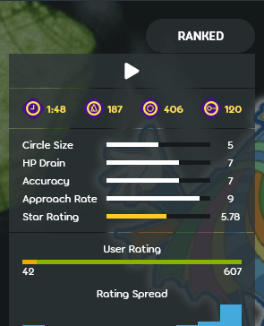

---
tags:
  - BPM
  - tempo
  - beats per minute
---

# Tempo

*ดูเพิ่มเติม: [Timing](/wiki/Beatmapping/Timing)*

::: Infobox

:::

**Tempo** หมายถึงความเร็วของเพลง โดยทั่วไปวัดเป็น **beats per minute** (***BPM***) หรือจำนวน [whole musical beats](/wiki/Music_theory/Beat) ในหนึ่งนาทีของเพลง ตัวอย่างเช่น tempo 60 beats per minute หมายถึงหนึ่ง beat ต่อวินาที ส่วน tempo 120 beats per minute จะเร็วเป็นสองเท่า หรือสอง beats ต่อวินาที Tempo ส่งผลโดยตรงต่อ gameplay หลายด้าน เช่น [slider velocity](/wiki/Gameplay/Hit_object/Slider/Slider_velocity) หรือการกระพริบของ [kiai time](/wiki/Gameplay/Kiai_time) [หน้า beatmap information](/wiki/Beatmap_information) จะแสดง tempo ข้างสัญลักษณ์ [metronome](https://en.wikipedia.org/wiki/Metronome) ซึ่งเป็นอุปกรณ์ที่นักดนตรีใช้ช่วยเล่นให้ตรง pulse ที่สม่ำเสมอ

## Gameplay

องค์ประกอบหลายอย่างใน osu! อิง timing รอบ tempo ปัจจุบันของเพลง:

- ความเร็ว gameplay เพราะเพลงที่ tempo สูงกว่าจะมี [beats](/wiki/Music_theory/Beat) สั้นกว่า
- Base [slider velocity](/wiki/Gameplay/Hit_object/Slider/Slider_velocity) ใน [osu!](/wiki/Game_mode/osu!) และ default scrolling speed ของ [osu!mania](/wiki/Game_mode/osu!mania)
- ความถี่ของการกระพริบ [kiai time](/wiki/Gameplay/Kiai_time)
- แสงกระพริบใน [main menu](/wiki/Client/Interface#main-menu), heartbeat ของ [osu! cookie](/wiki/Client/Interface/Cookie), และ star bursts ใน[หน้าจอเลือกเพลง](/wiki/Client/Interface#song-select)
- ความเร็ว [countdown](/wiki/Beatmap/Countdown)

## Beatmapping

[Timing points](/wiki/Client/Beatmap_editor/Timing) ใช้ BPM และ offset เพื่อให้สามารถ [snapping](/wiki/Beatmapping/Snapping) [hit objects](/wiki/Gameplay/Hit_object) เข้ากับ[ไทม์ไลน์](/wiki/Client/Beatmap_editor/Timelines) ขณะสร้างบีตแมปได้ Timeline snapping ทำให้ gameplay ตรงกับ beat

[แท็บ timing](/wiki/Client/Beatmap_editor/Timing) ของ [beatmap editor](/wiki/Client/Beatmap_editor) มีเครื่องมือประมาณค่า BPM ซึ่งคำนวณ timing ของบีตแมปจากการ tap ตามเพลง อย่างไรก็ตาม ผลลัพธ์ที่ได้มักต้องปรับเพิ่มเติมเพื่อให้แม่นยำ

เพลงสมัยใหม่ส่วนใหญ่ใช้ BPM เดียว ซึ่งต้องใช้ timing point เดียว เพลงที่ซับซ้อนกว่าอาจต้องใช้ timing points หลายจุดและ metronome resets<!-- TODO: link --> เพื่อ timing ให้ถูกต้อง Timing points จะแสดงเป็นเส้นสีแดงในไทม์ไลน์ด้านล่างของ editor
