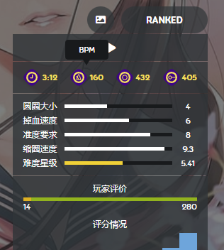

---
tags:
  - BPM
  - tempo
  - beats per minute
  - 每分钟节拍数
  - 节奏
  - 节拍
---

# 曲速

*参见：[测定时间轴](/wiki/Beatmapping/Timing)*

::: Infobox

:::

**曲速** 即歌曲的速度。通常用**每分钟节拍数** (***BPM***)——即一分钟内，歌曲所含的[乐理上一整拍](/wiki/Music_theory/Beat)的数量来衡量它。例如，每分钟 60 拍的曲速代表了每秒一拍，每分钟 120 拍的曲速是之前的两倍之快，即每秒两拍。曲速会直接影响很多游戏元素，比如[滑条速度 (SV)](/wiki/Gameplay/Hit_object/Slider/Slider_velocity)、[Kiai 时间](/wiki/Gameplay/Kiai_time)闪光等。在谱面信息页上，曲速展示在一个[节拍器](https://zh.wikipedia.org/wiki/%E7%AF%80%E6%8B%8D%E5%99%A8)（有助于音乐家按照固定的节奏演奏的设备）标识旁边。

## 游玩

许多 osu! 元素的出现时机、频次或时间轴基于歌曲当前的曲速：

- 因为曲速更快，[节拍](/wiki/Music_theory/Beat)间隔会更短，从而会影响到游玩速度
- [osu!](/wiki/Game_mode/osu!) 的[滑条速度 (SV)](/wiki/Gameplay/Hit_object/Slider/Slider_velocity) 和 [osu!mania](/wiki/Game_mode/osu!mania) 的默认下落速度所参考的基准
- [Kiai 时间](/wiki/Gameplay/Kiai_time)内，闪光的频次
- [主菜单](/wiki/Client/Interface#主菜单)闪光、[osu! 粉饼](/wiki/Client/Interface/Cookie)的搏动效果、[选歌界面](/wiki/Client/Interface#选歌界面)的喷星效果
- [倒计时](/wiki/Beatmap/Countdown)速度

## 作图

在创建谱面时，确定 BPM 和偏移值的[时间点](/wiki/Client/Beatmap_editor/Timing)能保证[打击物件](/wiki/Gameplay/Hit_object)能[对齐](/wiki/Beatmapping/Snapping)到[时间线](/wiki/Client/Beatmap_editor/Timelines)上。这能保证玩家能跟着节拍游玩。

[谱面编辑器](/wiki/Client/Beatmap_editor) 的 [测定时间轴 (Timing) 标签页](/wiki/Client/Beatmap_editor/Timing)包含了一个用于估计 BPM 的工具，可以让谱师跟着歌曲的节拍点击来测定谱面的时间轴。然而，所获得的结果通常需要更进一步调整，才能精确无误。

大多数现代歌曲只含有一个 BPM，一个时间点就能确定时间轴。更复杂歌曲的时间轴可能需要多个计时点、多次重置节拍器<!-- TODO: link --> 才能正确展现。在谱面编辑器底部的时间轴上，时间点通常显示为一根红线。
