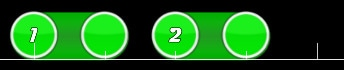
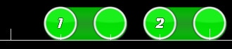
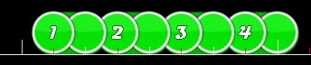
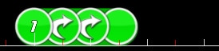
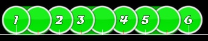
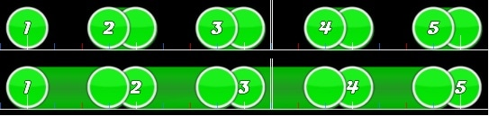
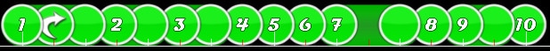

# Théorie de la musique

*[Le guide original par ziin](https://osu.ppy.sh/community/forums/topics/58959)*

Osu! est un jeu de rythme, les beatmaps sont donc normalement créées pour s'adapter à la musique plutôt qu'au BPM. Dans cette courte rédaction je discuterais de la théorie de la musique et comment elle s'applique à une beatmap osu!, ainsi que d'expliquer pourquoi certaines choses sonnent mal (du moins pour moi). En aucun cas, les sujets abordés ne peuvent être considérés comme des «lignes directrices». Pensez que c'est une théorie à la place.  La plupart du temps, ils s'appliquent à certaines parties des chansons, mais il existe de nombreuses exceptions. Tout ce que je dirais ici est une opinion personnelle basée sur mes 12 ans d'expérience dans un orchestre harmonique ou pris directement de Wikipedia. On ne peut pas l’appliquer à toutes les formes de musique, en particulier celles d’avant-garde et la plupart des musiques de Touhou (donc, la moitié des musiques d'osu ?).

## Partie 1: Explication des temps et certaines techniques courantes

### Temps forts

Le temps fort est l'impulsion qui se produit au début d'une mesure dans la musique mesurée. Son nom vient du coup de bâton du chef d'orchestre dirigé vers le bas sur le premier temps de chaque mesure. Il porte souvent l'accent le plus fort du cycle rythmique.

### Temps faibles

Les temps faible sont généralement les temps pairs. Par exemple dans une mesure à 4/4, ce sont les temps 2 et 4… Dans la musique populaire d'aujourd'hui, la caisse claire est généralement utilisée sur les temps faibles. C'est pourquoi mettre des applaudissements sur les temps 2 et 4 *semble bien*. Certaines chansons rallongent même le deuxième temps d'un demi-temps (ce qui donne les temps 2 et 3,5).

### Sauter un temps

C'est là que le temps fort (généralement) est omis. Sauter un temps dans une chanson rapide peut faire monter la tension. Souvent, seul un instrument particulier perd le rythme, alors que les autres jouent normalement. Abandonner le rythme peut être un moyen intéressant de construire un rythme, mais il ne faut pas en abuser. Une autre façon de simuler cela consiste à utiliser des sliders décalés.

## Partie 2: Sliders

### Sliders des temps forts

C'est les sliders les plus communs que vous pouvez trouver. Ils sont facile à jouer, à prédire et parfois fades. Les notes où les sliders commencent aux temps 1 et 3, qui sont les temps forts.

### Sliders des temps faibles

C'est la façon dont je les appelle. Les sliders qui commencent au temps 4 ont un sérieux problème : si c'est un slider 1/1, il *finira* sur le temps fort.  Ils laissent le temps fort sans stress, et peuvent sembler étrange à jouer, surtout lorsqu'ils sont répétés.

### Sliders décalés

J'appelle comme cela les sliders qui commencent sur des ticks rouges décalés. Ceux-ci sont particulièrement dangereux car ils vous laissent généralement sans battement régulier. Essayez d'éviter de les répéter, car ils souffrent également des mêmes problèmes que les sliders des temps faibles.

### Sliders répétés

La répétition de sliders peut être très intéressante, mais souvent, les utilisateurs ajoutent plusieurs répétitions. Je considère que la répétition de sliders comportant plus d'une répétition est source de confusion, car souvent la 4ème répétition n'apparaît que lorsque vous avez déjà appuyé sur le slider. Les sliders courts et les sliders longs ne posent pas ce problème car ils peuvent généralement être facilement prédits, et les sliders longs vous donnent le temps de réagir. Il existe très peu de cas où un slider répété 2 fois fonctionne mieux que 2 sliders normaux ou 4 cercles.

Une exception évidente concerne les streams longs où un slider de répétition remplace 4 cercles. C'est probablement mieux que d'utiliser des sliders à une répétition.

### Patterns de slider

Alterner cercle, slider, cercle, slider est une manière élégante de mapper des rythmes en demi-notes en pointillés (c.-à-d. les rythmes 1 et 1/2) car elle met l’accent sur le slider, qui est généralement la note accentuée. Personnellement, j'adore ces rythmes et je les préfère aux slider à une répétition. Vous pouvez également faire cercle cercle slider slider cercle slider, etc ... C’est aussi simple que de mélanger un rythme 1/1 ou 1/2 en accentuant certaines notes en utilisant des sliders à différents endroits.

### Sliders courts vs sliders longs

Les sliders sur osu! ressemblent plus à une note maintenue dans la musique puisque les spinners sont rarement utilisés et les cercles n’ont pas de longueur. Dans cet exemple, vous pouvez voir comment les sliders courts placent la note que le joueur doit frapper sur une note au 1/4. Non seulement cela n’est pas intuitif car il n’y a rien à frapper sur le temps, mais si vous utilisez de longs sliders, le son sera le même, la frappe sur le temps et suivra probablement mieux la musique. En général, les sliders courts sont une mauvaise idée. L'inverse est vrai pour les très longs sliders, mais en général uniquement parce qu'ils finissent par passer sur des parties importantes de la chanson ou sont simplement ennuyeux. Il existe de nombreuses exceptions, en particulier si le rythme se répète et si une variation est nécessaire dans la beatmap.

### La chose la plus importante à retenir

La plupart des musiques fonctionnent par groupes de 2 ou 4. 4 temps à la mesure, 4 mesures à la phrase, etc. Tant que vous placez un début de spinner ou un cercle sur le temps fort (long tick blanc) et parfois au milieu de la phrase, vous pouvez insérer n'importe quel nombre de sliders des temps faibles ou décalés avec des patterns de sliders fous, des sliders courts stupides et des stream stupides sur la map, même si cela ne correspond pas à la chanson. Je suis sérieux. Ce n’est évidemment pas tout à fait recommandé, car vous pouvez alors copier n'importe quel morceau avec le même BPM et la même structure, le copier / coller et obtenir la même carte de qualité médiocre. Il est également important de mapper sur la musique, mais la plupart des musiques se répètent encore et encore, il est donc bon d’apporter quelque chose de différent de temps en temps.

Vous devez déjà savoir que lorsque vous jouez la ligne de basse avec n'importe quel instrument, vous pouvez créer presque *n'importe quel* rythme et jouer *n'importe* quelle note, à condition de jouer le temps fort de chaque mesure. C'est dire à quel point le temps fort est important. De toute évidence, ce n’est pas toujours parfait, mais au moins, il est acceptable.

Les chansons qui utilisent uniquement des sliders de temps forts sont vouées à être ennuyeuses, alors assurez-vous d’improviser vos rythmes.

## Partie 3: Overmapping

Pour moi, l'[overmapping](/wiki/Glossary) est le fait de placer une note ou la fin d'un slider où une note n'existe pas dans le fond. Il y a plusieurs raisons d'overmapper :

- Le rythme est trop difficile à jouer normalement/être fun.
  - Cela arrive souvent avec des chansons qui utilisent des triolets dans une partie en 1/6, et le mappeur le simplifie en 1/4.
- La musique de fond accélère ou ralentit et s'éloigne trop de ce qu’elle devrait être.
  - Cela ne se produit généralement pas et vous ne devez généralement pas mapper des parties non capturées correctement.
- La chanson swing, mais le mappeur déteste 1/6.
  - Je ne considère pas cela comme une excuse valable et votera 1 automatiquement.
- La chanson est ennuyeuse et a besoin de rythmes inventés pour rester intéressante.

Si vous vous reconnaissez dans un des points ci-dessus, alors vous mappez probablement mal.

Si vous voulez vraiment overmapper quelque chose pour des raisons de difficulté / plaisir (l'excuse la plus courante), assurez-vous qu'il n'y ait pas un autre moyen de mapper correctement les notes (par exemple, en utilisant un slider répétitif). Mapper un roulement en 1/6 avec un slider répétitif de 1/4 ou 1/8 est tout simplement faux. Ils se jouent tous à l'identique, et la seule différence est la façon dont ils sonnent et l'impact sur le score.
