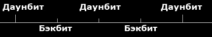

# Теория музыки

Часть статьи основана на [гайде от ziin](https://osu.ppy.sh/community/forums/topics/58959), а также на материалах сайта [music-theory.ru](https://music-theory.ru).

osu! является прежде всего ритм-игрой, и в своих картах Вы должны следовать музыке, а не просто подгонять объекты под некоторый [темп](/wiki/Glossary). В этой небольшой статье будет описана упрощённая теория музыки (применительно к osu!) и будет объяснено, почему одни способы расстановки объектов дают при игре худшее чувство ритма, чем другие.

## Вступление

### Размер такта

Музыка состоит из повторяющихся частей, называемых тактами. На картинке справа представлен такт размера 4/4: первое число означает, что он состоит из 4 сильных, акцентированных нот, а второе — что каждая из этих нот равна по длине т.н. *четвертной* ноте. Понятие единичной, половинной, четвертной и т.д. нот вводится для того, чтобы их можно было сравнивать по длине и определять, во сколько раз каждая нота (звук) длится дольше другой.

**Важное примечание:** в мире osu! **четвертная нота — это белый тик**, и она обозначается не 1/4, а **1/1**, поскольку именно на её основе строятся все остальные длины нот (см. раздел ниже). Нота также называется битом (единственное число — бит, англ. *beat* — удар).

Не стоит воспринимать фразу «такт состоит из N нот» буквально: учитываются только сильные (см. далее) ноты, те, которые являются основой музыки и на которых строится вся композиция. Разумеется, расстояние между двумя соседними нотами можно разделить на 2, 3, 4, 6 и так далее частей, на границу каждой из которой удастся поставить новую ноту. Данный процесс можно наблюдать, например, в редакторе при передвижении слайдера в правом верхнем углу (он называется [Beat Snap Divisor](/wiki/Beatmap_Editor/Beat_Snap_Divisor), в русском варианте — [шаг временной шкалы](/wiki/Beatmap_Editor/Beat_Snap_Divisor)).

Существуют ли такты других размеров? Безусловно! В настоящей теории музыки их множество, однако бо́льшую часть времени Вы будете иметь дело только с 4/4. Следом по популярности идёт размер такта 3/4, когда самая сильная нота будет появляться каждый третий раз, ну а дальше начинается различная экзотика. Впрочем, если Вы решите начать мапать брейккор, например, [Venetian Snares](https://osu.ppy.sh/beatmapsets/243485) (данная ссылка ведёт на карту "My So-Called Life"), то столкнётесь с нестандартными размерами гораздо раньше (см. упомянутую карту, момент времени 04:33:995).

Стоит также упомянуть неполный такт, или т.н. затакт, обычно являющийся вступлением к песне. [Пример затакта (первые две ноты)](https://music-theory.ru/sound/PP/19/19_ex3.mp3).

### Длительность нот

Под длиной понимается время между двумя нотами, или время между началом и концом звука, т.е. его длина. Таким образом, первое число в обозначении будет зависеть от того, сколько длится звук.

- Белые тики — 1/1 (единичная нота)
- Красные тики — 1/2 (половинная нота)
- Синие тики — 1/4 (четвертная нота)
- Жёлтые тики — 1/8
- Серые тики — 1/16

Отдельно идут ноты, получающиеся из деления единичной на количество частей, кратное 3:

- Фиолетовые тики — 1/3
- Коричневые тики — 1/6
- Серые тики — 1/12

## Характер и виды нот

### Сильная доля

**Сильная доля** (англ. downbeat или upbeat) — это акцентированная нота, зачастую обозначающая начало новой части (такта) в музыке. Её английское название (downbeat) связано с нисходящим жестом дирижёра на первой доле каждого такта. Как следует из названия, на акцентированную ноту обращается больше внимания за счёт её выделения среди остальных.

Чтобы понять, как звучат сильные доли, взгляните на изображение справа, а затем [прослушайте музыкальный фрагмент](https://www.music-theory.ru/sound/PP/19/19_ex2.mp3). Под каждой из акцентированных нот расположен символ /\\ или >.

В терминологии osu! сильной доле соответствуют белые тики:

- 1 и 3 **белый** тик такта — даунбит (downbeat).
- 2 и 4 **белый** тик такта — апбит (upbeat).

Именно за счёт того, что менее сильная доля (upbeat) очень часто выпадает на 2-ю и 4-ю ноту в такте, на эти ноты удобно ставить хлопки, чтобы в некотором роде сбалансировать композицию и придать апбиту силу с помощью хлопков.

### Слабая доля

**Слабая доля** (англ. offbeat): как следует из названия, у ноты, которой соответствует данная доля, нет акцента, и она ощущается заметно слабей своего окружения. В упомянутом выше музыкальном фрагменте каждая вторая нота является слабой. В терминологии osu! слабой доле соответствуют все остальные тики: 1/2, 1/3, 1/4, ...

## Техники

### Пропуск ноты

Под пропуском ноты понимается не только, собственно, сам пропуск, но еще и одновременное выделение ноты данного инструмента среди остальных. Случается так, что один конкретный инструмент делает паузу, а остальные продолжают играть. Таким образом, в музыке с быстрым темпом создается напряжение, ощутить которое можно после появления следующей за паузой ноты.

Пропуск ноты является неоднозначной техникой, применение которой зависит от песни и от того, какой именно инструмент играет ведущую партию. Если Вы будете пропускать ноты «на ровном месте», т.е. там, где на самом деле по ощущениям они должны идти непрерывно, никакого напряжения не будет, а вместо него появятся странные и зачастую неудобные паузы. Неудобство проявится потому, что Ваша карта перестала следовать музыке, но инструмент всё играет.

### Удвоение или уполовинивание BPM

Зачастую бывает так, что попытка определить BPM песни даёт неоднозначные результаты. Сильные ноты слышны, но до конца не понятно, можно ли принять каждую из них за единичную? Ведь, помимо сильных, есть ещё и слабые ноты, и их иногда хватает с избытком.

Объясним данную технику на примере карты [Amane — Purity Red](https://osu.ppy.sh/beatmapsets/121064). Посмотрев на страницу BSS, Вы можете убедиться, что BPM (темп) песни равен **70**. При данной настройке автор посчитал, что такт состоит из 4 сильных единичных нот, которые Вы можете услышать на превью:

- глухой звук — рассыпчатый звук — глухой звук — рассыпчатый звук

Тем не менее, такт можно воспринять по-другому:

- глухой звук — **(нет звука)** — рассыпчатый звук — **(нет звука)**

При таком варианте восприятия считается, что каждый сильный звук на самом деле в 2 раза короче, а часть звуков просто *пропущена*. Таким образом, длительность такта тоже сокращается в 2 раза, а поскольку более короткому такту соответствует более быстрый темп, BPM музыки будет равен **140**.

---

Копья в данном споре ломаются уже несколько лет, соглашение не достигнуто до сих пор. Хотя выставление более быстрого BPM в основном используется при оправдывании избытка нот в карте, оно может быть более верным с точки зрения логики. Действительно, если отбросить сильные доли, можно ориентироваться на вторичные звуки, обилие (и распределение) которых могут сооветствовать быстрой песне.

С другой стороны, если считать, что размер такта определяется частотой появления самой сильной ноты, а также количеством остальных сильных нот, то вполне естественно считать, что BPM песни будет относительно низким.

Какой дорогой идти? Решать Вам. Что при «половинном», что при «удвоенном» BPM песню можно замапать как одинаково быстро, так и одинаково медленно, в зависимости от намерений маппера.

### Овермаппинг

Если представить, что хитсаунды osu! — дополнительный инструмент, которым можно подыгрывать песне, становится возможным использование таких приёмов, как андермаппинг и овермаппинг.

**Овермаппинг** (overmapping) — намеренное добавление нот в osu! туда, где нет звуков в музыке, или (в альтернативной трактовке) где звуки невероятно слабы. Первоначально овермаппинг использовался для того, чтобы заполнить место слабых нот в энергичных песнях и тем самым поддержать общий ритм песни или карты. Одним из наиболее распространённых применений было добавление триплета (трёх нот) для поддержки ритма, в результате чего позиции песни, где триплеты были на самом деле, сливались с теми, где триплеты были расставлены маппером.

В дальнейшем овермаппингом стали пользоваться более активно, создавая и поддерживая «свой» ритм, идущий параллельно, но иногда — дополняющий песню.

Плох ли овермаппинг? «Не просто плох, отвратителен! Вы что, с ума сошли? osu! — **ритм-**игра, музыка не просто так фоном играет!» — воскликнул бы автор этих строк и тем самым продемонстрировал бы свою предвзятость. Овермаппинг можно использовать как во вред песне, захламляя её в попытках следовать всему сразу множеством нот, не имеющих отношения ни к ведущей партии песни, ни вообще к каким-то звукам в музыке. Но с помощью овермаппинга можно и заполнить провалы в расположении нот, поддержать игрока, разнообразить процесс игры.

### Андермаппинг

**Андермаппинг** (undermapping) — намеренный пропуск нот в osu! там, где есть звуки в музыке. По аналогии с обычным пропуском нот, Вы можете использовать этот приём для того, чтобы разнообразить ритм своей карты и выделить один из инструментов, заставив игрока прислушиваться к нему. Злоупотребление этим приёмом может привести к потере изначального ритма.

## Слайдеры

Слайдеры делятся на виды, в зависимости от того, на каком именно бите они начинаются.

### Даунбит

Даунбит-слайдеры начинаются с первой или третьей ноты такта. Они являются наиболее популярными в маппинге за счёт их интуитивности и простоты восприятия. Игрок нажимает на начало слайдера при звучании сильной, акцентированной ноты и тем самым подыгрывает песне.

### Апбит или бэкбит

Апбит-слайдеры начинаются со второй или четвёртой ноты в такте. Несмотря на то, что эта нота традиционно менее сильна, чем даунбит, они тоже зачастую хорошо играются при достаточно малой длине (см. ниже, почему).

### Оффбит

Оффбит-слайдеры начинаются со всех остальных нот, т.е. с красных (чаще всего), синих и других тиков временно́й шкалы.

Здесь-то и появляется проблема, которой подвержены карты как новичков, так и уже освоившихся, а иногда — даже опытных мапперов. Слайдеры данного вида очень, просто невероятно часто **заканчиваются** на сильной ноте, тем самым закрывая её от игрока и мешая ему подыграть музыке. При достаточном количестве таких слайдеров создаётся странное ощущение, как будто карта что-то упускает. И действительно, она упускает из виду сильные биты, на которых строится песня и которые **должны** быть выделены, потому что им соответствуют сильные, акцентированные ноты в музыке.

Наихудшей разновидностью данной ошибки является пропуск начала такта, которое соответствует большому белому тику временной шкалы. Несмотря на то, что не все такты ~~одинаково полезны~~ начинаются одинаково сильно, в отдельных случаях закрытым оказывается невероятно сильный звук, обозначающий, к примеру, начало припева или другой важной части песни, которую необходимо выделить новым объектом, а не тем, что Вы заставите игрока отпустить клавишу.

Если Вы заметили в своей карте слайдеры, кончающиеся на больших белых тиках, постарайтесь от них избавиться, чтобы на большом белом тике находилось **начало** объекта, а не его конец.

### Слайдеры с повторами

Слайдер с более чем одним повтором (реверс-стрелкой).

От длины слайдера с повторами зависит то, насколько он хорошо читается. На более длинных слайдерах у игрока есть время среагировать на появившуются стрелку и приготовиться к смене направления. На коротких слайдерах двигать курсор необязательно, поскольку он остаётся на шарике слайдера и не может «слететь». Таким образом, самыми проблемными являются «средние» по длине слайдеры.

Количество повторов также влияет на читаемость. Среагировать на один повтор проще всего, а дальше начинаются проблемы. Несколько повторов традиционно используется либо на очень коротких, так называемых **кикслайдерах,** которые (при неинтуитивном числе повторов) можно отпустить слишком рано, либо на средних слайдерах, когда на повтор можно не успеть среагировать: слайдер кажется таким же, как его окружение.

Практически всегда слайдер с несколькими повторами можно заменить на несколько обычных слайдеров (иногда — в объединении с нотами), и получившаяся группа будет более динамичной и легко воспринимаемой, интуитивной. Старайтесь минимизировать количество повторов, либо — для коротких кикслайдеров — подобрать длительность слайдера под единичную ноту (белый тик). Например, для 1/4 слайдеров (длиной с синий тик) это будет 3 повтора, чтобы каждый следующий слайдер или объект начинался с интуитивно понятного белого тика.

### Cлайдеры: короткие или длинные?

В большинстве случаев всё зависит от песни, на которую Вы делаете карту, но обычно средние и длинные слайдеры играются лучше коротких. На картинке справа оба варианта звучат одинаково, но воспринимаются по-разному. В первом случае игроку приходится нажимать на синем тике, тем самым пытаясь поймать слабую ноту. Сильная же нота не только остаётся без внимания (поскольку она закрыта концом слайдеров), но и сбивает с толку, продолжая поддерживать ритм, которому не следует карта.
