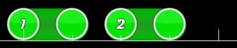
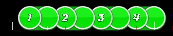
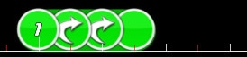
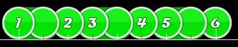
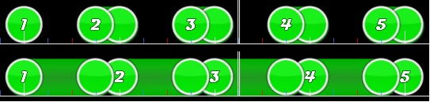

# Music theory

*[คู่มือต้นฉบับโดย ziin](https://osu.ppy.sh/community/forums/topics/58959)*

osu! เป็นเกมดนตรีเป็นหลัก และโดยปกติบีตแมปจะถูกสร้างจากแนวคิดว่าแมปควรเข้ากับเพลง มากกว่าจะเข้ากับ BPM ใด BPM หนึ่ง ในบทความสั้นนี้ ฉันจะพูดถึงทฤษฎีดนตรีในมุมที่ใช้กับบีตแมป osu! รวมถึงอธิบายว่าทำไมบางอย่างถึงฟังดูไม่ดี (อย่างน้อยก็สำหรับฉัน) เรื่องที่พูดถึงตรงนี้ไม่ควรถูกมองว่าเป็น "guidelines" แต่อย่างใด ให้คิดว่ามันเป็นทฤษฎีแทน ส่วนใหญ่จะใช้ได้กับบางช่วงของเพลง แต่ก็มีข้อยกเว้นมากมาย ทุกอย่างที่ฉันพูดตรงนี้เป็นความเห็นส่วนตัวจากประสบการณ์วง concert band มากกว่า 12 ปี หรือดึงมาจาก Wikipedia โดยตรง มันใช้ไม่ได้กับดนตรีทุกรูปแบบ โดยเฉพาะแนว avant-garde และเพลง Touhou ส่วนใหญ่ (ก็ครึ่งหนึ่งของ osu! แล้วมั้ง?)

## Part 1: Breakdown of common time and techniques

### Downbeat, onbeat

Downbeat คือแรงกระตุ้นที่เกิดขึ้นตอนเริ่มต้น bar ในดนตรีที่มีการนับห้อง ชื่อนี้มาจากจังหวะที่ผู้กำกับหรือ conductor กด baton ลงบน beat แรกของแต่ละ measure มันมักเป็นจุดที่มี accent แข็งที่สุดในรอบ rhythm

### Backbeat, upbeat, sometimes called offbeat

Back beat หรือ backbeat คือการเน้นแบบ syncopated บน beat ที่เป็น "off" ใน rhythm 4/4 แบบง่าย ๆ ตรงนี้คือ beats 2 และ 4 ในเพลงยอดนิยมปัจจุบัน snare drum มักถูกใช้เล่น pattern backbeat นี่คือเหตุผลที่การใส่ claps บน beats 2 และ 4 *ฟังดูดี* เพลงร่วมสมัยส่วนใหญ่ใช้ snare backbeat บางเพลงจะเพิ่ม kick เข้าไปใน backbeat ด้วยการขยับ beat ที่สองขึ้นไปครึ่ง beat (จึงเป็น beats 2 และ 3.5)

### Dropping the beat

นี่คือจุดที่ downbeat (โดยปกติ) ถูกละออกหรือ dropped ในเพลงเร็ว การ dropping the beat มักสร้าง tension บ่อยครั้งมีเพียงเครื่องดนตรีหนึ่งชนิดเท่านั้นที่ drop beat ในขณะที่เครื่องอื่นเล่นตามปกติ Dropping the beat เป็นวิธีที่น่าสนใจในการสร้าง rhythm แต่ไม่ควรใช้มากเกินไป อีกวิธีในการจำลองสิ่งนี้คือใช้ upbeat หรือ offbeat sliders

## Part 2: Sliders

### Onbeat sliders

นี่คือสไลเดอร์ที่พบได้บ่อยที่สุด เล่นได้ดี คาดเดาง่าย และบางครั้งก็จืดไปหน่อย สังเกตว่าสไลเดอร์เริ่มที่ beats 1 และ 3 ซึ่งเป็น downbeats

### Upbeat sliders

นี่คือชื่อที่ฉันชอบเรียกมัน สไลเดอร์ที่เริ่มบน beat 4 มีปัญหาร้ายแรงอย่างหนึ่ง: ถ้ามันเป็นสไลเดอร์ 1/1 มันจะ *จบ* บน downbeat ทำให้ downbeat ไม่ถูกเน้น และอาจเล่นแล้วขัด โดยเฉพาะเมื่อใช้ซ้ำ ๆ

### Offbeat sliders

ฉันเรียกสไลเดอร์ที่เริ่มบน red ticks ว่า offbeat สไลเดอร์เหล่านี้อันตรายเป็นพิเศษ เพราะโดยปกติมันทำให้คุณไม่มี beat ที่มั่นคง ควรหลีกเลี่ยงการใช้ซ้ำ เพราะมีปัญหาแบบเดียวกับ upbeat sliders

### 2x+ Repeating sliders

Repeating sliders อาจน่าสนใจมาก แต่บ่อยครั้งคนจะเพิ่ม repeats หลายครั้งเข้าไป ฉันมองว่าสไลเดอร์ที่มี repeat มากกว่า 1 ครั้งมักทำให้สับสน เพราะหลายครั้ง repeat ที่ 4 จะยังไม่แสดงจนกว่าคุณจะกดสไลเดอร์นั้นไปแล้ว สไลเดอร์สั้นและสไลเดอร์ยาวไม่มีปัญหานี้ เพราะสไลเดอร์สั้นมักคาดเดาได้ง่าย และสไลเดอร์ยาวให้เวลาตอบสนองพอ มีไม่กี่กรณีที่สไลเดอร์ 2x repeating ทำงานได้ดีกว่าสไลเดอร์ปกติ 2x หรือ circles 4 ตัว

ข้อยกเว้นที่เห็นชัดคือใน streams ยาวที่ใช้ repeating slider แทน circles 4 ตัว แบบนี้น่าจะดีกว่าการใช้ 1x repeating sliders

### Slider patterns

การสลับ circle, slider, circle, slider เป็นวิธีแมป dotted half note rhythms (เช่น rhythms แบบ 1 และ 1/2) ที่ดี เพราะมันใส่ stress ไว้บนสไลเดอร์ ซึ่งมักเป็นโน้ตที่ถูกเน้น ฉันชอบ rhythms แบบนี้มาก และชอบมากกว่า 1x repeating sliders คุณยังทำ circle circle slider circle slider slider ฯลฯ ได้ด้วย มันง่ายเหมือนการผสม rhythm 1/1 หรือ 1/2 ตรง ๆ โดยเน้นโน้ตบางตัวด้วยสไลเดอร์ในตำแหน่งต่าง ๆ

### Short Sliders vs Long sliders

สไลเดอร์ใน osu! คล้ายกับ held note ในดนตรีมากที่สุด เพราะสปินเนอร์ไม่ค่อยถูกใช้ และ circles ไม่มีความยาว ในตัวอย่างนี้จะเห็นว่าสไลเดอร์สั้นทำให้โน้ตที่ผู้เล่นต้องกดอยู่บนโน้ต 1/4 ไม่ใช่แค่ไม่เป็นไปตามสัญชาตญาณเพราะไม่มีอะไรให้กดบน beat แต่ถ้าใช้สไลเดอร์ยาวแทน มันจะให้เสียงเหมือนกัน กดบน beat และน่าจะตามเพลงได้ดีกว่า โดยทั่วไป สไลเดอร์สั้นเป็นไอเดียที่ไม่ดี ส่วนสไลเดอร์ที่ยาวมากก็มีปัญหาตรงกันข้าม แต่โดยปกติเพราะมันมักลากผ่านส่วนสำคัญของเพลงหรือแค่น่าเบื่อ มีข้อยกเว้นมากมาย โดยเฉพาะถ้า rhythm ซ้ำและบีตแมปต้องการความหลากหลาย

### สิ่งสำคัญที่สุดที่ต้องจำ

ดนตรีส่วนใหญ่ทำงานเป็นกลุ่ม 2 หรือ 4 เช่น 4 beats ต่อ measure, 4 measures ต่อ phrase ฯลฯ ตราบใดที่คุณวางจุดเริ่มสไลเดอร์หรือ circle บน downbeat (long white tick) และบางครั้งบนกลาง phrase คุณสามารถใส่ upbeat หรือ offbeat sliders จำนวนเท่าไรก็ได้ พร้อม slider patterns ประหลาด ๆ, สไลเดอร์สั้นแปลก ๆ และ streams ที่ดูบ้าบอในแมป แม้มันจะไม่เข้ากับเพลง ฉันพูดจริงนะ แน่นอนว่าไม่ได้แนะนำทั้งหมด เพราะถ้าอย่างนั้นคุณก็เอาเพลงใดก็ได้ที่มี BPM และโครงสร้างเพลงเหมือนกันมา copy/paste แล้วได้แมปคุณภาพต่ำแบบเดิม การแมปตามเพลงก็สำคัญ แต่ดนตรีส่วนใหญ่ก็ซ้ำไปซ้ำมาอยู่แล้ว จึงเป็นเรื่องดีที่จะใส่อะไรที่แตกต่างเป็นครั้งคราว

เป็นเรื่องที่รู้กันทั่วไปว่าเมื่อเล่น bass line ด้วยเครื่องดนตรีใด ๆ คุณสามารถแต่ง rhythm แทบ *อะไรก็ได้* และเล่นโน้ต *อะไรก็ได้* ตราบใดที่คุณเล่น downbeat ในแต่ละ measure ให้อยู่ใน key นั่นคือความสำคัญของ downbeat แน่นอนว่ามันไม่ได้สมบูรณ์แบบเสมอไป แต่อย่างน้อยก็ยอมรับได้

เพลงที่ใช้แต่ onbeat sliders ถูกกำหนดให้ต้องน่าเบื่อ ดังนั้นอย่าลืม improvise rhythms ของคุณ

## Part 3: Overmapping

นิยามของฉันสำหรับ [overmapping](/wiki/Beatmapping/Overmapping) คือการวางโน้ตหรือ slider end ในจุดที่ไม่มีโน้ตอยู่ในเสียงพื้นหลัง มีเหตุผลอยู่ไม่กี่อย่างที่จะ overmap:

- Rhythm ยากเกินไปสำหรับการเล่นปกติ/เล่นสนุก
  - สิ่งนี้มักเกิดกับเพลงที่ใช้ triplets ใน snap 1/6 แล้วแมปเปอร์ simplify เป็น 1/4
- เพลงพื้นหลังเร่งหรือช้าลง และต่างจากตำแหน่งที่ควรจะเป็นอย่างชัดเจน
  - ปกติสิ่งนี้ไม่ค่อยเกิด และโดยทั่วไปคุณไม่ควรแมปส่วนที่ snap ไม่ถูกต้อง
- เพลงอยู่ใน swing time signature แต่แมปเปอร์เกลียด 1/6
  - ฉันไม่ถือว่านี่เป็นข้อแก้ตัวที่ถูกต้อง และจะ vote 1 อัตโนมัติ
- เพลงน่าเบื่อและต้องการ rhythms ที่แต่งขึ้นมาเพื่อให้มันน่าสนใจ

ถ้าเป็นแบบนั้น มีโอกาสสูงว่าคุณกำลังแมปผิด

ถ้าคุณอยาก overmap จริง ๆ ด้วยเหตุผลเรื่องความยาก/ความสนุก (ข้ออ้างที่พบบ่อยที่สุด) ให้แน่ใจว่าไม่มีวิธีอื่นในการแมปโน้ตให้ถูกต้องแล้ว (เช่น ใช้ repeating slider) การแมป roll snap 1/6 ด้วย repeating slider 1/4 หรือ 1/8 นั้นผิดแบบชัดเจน ทั้งหมดเล่นเหมือนกัน และต่างกันแค่เสียงกับผลต่อ score
