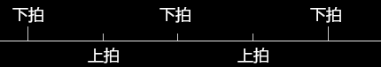
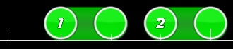
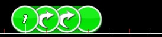
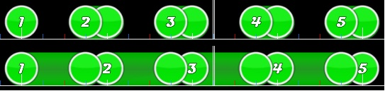

# 音乐理论

*[原指南帖，作者 ziin](https://osu.ppy.sh/community/forums/topics/58959)*

osu! 主要是一款音乐游戏，在制作谱面时，通常以契合音乐为出发点，而非单纯匹配特定的 BPM。在这篇短文中，我会讨论音乐理论在 osu! 谱面中的应用，同时也会解释为什么某些东西听起来很别扭（至少对我来说如此）。本文讨论的内容绝不可被视作“准则”；相反地，请将其视作理论。大多数时候，它们可以完美符合乐曲的某些部分，但也有很多例外。我在这里讲述的所有内容均为个人观点，其基于我十二余年管乐团演奏的经验，或是直接从维基百科引用而来。它不适用于所有形式的音乐，尤其是先锋音乐与多数东方音乐（大概囊括里 osu! 的一半曲库？）。

## 第一部分：常见节拍与技巧解析

### 下拍，正拍

下拍 (Downbeat) 指在有节拍的音乐中，小节开头出现的动力。它的名字来源于指挥在每小节的第一拍时，向下挥动指挥棒的动作。它通常承载着节奏周期的最强重音。

### 反拍，上拍

反拍 (Backbeat) 指位于“非正拍”的切分重音。在简单的 4/4 节奏中，反拍对应第 2 拍与第 4 拍...在当今的流行音乐中，通常会用小军鼓演奏反拍节奏型。这也就是把拍手声放在第二拍与第四拍*听感很好*的原因。多数当代音乐会使用军鼓反拍。部分乐曲会将第二个反拍提前半拍（也就是第 2 拍与第 3.5 拍），来增强反拍力度。

### 省略强拍

这（通常）指的是省略或跳过下拍。在节奏较快的乐曲中省略强拍，通常能营造出张力。一般情况下，只有特定的一种乐器会省略强拍，而其他乐器照常演奏。省略强拍是一种构建节奏的有趣方式，但不应被过度使用。模拟这种效果的另一种方法是使用上拍或离拍滑条。

## 第二部分：滑条

### 强拍滑条

这种滑条是最常见的，手感好，易于预测，有时也很平淡。注意滑条是如何从第一拍与第三拍开始的，这两拍是下拍。

### 上拍滑条

这是我喜欢的叫法。第四拍开始的滑条有很严重的问题：如果是 1/1 滑条，则会在下拍*结束*。这使下拍没有被强调，游玩时会很奇怪，尤其是重复使用的时候。

### 离拍滑条

我把从节拍后红线开始的滑条称作离拍滑条。这些滑条极其危险，因为它们通常不会给玩家稳定的拍子。离拍滑条与上拍滑条有相同的复杂度问题，因此请尽量避免重复使用它们。

### 2x+ 折返滑条

折返滑条可以很有趣，但是人们往往会添加多个折返。我觉得折返不止一次的滑条会使人困惑，因为往往在玩家命中滑条本身之后，第四个折返才会展示出来。短滑条一般很容易预测，而长滑条会给出足够的反应时间，因此它们都没有这种问题。只有极少数情况下，2x 折返滑条的效果会优于 2x 一般滑条与 4x 圆圈。

很长的连打显然是个例外，一个折返滑条可以替代四个圆圈。这可能比使用 1x 折返滑条要好。

### 滑条排列

将圆圈与滑条交替使用是表现附点二分音符节奏（即 1 又 1/2 节奏）的巧妙方法，因为它突出了滑条，而滑条通常又对应了重音。我个人很喜欢这类节奏，它们比 1x 折返滑条要好。也可以在两个圆圈后放两个滑条，以此类推...就像在不同地方使用滑条强调特定音符，将简单的 1/1 或 1/2 节奏混合起来一样简单。

### 短滑条 vs 长滑条

osu! 中的滑条最接近音乐中的长音，因为转盘很少使用，而圆圈没有长度。在这个例子中，可以看出短滑条将玩家需要点击的音符放在了四分之一音符的位置上。这不仅是因为节拍上没有可点击的音符而很反直觉，而且如果改用长滑条，产生的听感相同，能够击中节拍，同时很可能更贴合音乐。总的来说，使用短滑条是个坏主意。非常长的滑条也是如此，但通常只是因为它会跳过乐曲的重要部分，或者单纯很乏味。当然例外也有很多，尤其是节奏过于重复，需要在谱面中添加一些变化时。

### 记住，最重要的事情

大多数音乐都是以 2 或 4 为一组运作的。一小节 4 拍，4 小节一乐句等等...只要在下拍（长白线）处放一个滑条头或圆圈，有时在乐句中间放一个，就可以在谱面中放置任意数量的上拍或离拍滑条，设计出疯狂的滑条排法、抽象的短滑条与无脑连打，就算与乐曲不契合也行。我是认真的。当然这种做法显然并不完全推荐，因为那样的话，只需找一首 BPM 与结构相同的乐曲，复制粘贴，就能做出同样的低质量谱面。跟着音乐作图也很重要，但多数音乐只是不断重复，因此不时穿插一些不同的元素也是很好的。

众所周知，用任何乐器演奏低音线时，只要按曲调演奏每小节的下拍，即可编出*任意*节奏、弹奏*任意*音符。这便是下拍的重要之处。这一点显然并不总是完美，但至少是可以接受的。

只使用强拍滑条的谱面注定乏味，因此还请即兴发挥节奏。

## 第三部分：过度采音

我对[过度采音](/wiki/Beatmapping/Overmapping)的定义是，在背景音本不存在音符的地方放置一个音符或滑条尾。过采有以下几点原因：

- 节奏对于正常或娱乐游玩过于困难。
  - 这通常发生在使用 1/6 三连音的乐曲中，谱师会将其简化为 1/4 音符。
- 背景音乐正在加速或减速，与原曲速明显不同。
  - 这种情况不常发生，通常不应在没有正确对齐的部分作图。
- 乐曲使用三拍子拍号，而谱师讨厌 1/6 节奏。
  - 我不认为这个理由合理，会直接投 1 票。
- 乐曲很乏味，需要编出一些节奏保持趣味性。

那么作图可能出问题了。

如果真的想要出于难度或娱乐性（最常见的借口）去过度采音，那么请确保除此之外，已经没有其他相对正确的作图方式（如使用折返滑条）。用 1/4 或 1/8 的折返滑条去贴合 1/6 的滚奏，纯粹是错误的。它们的演奏效果完全相同，唯一的区别是听感和对成绩分数的影响。
