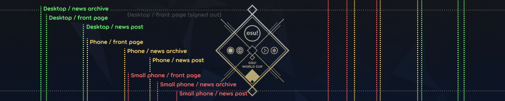
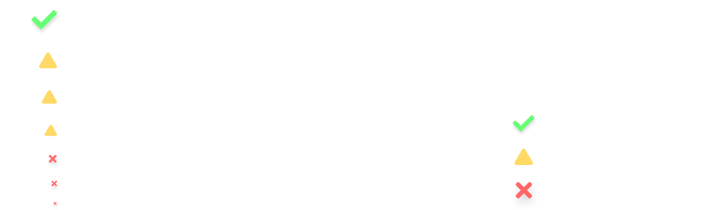

# News styling criteria

*For wiki articles, see: [Article styling criteria](/wiki/Article_styling_criteria)*

**News posts**, or **news articles**, exist on a slightly different system to the main osu! wiki, but follow similar principles. Writing them involves careful attention to a few key features and formats as outlined below.

Like wiki articles, all news posts should aim to have proper spelling and grammar at a bare minimum, as well as having correct and up-to-date information.

Anyone interested in contributing to or writing news posts, reach out in the `#osu-news` channel of the [osu! Discord server](https://discord.com/invite/ppy). Alternatively contact ::{ flag=SE }:: [Walavouchey](https://osu.ppy.sh/users/5773079), ::{ flag=RS }:: [0x84f](https://osu.ppy.sh/users/7944724), or any active [wiki or news maintainer](/wiki/People/osu!_wiki_maintainers).

## Locales

The news system does not support locales. All articles must be in English (preferably British English), with a consistent register.

What this register entails depends on the focus and tone of the article, but it must be consistent. Articles that sound professional must always sound professional. Articles that are conversational must always be conversational.

## Writing standards

All news posts must be written with a few key concepts in mind: conciseness, audience, and presentation.

### Conciseness

News posts should be short and sweet, with appropriate information condensed as much as possible without being overly dense.

Provide links to in-depth resources instead of referencing them directly in text. Use visual displays wherever possible to convey large amounts of information at a glance.

### Audience

osu!'s chief audience is mainly teenagers and young adults, though we are an all-ages community. Consider the attention span of said demographic — conciseness ties in very closely to this.

Consider well what you write within your article and whether it would interest the community at large enough to warrant including it.

### Presentation

News posts must aim to be as pleasingly neutral as possible in terms of presentation.

Pleasingly neutral, however vague, refers to an article that is both light and robust, saying what it needs to say without giant blocks of text. It must be consistent in formatting, style and register. Large quantities of information should be supported or supplanted with visual aids.

## Formatting

### File names

News posts are markdown files (`.md`) placed in the [`news/` directory](https://github.com/ppy/osu-wiki/tree/master/news) of the [`osu-wiki` GitHub repository](https://github.com/ppy/osu-wiki), under the following format:

```
news/yyyy/yyyy-mm-dd-news-post-title.md
```

The file name must contain the whole title, with all spaces replaced with hyphens (`-`) and all additional characters (such as punctuation marks) removed with no replacement.

### Structure

All news article files need to be structured in the following manner:

```markdown
---
layout: post
title: News Post Title
date: 2017-08-17 03:00:00 +0000
---

Short preview paragraph


Content

—Author
```

- `layout` must always be set to `post`.
- `title` must represent the article's full title. Markdown formatting is disallowed in this string. News post titles, unlike wiki article titles and other headings, should be in title case. Note that surrounding quotes (`"`) may be necessary if the title contains colons (`:`) or number signs (`#`).
- `date` must represent a combined string displaying a calendar date in ISO 8601 format (`2017-08-17`), followed by a 24-hour time string (`03:00:00`), followed by a time offset from UTC (`+0000`). This is the publication date used to determine when the news post becomes visible on the website.
- The preview paragraph is what will be shown on the front page, news archive, and the osu!(lazer) in-game news listing, in addition to being the first paragraph of the news post.

### Markdown

Markdown usage is covered by the [article styling criteria](/wiki/Article_styling_criteria), but the following points concern news articles specifically:

- Heading level 1 (`#`), corresponding to a title, must not be used, because the title is provided by the front matter at the top of the article.
- [Infoboxes](/wiki/Article_styling_criteria/Formatting#infoboxes) and [footnotes](/wiki/Article_styling_criteria/Formatting#footnotes) are not supported.
- The [banner image](#banners) must not contain any alt text, i.e. text inside the square brackets of a markdown image link (``).

### Images

*For image format and quality standards, see: [Article styling criteria § Formats and quality](/wiki/Article_styling_criteria/Formatting#formats-and-quality)*

Images linked in news articles must either be hosted on osu! servers (i.e. `assets.ppy.sh`) or be placed in the `osu-wiki` GitHub repository.

News articles that use images have their own folder within the [`wiki/shared/news/` directory](https://github.com/ppy/osu-wiki/tree/master/wiki/shared/news), with the same name as the news post file name. Example: `wiki/shared/news/2017-08-17-news-post-title/banner.jpg`.

### Banners

News posts must have an image after the preview paragraph for use as a **banner** (also called *cover*). The first image in an article will be used as its banner on the front page, news listing, and news article view.

These banners appear in many different aspect ratios in different places of the website and on different devices, and should therefore be designed with any cropping due to this in mind.



Use [this banner visualisation tool](https://tcomm.hivie.tn/assets-previewer?tab=news-banners) to check how the banner will appear in different parts of the website.

Banners should have a minimum 1000x200 px base size. A version with each dimension doubled should be provided if the source image is large enough to support it (resulting in `banner.jpg` and `banner@2x.jpg`). Banner images appearing in multiple news articles should be put in the [`wiki/shared/news/banners/` directory](https://github.com/ppy/osu-wiki/tree/master/wiki/shared/news/banners).

### HTML and embedded content

Limited use of HTML is allowed for the purposes of embedding off-site content such as YouTube videos, Twitch VODs, or other applets designed to showcase osu! or osu!-related content.

The width of all embedded content frames must be set to 95% with the exception of tall aspect ratios. To be included in articles in general, embedded content must support display at full-width styling without breaking or looking awful.

Video embed hosted on `assets.ppy.sh`:

```html
<div align="center" class="osu-md__paragraph">
    <video width="95%" controls>
        <source src="https://assets.ppy.sh/artists/172/release_showcase.mp4" type="video/mp4" preload="none">
    </video>
</div>
```

Video embed hosted on YouTube:

```html
<div align="center" class="osu-md__paragraph">
    <iframe width="95%" style="aspect-ratio: 16 / 9;" src="https://www.youtube.com/embed/cXkiX7u4a9g" frameborder="0" allowfullscreen></iframe>
</div>
```

## Design

The following applies to all media in news posts and includes common reasons for requested changes or inquiries by the news team:

- **Assets created for news posts should be cleared in terms of permissions and licensing.**
- **No brand or sponsorship placements are allowed.** It is not on osu! to provide advertising for them.
- **Note the [brand identity guidelines](/wiki/Brand_identity_guidelines), especially for the game and game mode names.** Terms like "standard" or "ctb" are not used in official contexts.
  - Preferred: "osu!", "osu!taiko", "osu!catch", "osu!mania" (also note that this is the canonical ordering whenever they're presented in sequence)
  - Acceptable: "osu!", "taiko", "catch", "mania"
  - Acceptable: "OSU!", "OSU!TAIKO", "OSU!CATCH", "OSU!MANIA", "TAIKO", "CATCH", "MANIA" (in contexts where text is styled in uppercase)
  - Not acceptable: "osu!standard", "standard", "osu", "Osu!", "ctb"
- **The minimum height for text is the height of paragraph text on desktop aspect ratios.** Anything smaller is not legible on mobile devices. View this page on a mobile device or resize the browser window for reference.



Some community members spare no effort in creating quality graphics or even animated videos for inclusion in news posts. However, please contact the news team early regarding designs and assets if possible, as any required changes may cause unexpected delays or omission from the news post.
