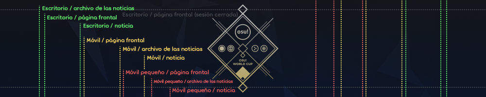
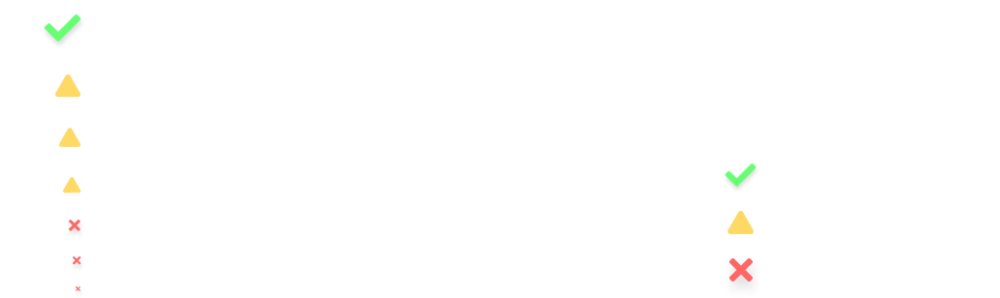

# Criterios de estilo para las noticias

*Para los artículos de la wiki, véase: [Criterios de estilo para los artículos](/wiki/Article_styling_criteria)*

Las **noticias**, existen en un sistema ligeramente diferente al de la wiki principal de osu!, pero siguen principios similares. Para redactarlas hay que prestar especial atención a algunas características y formatos clave que se describen a continuación.

Al igual que los artículos de la wiki, todas las noticias deben tener un mínimo de ortografía y gramática correctas, así como información correcta y actualizada.

Cualquiera que esté interesado en contribuir o escribir noticias puede enviar un mensaje en el canal `#osu-news` del [servidor de Discord osu!](https://discord.com/invite/ppy). También pueden ponerse en contacto con ::{ flag=SE }:: [Walavouchey](https://osu.ppy.sh/users/5773079), ::{ flag=RS }:: [0x84f](https://osu.ppy.sh/users/7944724), o cualquier [mantenedor de la wiki o de las noticias](/wiki/People/osu!_wiki_maintainers) activo.

## Configuraciones regionales

El sistema de noticias no acepta configuraciones regionales. Todos los artículos deben estar en inglés (preferiblemente inglés británico), con un registro consistente.

Lo que implique este registro depende del enfoque y el tono del artículo, pero debe ser consistente. Los artículos que suenen profesionales deben sonar siempre profesionales. Los artículos que sean de conversación deben ser siempre de conversación.

## Estándares de redacción

Todas las noticias deben redactarse teniendo en cuenta algunos conceptos clave: concisión, audiencia y presentación.

### Concisión

Las noticias deben ser breves y concisas, con la información adecuada resumida al máximo sin ser demasiado densa.

Proporciona enlaces a recursos más detallados en lugar de referenciarlos directamente en el texto. Siempre que sea posible, usa presentaciones visuales para transmitir grandes cantidades de información de un vistazo.

### Audiencia

El público principal de osu!, en su mayoría, son adolescentes y jóvenes adultos, aunque somos una comunidad para todas las edades. Considera la capacidad de atención de dicho grupo demográfico; la concisión está estrechamente relacionada con esto.

Analiza bien lo que escribes en tu artículo y piensa si le interesaría a la comunidad en general lo suficiente como para justificar su inclusión.

### Presentación

La presentación de las noticias debe ser lo más neutra posible.

Un artículo agradablemente neutro, aunque sea vago, es a la vez ligero y sólido, y dice lo que tiene que decir sin grandes bloques de texto. Debe ser consistente en cuanto a formato, estilo y registro. Las grandes cantidades de información deben apoyarse o suplantarse con ayudas visuales.

## Formato

### Nombres de los archivos

Las noticias son archivos en formato markdown (`.md`) ubicados en el directorio [`news/`](https://github.com/ppy/osu-wiki/tree/master/news) del repositorio [`osu-wiki` en GitHub](https://github.com/ppy/osu-wiki), con el siguiente formato:

```
news/yyyy/yyyy-mm-dd-título-de-la-noticia.md
```

El nombre del archivo debe contener el título completo, con todos los espacios reemplazados por guiones (`-`) y todos los caracteres adicionales (como signos de puntuación) eliminados sin reemplazo.

### Estructura

Todos los archivos de las noticias deben estar estructurados de la siguiente manera:

```markdown
---
layout: post
title: Título de la noticia
date: 2017-08-17 03:00:00 +0000
---

Breve párrafo de avance


Contenido

—Autor
```

- `layout` siempre debe estar en `post`.
- `title` debe representar el título completo del artículo. El formato Markdown no se puede usar en esta cadena. Los títulos de las noticias, a diferencia de los títulos de los artículos de la wiki y otros encabezados, deben ir en mayúsculas. Ten en cuenta que las comillas (`"`) pueden ser necesarias si el título contiene dos puntos (`:`) o signos numéricos (`#`).
- `date` debe representar una cadena combinada que muestre una fecha de calendario en formato ISO 8601 (`2017-08-17`), seguida de una cadena horaria de 24 horas (`03:00:00`), seguida de un margen de tiempo establecido en UTC (`+0000`). Esta es la fecha de publicación usada para determinar cuándo la noticia se hará visible en el sitio web.
- El párrafo de avance es el que se mostrará en la portada, en el archivo de las noticias y en el listado de las noticias dentro de osu!(lazer), además de ser el primer párrafo de la noticia.

### Markdown

El uso de Markdown está cubierto por los [criterios de estilo para los artículos](/wiki/Article_styling_criteria), pero los siguientes puntos se refieren específicamente a las noticias:

- El nivel de encabezado 1 (`#`), correspondiente a un título, no debe usarse, porque el título lo proporciona la portada en la parte superior del artículo.
- Las [cajas de información](/wiki/Article_styling_criteria/Formatting#cajas-de-información) y las [notas al pie](/wiki/Article_styling_criteria/Formatting#notas-al-pie) no son compatibles.
- La [imagen del banner](#banners) no debe contener ningún texto alternativo, es decir, texto dentro de los corchetes de un enlace de una imagen con markdown (``).

### Imágenes

*Para los estándares de formato y calidad de las imágenes, véase: [Criterios de estilo para los artículos § Formatos y calidad](/wiki/Article_styling_criteria/Formatting#formatos-y-calidad)*

Las imágenes enlazadas en las noticias deben estar alojadas en los servidores de osu! (por ejemplo, `assets.ppy.sh`) o en el repositorio `osu-wiki` en GitHub.

Las noticias que usan imágenes tienen su propia carpeta dentro del directorio [`wiki/shared/news/`](https://github.com/ppy/osu-wiki/tree/master/wiki/shared/news), con el mismo nombre que el archivo de la noticia. Ejemplo: `wiki/shared/news/2017-08-17-título-de-la-noticia/banner.jpg`.

### Banners

Las noticias deben tener una imagen después del párrafo de avance para su uso como **banner** (también llamado *portada*). La primera imagen de un artículo se usará como banner en la página frontal, en el listado de las noticias y en la vista de los artículos de las noticias.

Estos banners aparecen en muchas relaciones de aspecto diferentes en distintos lugares del sitio web y en distintos dispositivos, por lo que deben diseñarse teniendo en cuenta cualquier recorte debido a esto.



Usa [esta herramienta de visualización](https://tcomm.hivie.tn/assets-previewer?tab=news-banners) para comprobar cómo aparecerá el banner en diferentes partes del sitio web.

Los banners deben tener un tamaño base mínimo de 1000x200 píxeles. Se debe proporcionar una versión con cada dimensión duplicada si la imagen de origen es lo suficientemente grande como para ser compatible (lo que da como resultado `banner.jpg` y `banner@2x.jpg`). Las imágenes de los banners que aparecen en varias noticias deben colocarse en el directorio [`wiki/shared/news/banners/`](https://github.com/ppy/osu-wiki/tree/master/wiki/shared/news/banners).

### HTML y contenido incrustado

Se permite un uso limitado de HTML para incrustar contenido externo, como vídeos de YouTube, VODs de Twitch u otros programas diseñados para mostrar contenido de osu! o relacionado con osu!.

El ancho de todos los marcos del contenido incrustado debe ajustarse al 95 %, con la excepción de las relaciones de aspecto altas. Para ser incluido en los artículos en general, el contenido incrustado debe soportar la visualización en estilo de ancho completo sin romperse o verse horrible.

Vídeo incrustado alojado en `assets.ppy.sh`:

```html
<div align="center" class="osu-md__paragraph">
    <video width="95%" controls>
        <source src="https://assets.ppy.sh/artists/172/release_showcase.mp4" type="video/mp4" preload="none">
    </video>
</div>
```

Vídeo incrustado alojado en YouTube:

```html
<div align="center" class="osu-md__paragraph">
    <iframe width="95%" style="aspect-ratio: 16 / 9;" src="https://www.youtube.com/embed/cXkiX7u4a9g" frameborder="0" allowfullscreen></iframe>
</div>
```

## Diseño

Lo siguiente se aplica a todos los medios que aparecen en las noticias e incluye los motivos más comunes por los que el equipo de noticias solicita cambios o preguntas:

- **Los recursos creados para las noticias deben estar autorizados en cuanto a permisos y licencias.**
- **No se permite la colocación de marcas o patrocinadores.** No es responsabilidad de osu! hacerles publicidad.
- **Ten en cuenta las [directrices de identidad de marca](/wiki/Brand_identity_guidelines), especialmente para los nombres del juego y de los modos de juego.** Términos como «standard» o «ctb» no se usan en contextos oficiales.
  - Se prefiere el uso de «osu!», «osu!taiko», «osu!catch», «osu!mania» (además, ten en cuenta que este es el orden canónico siempre que se presentan en secuencia)
  - Es aceptable el uso de «osu!», «taiko», «catch», «mania»
  - Es aceptable el uso de «OSU!», «OSU!TAIKO», «OSU!CATCH», «OSU!MANIA», «TAIKO», «CATCH», «MANIA» (en contextos en los que el texto se escriba en mayúsculas)
  - No es aceptable el uso de «osu!standard», «standard», «osu», «Osu!», «ctb»
- **La altura mínima para el texto es la altura del texto del párrafo en las relaciones de aspecto de escritorio.** Todo lo que sea más pequeño no es legible en dispositivos móviles. Puedes ver este mismo artículo en un dispositivo móvil o cambiar el tamaño de la ventana del navegador como referencia.



Algunos miembros de la comunidad crean gráficos de calidad o incluso vídeos animados para incluirlos en las noticias. Sin embargo, siempre que sea posible, ponte en contacto con el equipo de noticias con antelación sobre los diseños y los recursos, ya que cualquier cambio necesario puede provocar retrasos inesperados u omisiones en las noticias.
