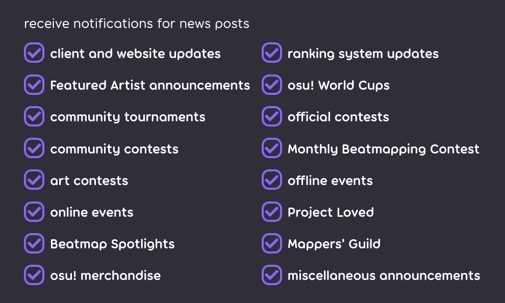
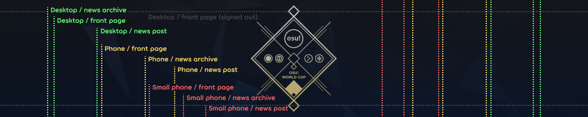
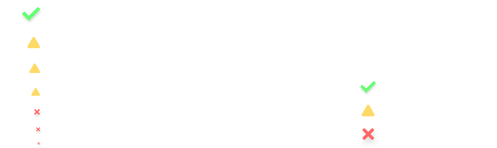
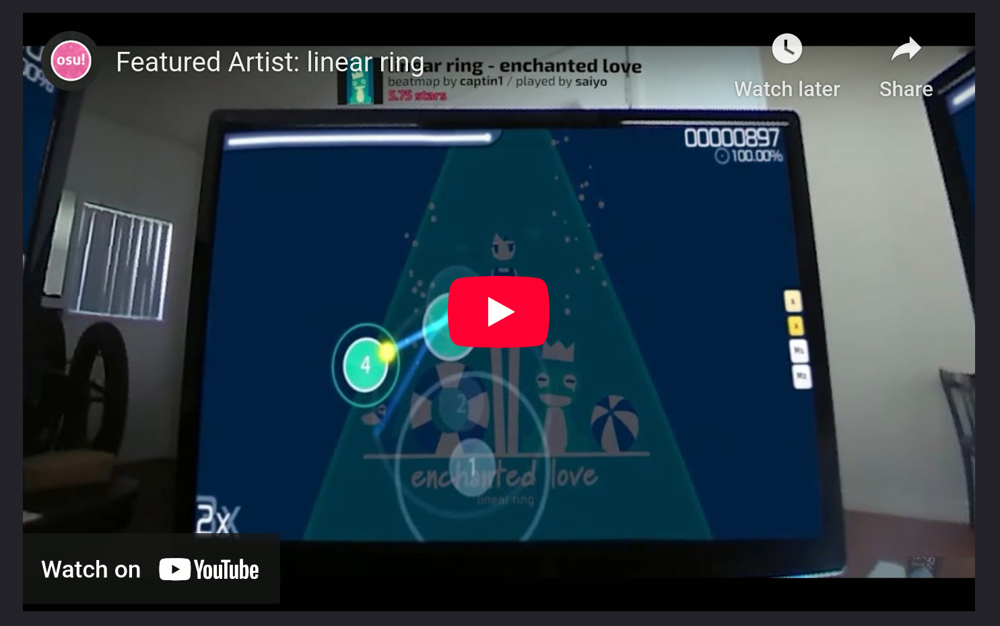
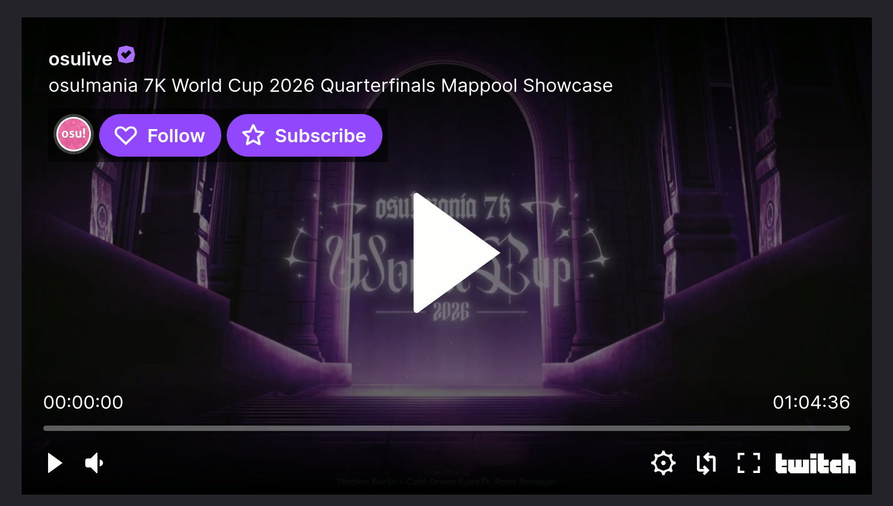
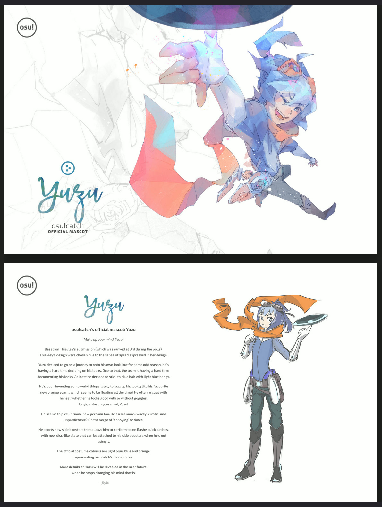
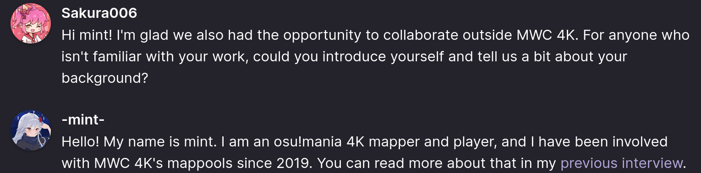

# News styling criteria

*สำหรับบทความ wiki ดูที่: [Article styling criteria](/wiki/Article_styling_criteria)*

**News posts** หรือ **news articles** อยู่บนระบบที่ต่างจาก osu! wiki หลักเล็กน้อย แต่ใช้หลักการใกล้เคียงกัน การเขียนข่าวต้องใส่ใจกับฟีเจอร์และรูปแบบสำคัญบางอย่างตามที่อธิบายด้านล่าง

เช่นเดียวกับบทความ wiki ข่าวทุกชิ้นควรมีการสะกดและไวยากรณ์ที่ถูกต้องเป็นขั้นต่ำ รวมถึงต้องมีข้อมูลที่ถูกต้องและอัปเดตด้วย

ผู้ที่สนใจช่วยหรือเขียน news post สามารถติดต่อในช่อง `#osu-news` ของ [osu! Discord server](https://discord.com/invite/ppy) หรือติดต่อ ::{ flag=TN }:: [Hivie](https://osu.ppy.sh/users/14102976), ::{ flag=ES }:: [RandomeLoL](https://osu.ppy.sh/users/7080063), ::{ flag=SE }:: [Walavouchey](https://osu.ppy.sh/users/5773079) หรือ [wiki หรือ news maintainer](/wiki/People/osu!_wiki_maintainers) ที่ยัง active อยู่ก็ได้

สำหรับทัวร์นาเมนต์และ contest การโฆษณา registration ผ่าน news post แยกต่างหากต้องได้รับอนุมัติจาก [Tournament Committee](/wiki/People/Tournament_Committee) และ [Contest Committee](/wiki/People/Tournament_Committee#contest-committee) ก่อนตามลำดับ ดูกฎและข้อมูลได้ที่หน้า [Official tournament support](/wiki/Tournaments/Official_support) และ [Official beatmapping contest support](/wiki/Contests/Official_support)

## Locales

ระบบ news ไม่รองรับ locale บทความทั้งหมดต้องเขียนเป็นภาษาอังกฤษ (แนะนำ British English) และใช้น้ำเสียงให้สม่ำเสมอ

น้ำเสียงที่ว่านี้ขึ้นอยู่กับโฟกัสและโทนของบทความ แต่ต้องคงเส้นคงวา บทความที่ดู professional ต้อง professional ตลอด บทความที่เป็นกันเองก็ต้องเป็นกันเองตลอด

## Writing standards

news post ทุกชิ้นต้องเขียนโดยคำนึงถึงแนวคิดหลักไม่กี่อย่าง: ความกระชับ, audience และ presentation

### Conciseness

news post ควรสั้น กระชับ และอ่านง่าย โดยย่อข้อมูลที่เหมาะสมให้มากที่สุดเท่าที่ทำได้โดยไม่แน่นเกินไป

ให้ลิงก์ไปยัง resource เชิงลึกแทนการอ้างอิงทุกอย่างในเนื้อหาโดยตรง ใช้ visual display เท่าที่ทำได้เพื่อสื่อข้อมูลจำนวนมากให้เข้าใจได้ในพริบตา

### Audience

audience หลักของ osu! คือวัยรุ่นและวัยผู้ใหญ่ตอนต้นเป็นส่วนใหญ่ แม้เราจะเป็นคอมมูนิตี้สำหรับทุกวัยก็ตาม ให้คำนึงถึงช่วงความสนใจของกลุ่มคนเหล่านี้ด้วย ความกระชับจึงเกี่ยวข้องกับเรื่องนี้มาก

คิดให้ดีว่าสิ่งที่คุณเขียนในบทความจะน่าสนใจพอสำหรับคอมมูนิตี้โดยรวมจนควรถูกใส่ไว้หรือไม่

### Presentation

news post ควรพยายามนำเสนอให้เป็นกลางและน่าอ่านมากที่สุด

คำว่าเป็นกลางและน่าอ่าน แม้จะฟังดูกว้าง ๆ หมายถึงบทความที่เบาแต่หนักแน่น พูดสิ่งที่ต้องพูดโดยไม่เป็นกำแพงข้อความขนาดใหญ่ ต้องสม่ำเสมอทั้ง formatting, style และ register ข้อมูลจำนวนมากควรถูกช่วยเสริมหรือแทนที่ด้วย visual aid

## Formatting

### File names

news post เป็นไฟล์ markdown (`.md`) ที่วางอยู่ใน [`news/` directory](https://github.com/ppy/osu-wiki/tree/master/news) ของ [`osu-wiki` GitHub repository](https://github.com/ppy/osu-wiki) ตามรูปแบบนี้:

```
news/yyyy/yyyy-mm-dd-news-post-title.md
```

ชื่อไฟล์ต้องมี title เต็ม โดยแทนช่องว่างทั้งหมดด้วย hyphen (`-`) และลบ character เพิ่มเติมทั้งหมด (เช่นเครื่องหมายวรรคตอน) โดยไม่ต้องแทนด้วยอะไร

### Structure

ไฟล์ news article ทุกไฟล์ต้องจัดโครงสร้างตามนี้:

```markdown
---
layout: post
title: News Post Title
date: 2017-08-17 03:00:00 +0000
series: miscellaneous
---

Short preview paragraph


Content

—Author
```

- `layout` ต้องตั้งเป็น `post` เสมอ
- `title` ต้องเป็น title เต็มของบทความ ห้ามใช้ Markdown formatting ใน string นี้ title ของ news post ต่างจาก title ของบทความ wiki และ heading อื่น ๆ โดยควรใช้ title case โปรดทราบว่าอาจจำเป็นต้องใส่ quote (`"`) ครอบ หาก title มี colon (`:`) หรือ number sign (`#`)
- `date` ต้องเป็น string ที่รวมวันที่ตามรูปแบบ ISO 8601 (`2017-08-17`), ตามด้วยเวลาแบบ 24 ชั่วโมง (`03:00:00`), ตามด้วย time offset จาก UTC (`+0000`) ค่านี้คือวันที่เผยแพร่ที่ใช้กำหนดว่า news post จะมองเห็นบนเว็บไซต์เมื่อใด
- preview paragraph คือข้อความที่จะปรากฏบน front page, news archive และรายการข่าวในเกมของ osu!(lazer) และยังเป็น paragraph แรกของ news post ด้วย
- news post ทุกชิ้นควรใส่และลิงก์ cover image ในโฟลเดอร์ [`wiki/shared/news/`](https://github.com/ppy/osu-wiki/tree/master/wiki/shared/news) ในกรณีหายากที่ไม่ต้องการใช้ ให้ใช้รูป default: `https://osu.ppy.sh/images/headers/news-show-default.jpg`
- `series` กำหนดว่าบทความจะถูกเผยแพร่ในหมวด notification ใดของเว็บไซต์ ซึ่งผู้ใช้ subscribe ได้จาก [account settings](https://osu.ppy.sh/home/account/edit) ค่านี้ต้องเป็นหนึ่งในรายการต่อไปนี้:
  - Specific series: `project_loved`, `beatmap_spotlights`, `featured_artists`, `fanart_contests`, `mappers_guild`, `ranking_system_updates` (เช่น performance points และ scoring), `game_updates` (ทั้ง client และ website), `merch_runs`, `world_cups` (รวม [LGA](/wiki/Tournaments/LGA)), `monthly_beatmapping_contest`
  - General categories: `official_contests` (ทุกอย่างที่ถูกจัดหมวดแบบนี้ในหน้า wiki [Contests](/wiki/Contests)), `community_contests`, `community_tournaments`, `offline_events`, `online_events`, `miscellaneous`



### Markdown

การใช้ Markdown ครอบคลุมอยู่ใน [article styling criteria](/wiki/Article_styling_criteria) แต่ประเด็นต่อไปนี้เกี่ยวข้องกับ news article โดยเฉพาะ:

- ห้ามใช้ heading level 1 (`#`) ซึ่งตรงกับ title เพราะ title ถูกระบุไว้ใน front matter ด้านบนของบทความแล้ว
- ไม่รองรับ [Infoboxes](/wiki/Article_styling_criteria/Formatting#infoboxes) และ [footnotes](/wiki/Article_styling_criteria/Formatting#footnotes)
- [banner image](#banners) ต้องไม่มี alt text หรือก็คือข้อความในวงเล็บเหลี่ยมของ markdown image link (``)

### Images

*สำหรับมาตรฐานรูปแบบและคุณภาพของรูปภาพ ดูที่: [Article styling criteria § Formats and quality](/wiki/Article_styling_criteria/Formatting#formats-and-quality)*

รูปที่ลิงก์ใน news article ต้อง host บนเซิร์ฟเวอร์ osu! (เช่น `assets.ppy.sh`) หรือถูกวางไว้ใน `osu-wiki` GitHub repository

news article ที่ใช้รูปจะมีโฟลเดอร์ของตัวเองใน [`wiki/shared/news/` directory](https://github.com/ppy/osu-wiki/tree/master/wiki/shared/news) โดยใช้ชื่อเดียวกับชื่อไฟล์ news post ตัวอย่าง: `wiki/shared/news/2017-08-17-news-post-title/banner.jpg`

### Banners

news post ต้องมีรูปหลัง preview paragraph เพื่อใช้เป็น **banner** (หรือเรียกว่า *cover*) รูปแรกในบทความจะถูกใช้เป็น banner บน front page, news listing และหน้า news article

banner เหล่านี้ปรากฏด้วย aspect ratio ที่แตกต่างกันในหลายส่วนของเว็บไซต์และบนอุปกรณ์ที่ต่างกัน ดังนั้นจึงควรออกแบบโดยคำนึงถึงการ crop ที่อาจเกิดขึ้น



ใช้ [banner visualisation tool นี้](https://tcomm.hivie.tn/assets-previewer?tab=news-banners) เพื่อตรวจว่า banner จะปรากฏอย่างไรในส่วนต่าง ๆ ของเว็บไซต์

banner ควรมี base size ขั้นต่ำ 1000x200 px ถ้ารูปต้นฉบับใหญ่พอ ควรมีเวอร์ชันที่เพิ่มขนาดแต่ละมิติเป็นสองเท่าด้วย (ได้เป็น `banner.jpg` และ `banner@2x.jpg`) banner image ที่ใช้ใน news article หลายชิ้นควรวางไว้ใน [`wiki/shared/news/banners/` directory](https://github.com/ppy/osu-wiki/tree/master/wiki/shared/news/banners)

## Design

ส่วนต่อไปนี้ใช้กับ media ทั้งหมดใน news post และรวมเหตุผลทั่วไปที่ news team อาจขอให้แก้หรือสอบถามเพิ่มเติม:

- **Asset ที่สร้างสำหรับ news post ต้องเป็นไปตาม [content usage guidelines](/wiki/Rules/Content_usage_permissions)**
- **ห้ามมี brand หรือ sponsorship placement** ไม่ใช่หน้าที่ของ osu! ที่จะโฆษณาให้สิ่งเหล่านั้น
- **โปรดสังเกต [brand identity guidelines](/wiki/Brand_identity_guidelines) โดยเฉพาะชื่อเกมและชื่อโหมดเกม** คำอย่าง "standard" หรือ "ctb" ไม่ใช้ในบริบท official
  - Preferred: "osu!", "osu!taiko", "osu!catch", "osu!mania" (และโปรดทราบว่านี่คือลำดับ canonical เมื่อนำเสนอเรียงกัน)
  - Acceptable: "osu!", "taiko", "catch", "mania"
  - Acceptable: "OSU!", "OSU!TAIKO", "OSU!CATCH", "OSU!MANIA", "TAIKO", "CATCH", "MANIA" (ในบริบทที่ข้อความถูก style เป็น uppercase)
  - Not acceptable: "osu!standard", "standard", "osu", "Osu!", "ctb"
- **ความสูงขั้นต่ำของข้อความคือความสูงของ paragraph text บน desktop aspect ratio** สิ่งที่เล็กกว่านั้นจะอ่านไม่ออกบนอุปกรณ์มือถือ ดูหน้านี้บนมือถือหรือ resize หน้าต่าง browser เพื่อใช้เป็น reference



สมาชิกคอมมูนิตี้บางคนทุ่มเทมากในการสร้างกราฟิกคุณภาพสูง หรือแม้แต่วิดีโอ animation สำหรับใส่ใน news post อย่างไรก็ตาม กรุณาติดต่อ news team ตั้งแต่เนิ่น ๆ เรื่อง design และ asset ถ้าทำได้ เพราะการแก้ไขที่จำเป็นอาจทำให้เกิดความล่าช้าหรือถูกตัดออกจาก news post อย่างไม่คาดคิด

## HTML and embedded content

อนุญาตให้ใช้ HTML แบบจำกัดเพื่อ embed content นอกเว็บไซต์ เช่น YouTube video, Twitch VOD หรือ applet อื่น ๆ ที่ออกแบบมาเพื่อโชว์ osu! หรือ content ที่เกี่ยวข้องกับ osu!

ความกว้างของ embedded content frame ทั้งหมดต้องตั้งเป็น 95% ยกเว้น aspect ratio แบบสูง หากจะใส่ในบทความโดยทั่วไป embedded content ต้องรองรับการแสดงผลแบบ full-width styling โดยไม่พังหรือดูแย่

### Video embed hosted on `assets.ppy.sh`

```html
<div align="center" class="osu-md__paragraph">
    <video width="95%" controls>
        <source src="https://assets.ppy.sh/artists/172/release_showcase.mp4" type="video/mp4" preload="none">
    </video>
</div>
```


### Video embed hosted on YouTube

```html
<div align="center" class="osu-md__paragraph">
    <iframe width="95%" style="aspect-ratio: 16 / 9;" src="https://www.youtube.com/embed/cXkiX7u4a9g" frameborder="0" allowfullscreen></iframe>
</div>
```



### Video embed hosted on Twitch

```html
<div align="center" class="osu-md__paragraph">
    <iframe width="95%" style="aspect-ratio: 16 / 9;" src="https://player.twitch.tv/?autoplay=false&parent=osu.ppy.sh&video=2321612622" allowfullscreen="true" scrolling="no"></iframe>
</div>
```



### Audio preview

```html
<audio controls>
    <source src="https://assets.ppy.sh/artists/493/0401%2B/d0tc0mmie%20-%20Strobe%20Light%20feat.%20Kasane%20Teto.mp3">
</audio>
```


### PDF files

โปรดทราบว่า PDF file ต้องมีขนาดน้อยกว่า ~20 MB เพื่อ embed ผ่าน `https://docs.google.com/gview`

```html
<div align="center">
    <iframe width="95%" style="aspect-ratio: 1.414;" src="https://docs.google.com/gview?url=https://assets.ppy.sh/media/yuzu/yuzu-embed.pdf&embedded=true" frameborder="0" allowfullscreen></iframe>
</div>
```



### Chat-style quotes

สำหรับ interview หรือ quote ที่มี avatar ของผู้ใช้ ให้ใส่ styling ต่อไปนี้ไว้ตอนต้นของ section ที่เกี่ยวข้องใน news post:

```html
<style>
    .news-chat-quote__avatar {
        float: left;
        width: 40px;
        height: 40px;
        border-radius: 50%;
        margin-left: -50px;
    }

    .news-chat-quote__text-container {
        margin-left: 50px;
    }

    .news-chat-quote__username {
        font-weight: 600;
        margin-bottom: 2px;
    }

    .news-chat-quote__colour-no-group {
        color: #FFFFFF;
    }
</style>
```

ในที่นี้ CSS styling `news-chat-quote__colour-{group}` จะตรงกับสีของ [user group](/wiki/People/User_groups):

| Group | Colour |
| :-: | :-- |
| `gmt` | `#99EB47` |
| `nat` | `#FA3703` |
| `dev` | `#E45678` |
| `alm` | `#999999` |
| `spt` | `#EBD047` |
| `bn` | `#A347EB` |
| `lvd` | `#FFD1DC` |
| `ppy` | `#0066FF` |
| `fa` | `#00FFFF` |
| `bsc` | `#76AEBC` |
| `tc` | `#FFB969` |
| `no-group` | `#FFFFFF` |

จากนั้นครอบ section ของเนื้อหาที่ indent ด้วย `<div>` และใส่ avatar กับ username ไว้ก่อนแต่ละส่วนที่ต้องการให้แสดง ตามตัวอย่างด้านล่าง:

```html
<div class="news-chat-quote__text-container">

<a class="avatar news-chat-quote__avatar" href="https://osu.ppy.sh/users/10365024" style="background-image: url('/wiki/shared/avatars/Sakura006.jpg')"></a>

<p class="news-chat-quote__username"><a class="news-chat-quote__colour-no-group" href="https://osu.ppy.sh/users/10365024">Sakura006</a></p>

Indented markdown content

</div>
```


