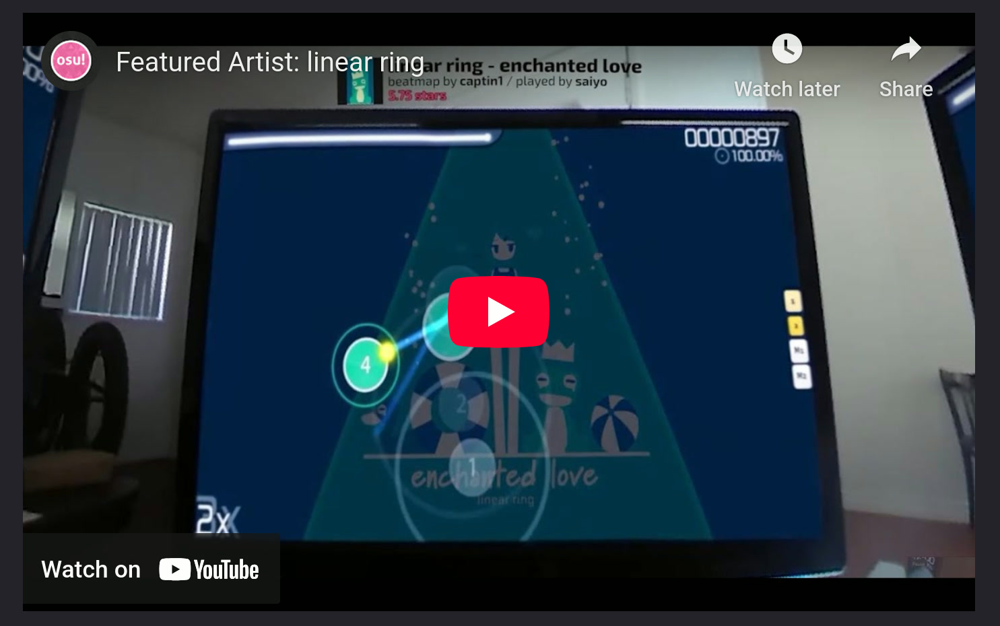
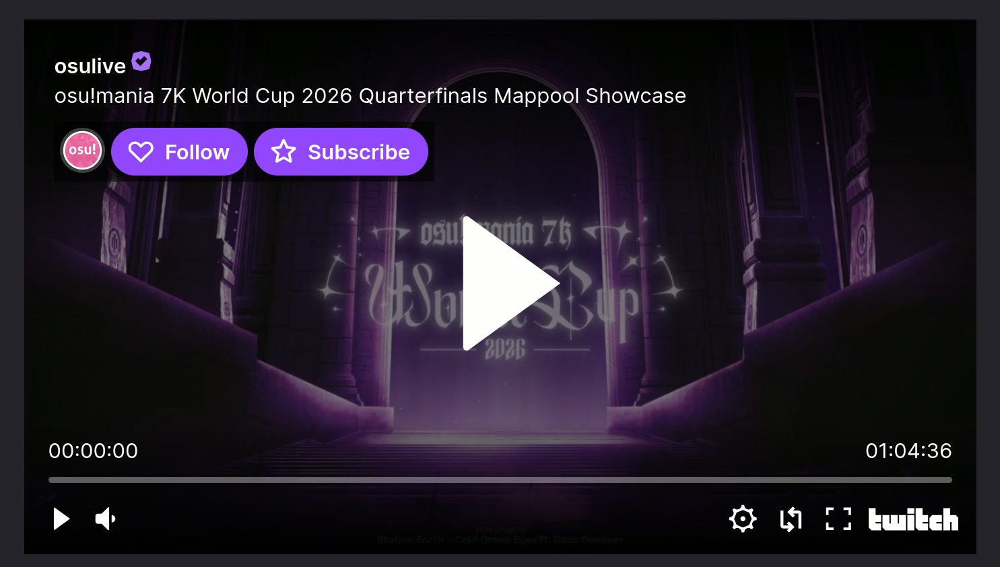
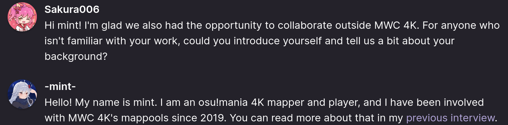

# 新闻稿风格规范

*关于 wiki 文章的相关规范，请参见：[文章风格规范](/wiki/Article_styling_criteria)*

**新闻稿**（或称**新闻文章**）的运行机制与 osu! wiki 的主要部分略有不同，但遵循相似的原则。撰写新闻稿时，需要仔细关注以下几个关键要素和格式。

与 wiki 条目一样，所有新闻稿在撰写时至少应该确保拼写和语法正确，信息准确且为最新。

如有撰写新闻稿或为此做出贡献，请前往 [osu! Discord 服务器](https://discord.com/invite/ppy) 的 `#osu-news` 频道，或直接联系 ::{ flag=TN }:: [Hivie](https://osu.ppy.sh/users/14102976)、::{ flag=ES }:: [RandomeLoL](https://osu.ppy.sh/users/7080063)、::{ flag=SE }:: [Walavouchey](https://osu.ppy.sh/users/5773079) 或者其他任意比较活跃的 [wiki 或新闻维护者](/wiki/People/osu!_wiki_maintainers)。

对于锦标赛和竞赛（通常指作图竞赛），如希望使用专门的新闻稿进行对报名的宣传，需要事先分别获得[锦标赛委员会 (TC)](/wiki/People/Tournament_Committee) 和[竞赛委员会 (CC)](/wiki/People/Tournament_Committee#竞赛委员会) 的批准。相关规则和信息请参见[官方锦标赛支持](/wiki/Tournaments/Official_support)和[官方作图竞赛支持](/wiki/Contests/Official_support)页面。

## 语言

新闻系统不支持多语言。所有文章必须使用英文（优先使用英式英语），并保持一致的语体风格。

语体风格的具体要求取决于文章的重点和语气，但它必须前后一致。偏专业性的文章必须始终保持专业语调，会话式的文章则需保持口语化风格。

## 写作标准

所有新闻稿的撰写需遵循几个核心理念：简洁、受众、呈现。

### 简洁

新闻稿应力求短小精悍，在不过度堆砌的前提下，尽可能浓缩相关信息。

提供深入资源的链接，而非直接在文中引用。尽可能使用可视化图表来让大量信息一目了然。

### 受众

osu! 的主要受众是青少年和年轻人，但我们同时也是一个全年龄社区。请考虑目标受众的注意力持续时间——这其实与简洁性密切相关。

仔细斟酌文章内容，判断其是否足以引起整个社区的兴趣，从而值得被纳入你的文章。

### 呈现

新闻稿在呈现方式上应力求一种令人愉悦的中立性。

“令人愉悦的中立”虽略显模糊，但意指文章既轻盈又扎实，能用精炼的文字表达核心内容，避免大段的文本堆砌。格式、风格和语体必须保持一致。体量大的信息应以可视化的方式辅助呈现。

## 格式

### 文件名

新闻稿为 Markdown 文件（`.md`），存放于 [`osu-wiki` GitHub 仓库](https://github.com/ppy/osu-wiki)的 [`news/` 目录](https://github.com/ppy/osu-wiki/tree/master/news)下。新闻稿的命名格式如下：

```
news/yyyy/yyyy-mm-dd-news-post-title.md
```

文件名必须包含完整标题，所有空格替换为连字符（`-`），所有附加字符（如标点符号）直接移除，无需替换。

### 结构

所有新闻文章需按以下格式构建：

```markdown
---
layout: post
title: 新闻稿标题
date: 2017-08-17 03:00:00 +0000
series: miscellaneous
---

简短预览段落


正文内容

—作者
```

- `layout` 必须始终设为 `post`。
- `title` 必须使用文章完整标题。此字符串中不允许使用 Markdown 格式。与 wiki 条目的标题或者其他标题不同，新闻稿标题应采用标题大小写。注意：若标题包含冒号（`:`）或井号（`#`），可能需要使用引号（`"`）包裹。
- `date` 必须使用 ISO 8601 格式的日历日期（`2017-08-17`），后跟 24 小时制时间字符串（`03:00:00`），再跟 UTC 时区偏移量（`+0000`）。此发布日期用于确定新闻稿何时在网站上可见。
- 预览段落将显示在首页、新闻存档以及 osu!(lazer) 游戏内的新闻列表中，同时也是新闻稿的第一段正文。
- 所有新闻稿均应包含并链接一张位于 [`wiki/shared/news/`](https://github.com/ppy/osu-wiki/tree/master/wiki/shared/news) 文件夹的封面图。极少数情况下若无需封面，请使用默认图片：`https://osu.ppy.sh/images/headers/news-show-default.jpg`。
- `series` 决定文章将在哪类网站通知中发布，用户可从其[帐户设置](https://osu.ppy.sh/home/account/edit)订阅。此项必须是以下之一：
  - 特定系列：`project_loved`、`beatmap_spotlights`、`featured_artists`、`fanart_contests`、`mappers_guild`、`ranking_system_updates`（例如表现分和计分方式）、`game_updates`（客户端和网站）、`merch_runs`、`world_cups`（包括 [LGA](/wiki/Tournaments/LGA)）、`monthly_beatmapping_contest`
  - 通用分类：`official_contests`（[竞赛](/wiki/Contests) wiki 页面中归类为此类的任何内容）、`community_contests`、`community_tournaments`、`offline_events`、`online_events`、`miscellaneous`


### Markdown

Markdown 的使用遵循 wiki 的[文章风格规范](/wiki/Article_styling_criteria)，但以下几点是新闻稿所特有的：

- 禁止使用一级标题（`#`），因为标题已由文章顶部的 Front Matter 中的 `title` 字段提供。
- 不支持[信息框](/wiki/Article_styling_criteria/Formatting#信息框)和[脚注](/wiki/Article_styling_criteria/Formatting#脚注)。
- [横幅图片](#横幅)不得包含替代文本，即 Markdown 图片链接方括号内的文字（``）。

### 图片

*关于图片格式和质量标准，请参见：[文章风格规范 § 格式与质量](/wiki/Article_styling_criteria/Formatting#格式和质量)*

新闻稿中引用的图片必须要么托管在 osu! 服务器上（即 `assets.ppy.sh`），要么存放在 `osu-wiki` GitHub 仓库中。

使用图片的新闻稿，其图片应存放在 [`wiki/shared/news/` 目录](https://github.com/ppy/osu-wiki/tree/master/wiki/shared/news)下以新闻稿文件名命名的独立文件夹中。例如：`wiki/shared/news/2017-08-17-news-post-title/banner.jpg`。

### 横幅

新闻稿必须在预览段落后放置一张图片作为**横幅**（也称*封面*）。文章中的第一张图片将用作首页、新闻列表和新闻文章视图中的横幅。

这些横幅在网站的不同位置以及不同设备上会以多种宽高比显示，因此在设计时需考虑到可能的裁剪情况。


可使用[此横幅预览工具](https://tcomm.hivie.tn/assets-previewer?tab=news-banners)查看横幅在网站不同位置的显示效果。

横幅基础尺寸应至少为 1000x200 像素。若源图足够大，应额外提供长宽都翻倍的版本（即提供 `banner.jpg` 和 `banner@2x.jpg`）。若同一横幅用于多篇新闻稿，应存放在 [`wiki/shared/news/banners/` 目录](https://github.com/ppy/osu-wiki/tree/master/wiki/shared/news/banners)下。

## 设计

以下内容适用于新闻稿中的所有媒体内容，并包含了新闻团队要求你修改内容或提出询问的常见原因：

- **为新闻稿创建的素材必须遵守[内容使用准许](/wiki/Rules/Content_usage_permissions)。**
- **禁止任何品牌或赞助商标识展示。** osu! 不为它们提供广告位。
- **注意[品牌标识准则](/wiki/Brand_identity_guidelines)，尤其是游戏和游戏模式的名称。** 在官方语境中不使用 "standard" 或 "ctb" 等术语。
  - 推荐："osu!"、"osu!taiko"、"osu!catch"、"osu!mania"（注意这同时也是按顺序呈现四个模式时的规范次序）
  - 可接受："osu!"、"taiko"、"catch"、"mania"
  - 可接受："OSU!"、"OSU!TAIKO"、"OSU!CATCH"、"OSU!MANIA"、"TAIKO"、"CATCH"、"MANIA"（在文本采用全大写的语境下）
  - 不可接受："osu!standard"、"standard"、"osu"、"Osu!"、"ctb"
- **图片中文字的最小高度应为 PC 端桌面宽高比下的段落文本高度。** 更小的文字在移动设备上无法辨认。可调整浏览器窗口大小或在移动设备上查看本页作为参考。


部分社区成员不遗余力地为新闻稿创作高质量的图片甚至动画视频。但请尽可能提前联系新闻团队讨论设计和素材，因为任何必要的修改都可能导致意外延迟，甚至不得不从新闻稿中移除。

## HTML 与嵌入内容

允许有限地使用 HTML 来嵌入站外内容，例如 YouTube 视频、Twitch 录像，或者其他旨在展示 osu! 或 osu! 相关内容的应用程序。

所有嵌入内容框架的宽度必须设为 95%，但高宽比较大的内容除外。一般而言，嵌入内容必须支持全宽样式显示，且不会因此而变形或显得难看。

### 嵌入托管于 `assets.ppy.sh` 的视频

```html
<div align="center" class="osu-md__paragraph">
    <video width="95%" controls>
        <source src="https://assets.ppy.sh/artists/172/release_showcase.mp4" type="video/mp4" preload="none">
    </video>
</div>
```


### 嵌入托管于 YouTube 的视频

```html
<div align="center" class="osu-md__paragraph">
    <iframe width="95%" style="aspect-ratio: 16 / 9;" src="https://www.youtube.com/embed/cXkiX7u4a9g" frameborder="0" allowfullscreen></iframe>
</div>
```



### 嵌入托管于 Twitch 的视频

```html
<div align="center" class="osu-md__paragraph">
    <iframe width="95%" style="aspect-ratio: 16 / 9;" src="https://player.twitch.tv/?autoplay=false&parent=osu.ppy.sh&video=2321612622" allowfullscreen="true" scrolling="no"></iframe>
</div>
```



### 音频预览

```html
<audio controls>
    <source src="https://assets.ppy.sh/artists/493/0401%2B/d0tc0mmie%20-%20Strobe%20Light%20feat.%20Kasane%20Teto.mp3">
</audio>
```


### PDF 文件

注意，如果要通过 `https://docs.google.com/gview` 嵌入，则该 PDF 文件必须小于约 20 MB。

```html
<div align="center">
    <iframe width="95%" style="aspect-ratio: 1.414;" src="https://docs.google.com/gview?url=https://assets.ppy.sh/media/yuzu/yuzu-embed.pdf&embedded=true" frameborder="0" allowfullscreen></iframe>
</div>
```


### 聊天风格的引文

如果希望嵌入带有用户头像的访谈或引用，请在该新闻稿相关章节的开头添加以下样式：

```html
<style>
    .news-chat-quote__avatar {
        float: left;
        width: 40px;
        height: 40px;
        border-radius: 50%;
        margin-left: -50px;
    }

    .news-chat-quote__text-container {
        margin-left: 50px;
    }

    .news-chat-quote__username {
        font-weight: 600;
        margin-bottom: 2px;
    }

    .news-chat-quote__colour-no-group {
        color: #FFFFFF;
    }
</style>
```

其中，`news-chat-quote__colour-{group}` CSS 样式对应不同的[用户组](/wiki/People/User_groups)颜色：

| 用户组 | 颜色 |
| :-: | :-- |
| `gmt` | `#99EB47` |
| `nat` | `#fa3703` |
| `dev` | `#E45678` |
| `alm` | `#999999` |
| `spt` | `#EBD047` |
| `bn` | `#A347EB` |
| `lvd` | `#FFD1DC` |
| `ppy` | `#0066FF` |
| `fa` | `#00FFFF` |
| `bsc` | `#76AEBC` |
| `tc` | `#FFB969` |
| `no-group` | `#FFFFFF` |

然后，将缩进内容包裹在 `<div>` 标签内，并在每部分前添加头像和用户名，如下所示：

```html
<div class="news-chat-quote__text-container">

<a class="avatar news-chat-quote__avatar" href="https://osu.ppy.sh/users/10365024" style="background-image: url('/wiki/shared/avatars/Sakura006.jpg')"></a>

<p class="news-chat-quote__username"><a class="news-chat-quote__colour-no-group" href="https://osu.ppy.sh/users/10365024">Sakura006</a></p>

缩进的 Markdown 内容

</div>
```


