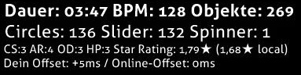
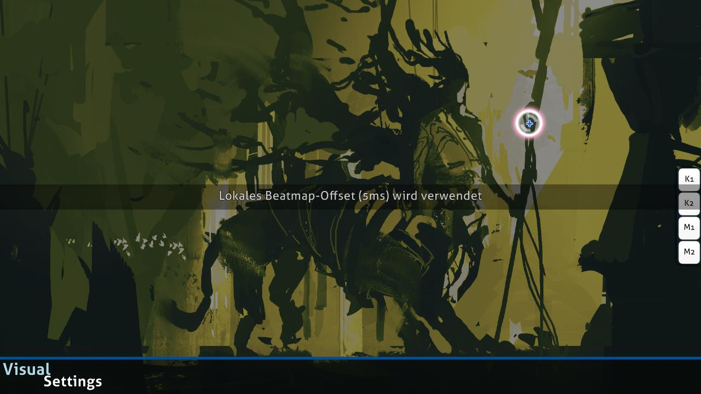

---
tags:
  - offline offset
---

# Lokales Offset

*Für andere Bedeutungen, siehe [Offset](/wiki/Offset).*

**Lokales Offset** (oder seltener *Offline-Offset*) ist eine Einstellung, die das Erscheinen von [Hit-Objekten](/wiki/Gameplay/Hit_object) in Bezug auf das Audio individueller [Beatmaps](/wiki/Beatmap) verschiebt. Dies kann für Spieler hilfreich sein, die auditive oder visuelle Verzögerungen haben. Das lokale Offset bildet gemeinsam mit dem [globalen Offset](/wiki/Offset/Universal_offset) einen Gesamtversatz.

## Verhalten

Das lokale Offset wird pro Beatmap individuell eingestellt. Alle Spielelemente ([Hit-Objekte](/wiki/Gameplay/Hit_object), [Storyboards](/wiki/Storyboard) und Videos im Hintergrund sowie Sound-Samples aus Storyboards) werden relativ zur Audiospur um eine bestimmte Anzahl an Millisekunden verschoben:

- **Negative** Werte lassen die Spielelemente **früher** erscheinen.
- **Positive** Werte lassen die Spielelemente **später** erscheinen.

Beachte, dass das [universale Offset](/wiki/Offset/Universal_offset) Elemente in die entgegengesetzte Richtung verschiebt.

Meistens ist es am besten, den lokalen Offset bei 0 zu lassen (vorausgesetzt, die Beatmaps sind korrekt getimt), es sei denn, einzelne Hardware-Probleme stehen im Weg. Wenn mehrere Spieler die gleiche Trefferdifferenz erhalten[^hit-difference], lohnt es sich, ein Mitglied des [Nomination Assessment Teams](/wiki/People/Nomination_Assessment_Team) zu kontaktieren, das das Problem bestätigen und ein [Online-Offset](/wiki/Offset/Online_offset) konfigurieren kann.

## Steuerung

Zu Beginn des Spiels kann das lokale Offset durch Drücken folgender Tasten geändert werden:

- `+`, um den Versatz um 5 Millisekunden zu erhöhen
- `-`, um den Versatz um 5 Millisekunden zu verringern
- `Alt` + `+`, um den Versatz um 1 Millisekunde zu erhöhen
- `Alt` + `-`, um den Versatz um 1 Millisekunde zu verringern

Sofern ein lokales Offset konfiguriert ist, zeigt osu! das lokale Offset in der Benutzeroberfläche über der Rangliste an.

osu! wird dich auch vor dem Spielstart über das lokale Offset informieren.

## Anmerkungen und Referenzen

[^hit-difference]: Der benötigte Versatz lässt sich entweder aus den Zeitangaben auf dem Genauigkeitsmeter, die meist an der gleichen, nicht zentrierten Stelle landen, oder aus gleichmäßigen [Fehlerwerten](/wiki/Gameplay/Accuracy#error) in der [Ergebnisanzeige](/wiki/Client/Interface#ergebnisanzeige) ableiten.
