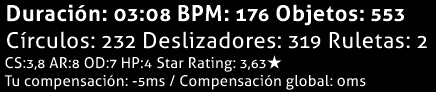
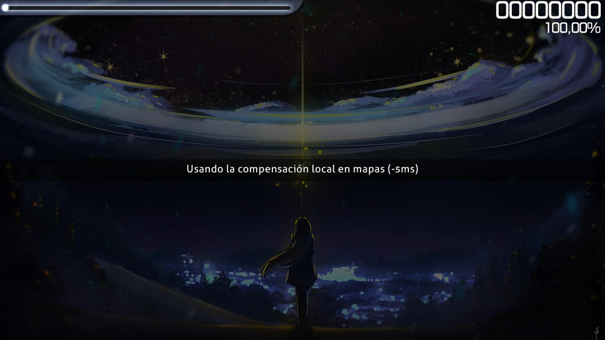

---
tags:
  - offline offset
  - compensación fuera de línea
---

# Compensación local

*Para otros usos, véase [Compensación](/wiki/Offset).*

La **compensación local** (o con menor frecuencia, *compensación fuera de línea*) es un ajuste que mueve la aparición de los [objetos](/wiki/Gameplay/Hit_object) en relación con el audio de los [beatmaps](/wiki/Beatmap) individuales. Esto puede ser útil para los jugadores que sufren un retraso en el audio o en lo visual. La compensación local de la canción funciona junto con la [compensación global](/wiki/Offset/Universal_offset) para calcular una compensación total.

## Comportamiento

La compensación local local se personaliza por beatmap. Funciona moviendo todos los elementos del juego ([objetos](/wiki/Gameplay/Hit_object), [storyboards](/wiki/Storyboard) y vídeos de fondo, así como las muestras de sonido de los storyboards) con respecto a la pista de audio en una cantidad especificada de milisegundos:

- Los valores **negativos** moverán los elementos del juego para que aparezcan **más pronto**.
- Los valores **positivos** moverán los elementos del juego para que aparezcan **más tarde**.

Ten en cuenta que la [compensación universal](/wiki/Offset/Universal_offset) mueve los elementos en la dirección opuesta.

La mayoría de las veces, es mejor mantener la compensación local en 0 (siempre que los beatmaps tengan su temporización configurada correctamente), a menos que se interpongan problemas individuales de hardware. En caso de que varios jugadores obtengan la misma diferencia de golpes[^hit-difference], vale la pena ponerse en contacto con un miembro del [Nomination Assessment Team](/wiki/People/Nomination_Assessment_Team), que puede confirmar el problema y aplicar una [compensación en línea](/wiki/Offset/Online_offset).

## Controles

Al inicio del juego, se puede cambiar la compensación local de la canción presionando:

- `+` para aumentar la compensación en 5 milisegundos
- `-` para disminuir la compensación en 5 milisegundos
- `Alt` + `+` para aumentar la compensación en 1 milisegundo
- `Alt` + `-` para disminuir la compensación en 1 milisegundo

Si se define una compensación local, osu! mostrará la compensación local en la interfaz arriba de la tabla de clasificación del mapa.

osu! también te mostrará la compensación local antes de empezar a jugar.

## Notas y referencias

[^hit-difference]: La compensación requerida puede deducirse bien de los tiempos en el medidor de puntuación que aterrizan en su mayoría en el mismo lugar no centrado, o bien de los valores consistentes del [error](/wiki/Gameplay/Accuracy#error) de la [pantalla de resultados](/wiki/Client/Interface#pantalla-de-resultados).
