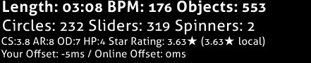
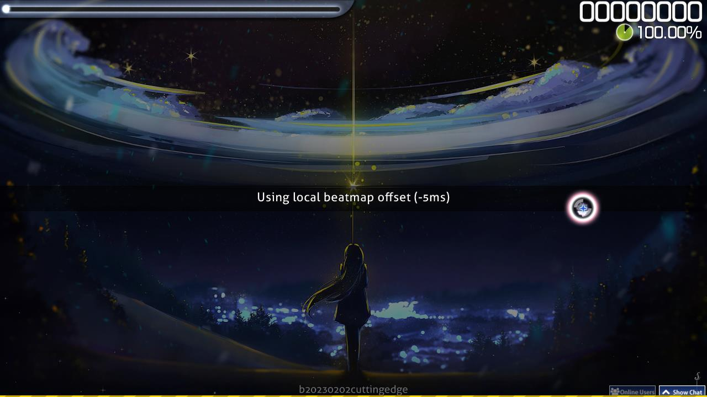

---
tags:
  - offline offset
---

# Local offset

*สำหรับความหมายอื่น ดู [Offset](/wiki/Offset)*

**Local offset** (หรือที่เรียกน้อยกว่าว่า *offline offset*) คือการตั้งค่าที่เลื่อนการปรากฏของ [hit objects](/wiki/Gameplay/Hit_object) เทียบกับเสียงของ[บีตแมป](/wiki/Beatmap)แต่ละแมป สิ่งนี้ช่วยผู้เล่นที่เจอ delay ด้านเสียงหรือภาพได้ Local song offset ทำงานร่วมกับ [global offset](/wiki/Offset/Universal_offset) เพื่อคำนวณ total offset

## พฤติกรรม

Local offset ถูกปรับแต่งแยกตามแต่ละบีตแมป มันทำงานโดยเลื่อนองค์ประกอบ gameplay ทั้งหมด ([hit objects](/wiki/Gameplay/Hit_object), [storyboards](/wiki/Storyboard) และวิดีโอพื้นหลัง รวมถึง storyboard sound samples) เทียบกับ audio track ตามจำนวนมิลลิวินาทีที่กำหนด:

- ค่า **ติดลบ** จะเลื่อนองค์ประกอบ gameplay ให้ **เร็วขึ้น**
- ค่า **บวก** จะเลื่อนองค์ประกอบ gameplay ให้ **ช้าลง**

โปรดทราบว่า [universal offset](/wiki/Offset/Universal_offset) เลื่อนองค์ประกอบในทิศทางตรงข้าม

โดยส่วนใหญ่ local offset ควรถูกตั้งไว้ที่ 0 (ในกรณีที่บีตแมปตั้ง timing ถูกต้องแล้ว) เว้นแต่มีปัญหาจาก hardware เฉพาะตัวเข้ามาเกี่ยวข้อง หากผู้เล่นหลายคนเจอ hit difference[^hit-difference] แบบเดียวกัน ควรติดต่อสมาชิก [Nomination Assessment Team](/wiki/People/Nomination_Assessment_Team) ซึ่งสามารถยืนยันปัญหาและใช้ [online offset](/wiki/Offset/Online_offset) ได้

## Controls

ตอนเริ่ม gameplay สามารถเปลี่ยน local song offset ได้ด้วยการกด:

- `+` เพื่อเพิ่ม offset 5 มิลลิวินาที
- `-` เพื่อลด offset 5 มิลลิวินาที
- `Alt` + `+` เพื่อเพิ่ม offset 1 มิลลิวินาที
- `Alt` + `-` เพื่อลด offset 1 มิลลิวินาที

หากมีการกำหนด local offset, osu! จะแสดง local offset ในอินเทอร์เฟซเหนือ scoreboard

osu! จะแจ้งเตือน local offset ก่อนเริ่ม gameplay ด้วย

## หมายเหตุและอ้างอิง

[^hit-difference]: Offset ที่ต้องใช้อาจอนุมานได้จาก timings บน score meter<!-- TODO: link --> ที่ส่วนใหญ่ตกอยู่ในตำแหน่งเดียวกันซึ่งไม่อยู่ตรงกลาง หรือจากค่า [hit error](/wiki/Gameplay/Accuracy#error) ที่สม่ำเสมอจาก[หน้าผลลัพธ์](/wiki/Client/Interface#results-screen)
