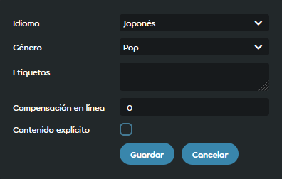

---
tags:
  - online song offset
  - compensación de la canción en línea
---

# Compensación en línea

*Para otros usos, véase [Compensación](/wiki/Offset).*

La **compensación en línea** es una compensación que se puede aplicar a un [beatmap](/wiki/Beatmap) después de que haya sido [clasificado](/wiki/Beatmap/Category#ranked). Esto suele hacerse cuando un beatmap necesita pequeños cambios en la [temporización](/wiki/Beatmapping/Timing) para alinearlo correctamente con la canción. Los valores de la compensación en línea se aplican encima de los valores de la [compensación universal](/wiki/Offset/Universal_offset) y la [compensación local](/wiki/Offset/Local_offset) de un jugador.

## Comportamiento

Un administrador del sitio web o un miembro del [Nomination Assessment Team](/wiki/People/Nomination_Assessment_Team) personaliza la compensación en línea para cada beatmap, la cual es mostrada automáticamente por osu! junto con las [tablas de clasificación](/wiki/Ranking). De forma similar a la compensación local, funciona moviendo todos los elementos del juego con relación a la pista de audio en una cantidad especificada de milisegundos:

- Los valores **negativos** mueven los elementos del juego para que aparezcan **más pronto**.
- Los valores **positivos** mueven los elementos del juego para que aparezcan **más tarde**.

Todos los valores de la compensación en línea se almacenan localmente para su uso en otro momento. Esto permite que los valores se apliquen incluso si un jugador está jugando sin conexión, siempre y cuando se haya conectado a internet antes de importar o jugar el beatmap.

## Historia

::: Infobox

:::

::: Infobox

:::

La compensación en línea se implementó en septiembre de 2008[^changelog-add] para el [Beatmap Appreciation Team](/wiki/People/Beatmap_Appreciation_Team) para hacer posible arreglar la temporización de un beatmap sin desclasificarlo. Con el paso del tiempo, se hizo accesible a los miembros de los diferentes equipos que supervisaban el proceso de clasificación, como el [Quality Assurance Team](/wiki/People/Quality_Assurance_Team) (QAT), el [Nomination Assessment Team](/wiki/People/Nomination_Assessment_Team) (NAT) y el [Global Moderation Team](/wiki/People/Global_Moderation_Team), debido a la similitud de los permisos de los grupos.

En mayo de 2019, el NAT declaró durante el seguimiento de la reestructuración del QAT[^qat-restructuring-follow-up-pr] que una compensación no válida requeriría la desclasificación del beatmap y no podría arreglarse a través de los respectivos controles del sitio web. De todos modos, todo el panel de gestión de los mapas se hizo visible para los [Beatmap Nominators](/wiki/People/Beatmap_Nominators).

En abril de 2022 se añadieron los controles de la compensación en línea[^new-website-offset] al nuevo sitio web, pero una semana después se limitaron únicamente a los administradores para evitar usos indebidos.[^new-website-offset-restriction]

## Referencias

[^changelog-add]: [Publicación de foro por peppy (16/9/2008)](https://osu.ppy.sh/community/forums/posts/50194)
[^qat-restructuring-follow-up-pr]: [Solicitud de cambios «BN Rules: Disqualifications» por MoMan (5/5/2019)](https://github.com/ppy/osu-wiki/pull/2160)
[^new-website-offset]: [Solicitud de cambios «Add offset edit to beatmapset metadata controls» por venix12 (12/4/2021)](https://github.com/ppy/osu-web/pull/7474)
[^new-website-offset-restriction]: [Solicitud de cambios «Only allow admin to edit beatmap offset» por nanaya (22/4/2022)](https://github.com/ppy/osu-web/pull/8834)
