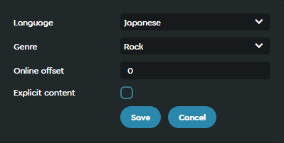

---
tags:
  - online song offset
  - онлайн-оффсет
  - онлайн оффсет
---

# Онлайн-оффсет

*У этого термина есть и другие значения, см. [Оффсет](/wiki/Offset).*

**Онлайн-оффсет** (англ. *online offset*) — вид оффсета, который применяется к [карте](/wiki/Beatmap) уже после того, как её [ранкнули](/wiki/Beatmap/Category#ranked). Это делается в ситуациях, когда в [тайминг](/wiki/Beatmapping/Timing) карты нужно внести небольшие изменения, чтобы подогнать её под песню. Онлайн-оффсет применяется после [универсального](/wiki/Offset/Universal_offset) и [локального](/wiki/Offset/Local_offset) оффсетов, оба из которых настраиваются игроком.

## Поведение

Онлайн-оффсет настраивается администраторами или членами [команды оценки номинаций](/wiki/People/Nomination_Assessment_Team) для отдельных неправильно затаймленных карт. osu! получает онлайн-оффсеты карт при загрузке их [таблиц рекордов](/wiki/Ranking). Онлайн-оффсет, как и его локальный аналог, сдвигает все игровые элементы относительно аудио на заданное число миллисекунд:

- При **отрицательном** оффсете элементы будут появляться **раньше**.
- При **положительном** оффсете элементы будут появляться **позже**.

Клиент кэширует значения онлайн-оффсетов всех карт, что позволяет играть с исправленным таймингом, даже если игрок отключил интернет после импортирования карты или её первого прохождения.

## История

::: Infobox

:::

::: Infobox

:::

Онлайн-оффсет был добавлен для членов [Beatmap Appreciation Team](/wiki/People/Beatmap_Appreciation_Team) в сентябре 2008 г.,[^changelog-add] чтобы тайминг карты можно было подправить без сброса рекордов. В разные периоды доступ к настройке онлайн-оффсета имели члены разных команд, отвечавших за систему ранкинга в целом: [Quality Assurance Team](/wiki/People/Quality_Assurance_Team) (QAT), [команда оценки номинаций](/wiki/People/Nomination_Assessment_Team) (NAT), а кроме того, [команда глобальной модерации](/wiki/People/Global_Moderation_Team), поскольку у них были схожие права доступа.

В мае 2019 г. члены NAT после реформы QAT[^qat-restructuring-follow-up-pr] сошлись на том, что неправильный оффсет нужно исправлять полноценно, временно убирая карту из Ranked, а не с помощью инструментов веб-сайта. Тем не менее, [номинаторам](/wiki/People/Beatmap_Nominators) решили дать полный доступ ко всей панели управления картой.

В апреле 2022 г. панель для настройки онлайн-оффсета была добавлена и на новый сайт[^new-website-offset], но доступ к ней получили только администраторы, чтобы предотвратить неправильное использование.[^new-website-offset-restriction]

## Ссылки

[^changelog-add]: [Пост от peppy в теме «Official Development Changelog», 16.09.2008](https://osu.ppy.sh/community/forums/posts/50194)
[^qat-restructuring-follow-up-pr]: [«BN Rules: Disqualifications», пулл-реквест от MoMan, 05.05.2019](https://github.com/ppy/osu-wiki/pull/2160)
[^new-website-offset]: [«Add offset edit to beatmapset metadata controls», пулл-реквест от venix12, 12.04.2021](https://github.com/ppy/osu-web/pull/7474)
[^new-website-offset-restriction]: [«Only allow admin to edit beatmap offset», пулл-реквест от nanaya, 22.04.2022](https://github.com/ppy/osu-web/pull/8834)
