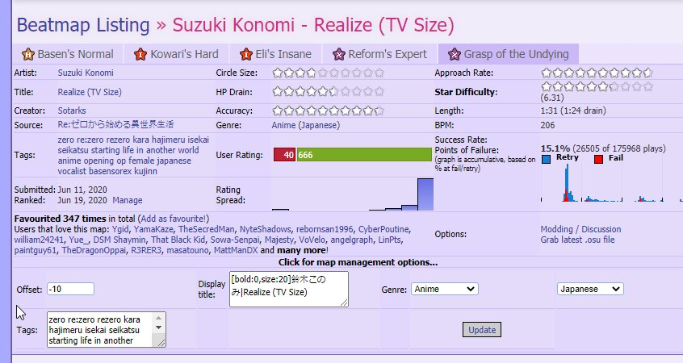
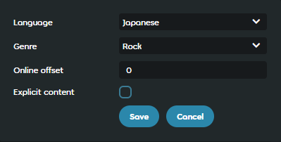

---
tags:
  - online song offset
---

# Online offset

*สำหรับความหมายอื่น ดู [Offset](/wiki/Offset)*

**Online offset** คือ offset ที่สามารถใช้กับ[บีตแมป](/wiki/Beatmap)หลังจากบีตแมปนั้น [ranked](/wiki/Beatmap/Category#ranked) ไปแล้ว โดยปกติทำเมื่อบีตแมปต้องปรับ [timing](/wiki/Beatmapping/Timing) เล็กน้อยเพื่อจัดให้ตรงกับเพลง ค่า online offset จะถูกนำไปใช้ต่อจากค่า [universal offset](/wiki/Offset/Universal_offset) และ [local offset](/wiki/Offset/Local_offset) ของผู้เล่น

## พฤติกรรม

Online offset ถูกปรับสำหรับบีตแมปที่ timing ผิดเป็นรายแมปโดยผู้ดูแลเว็บไซต์หรือสมาชิก [Nomination Assessment Team](/wiki/People/Nomination_Assessment_Team) และ osu! จะดึงค่าโดยอัตโนมัติพร้อมกับ [leaderboards](/wiki/Ranking) คล้ายกับ local offset มันทำงานโดยเลื่อนองค์ประกอบ gameplay ทั้งหมดเทียบกับ audio track ตามจำนวนมิลลิวินาทีที่กำหนด:

- ค่า **ติดลบ** จะเลื่อนองค์ประกอบ gameplay ให้ **เร็วขึ้น**
- ค่า **บวก** จะเลื่อนองค์ประกอบ gameplay ให้ **ช้าลง**

ค่า online offset ทั้งหมดจะถูกเก็บไว้ในเครื่องเพื่อใช้ภายหลัง ทำให้ค่ายังถูกนำไปใช้ได้แม้ผู้เล่นเล่นแบบ offline ตราบใดที่เคยเชื่อมต่ออินเทอร์เน็ตก่อนนำเข้าหรือเล่นบีตแมปนั้น

## ประวัติ

::: Infobox

:::

::: Infobox

:::

Online offset ถูกพัฒนาในเดือนกันยายน 2008[^changelog-add] สำหรับ [Beatmap Appreciation Team](/wiki/People/Beatmap_Appreciation_Team) เพื่อให้สามารถแก้ timing ของบีตแมปได้โดยไม่ต้อง unrank เมื่อเวลาผ่านไป ฟีเจอร์นี้ถูกเปิดให้สมาชิกทีมต่าง ๆ ที่ดูแลกระบวนการ ranking ใช้งานได้ เช่น [Quality Assurance Team](/wiki/People/Quality_Assurance_Team) (QAT), [Nomination Assessment Team](/wiki/People/Nomination_Assessment_Team) (NAT), และ [Global Moderation Team](/wiki/People/Global_Moderation_Team) เนื่องจาก permission ของ user groups คล้ายกัน

ในเดือนพฤษภาคม 2019 NAT ประกาศระหว่าง QAT restructuring follow-up[^qat-restructuring-follow-up-pr] ว่า offset ที่ไม่ถูกต้องจำเป็นต้องทำให้บีตแมป unrank และไม่สามารถแก้ผ่าน controls บนเว็บไซต์ที่เกี่ยวข้องได้ ถึงอย่างนั้น map management panel ทั้งหมดก็ถูกทำให้ [Beatmap Nominators](/wiki/People/Beatmap_Nominators) มองเห็นได้

ในเดือนเมษายน 2022 controls สำหรับ online offset ถูกเพิ่ม[^new-website-offset] เข้าเว็บไซต์ใหม่ แต่หนึ่งสัปดาห์หลังจากนั้นถูกจำกัดให้เฉพาะ administrators เพื่อป้องกันการใช้งานผิดทาง[^new-website-offset-restriction]

## อ้างอิง

[^changelog-add]: [โพสต์ฟอรัมโดย peppy (2008-09-16)](https://osu.ppy.sh/community/forums/posts/50194)
[^qat-restructuring-follow-up-pr]: ["BN Rules: Disqualifications", pull request โดย MoMan (2019-05-05)](https://github.com/ppy/osu-wiki/pull/2160)
[^new-website-offset]: ["Add offset edit to beatmapset metadata controls", pull request โดย venix12 (2021-04-12)](https://github.com/ppy/osu-web/pull/7474)
[^new-website-offset-restriction]: ["Only allow admin to edit beatmap offset", pull request โดย nanaya (2022-04-22)](https://github.com/ppy/osu-web/pull/8834)
