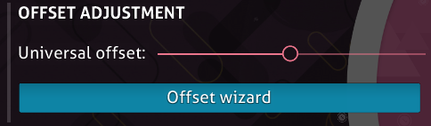

---
tags:
  - UO
  - global offset
  - offset global
---

# Universal offset

*Pour d'autres utilisations, voir [Offset](/wiki/Offset).*\
*Pour des instructions étape par étape sur la façon de régler l'universal offset à la valeur correcte, voir : [Comment utiliser l'assistant de décalage](/wiki/Guides/How_to_use_the_Offset_Wizard).*

**L'universal offset** (ou **offset global** souvent appelé décalage universel) est une [option](/wiki/Client/Options) qui déplace l'apparence des [objets](/wiki/Gameplay/Hit_object) par rapport à l'audio dans toutes les [beatmaps](/wiki/Beatmap). Cela peut s'avérer utile pour les joueurs qui subissent des décalages auditifs ou visuels. L'universal offset fonctionne avec le [décalage local](/wiki/Offset/Local_offset) pour calculer l'offset total.

## Comportement

L'universal offset fonctionne en ajoutant un délai spécifié entre la musique de chaque beatmap et les autres sons et graphiques associés. Contrairement à l'offset [local](/wiki/Offset/Local_offset) ou [en ligne](/wiki/Offset/Online_offset), il est appliqué à l'audio plutôt qu'aux éléments de gameplay, produisant l'effet inverse :

- Les valeurs **positives** déplacent les éléments de gameplay **plus tôt**.
- Les valeurs **négatives** déplacent les éléments de gameplay **plus tard**.

Il est généralement intéressant de garder le décalage universel à sa valeur par défaut, `0`, puisqu'un universal offset mal déterminé causera des problèmes de timing significatifs sur toutes les beatmaps. Cependant, si **toutes les beatmaps** ont des problèmes de timing constants et perceptibles, l'utilisation d'une valeur différente peut être bénéfique.[^local-offset] La valeur optimale de l'universal offset de chaque joueur diffère en raison des variations de leurs systèmes.

## Contrôles

La valeur de l'universal offset peut être modifiée directement dans les [options](/wiki/Client/Options). Il est également possible de l'adapter à la configuration actuelle à l'aide de l'[Assistant de décalage](/wiki/Client/Options/Offset_Wizard).

## Notes et références

[^local-offset]: En cas de problèmes de synchronisation avec des beatmaps individuelles, [l'offset local](/wiki/Offset/Local_offset) doit être utilisé à la place.
