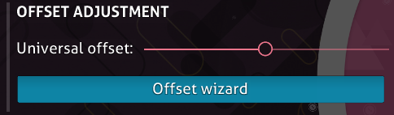

---
tags:
  - UO
  - global offset
---

# Universal offset

*สำหรับความหมายอื่น ดู [Offset](/wiki/Offset)*\
*สำหรับขั้นตอนแบบละเอียดในการตั้ง universal offset ให้ถูกต้อง ดู [How to use the Offset Wizard](/wiki/Guides/How_to_use_the_Offset_Wizard)*

**Universal offset** (หรือ **global offset**) คือ[ตัวเลือก](/wiki/Client/Options)ที่เลื่อนการปรากฏของ [hit objects](/wiki/Gameplay/Hit_object) เทียบกับเสียงใน[บีตแมป](/wiki/Beatmap)ทั้งหมด สิ่งนี้ช่วยผู้เล่นที่เจอ delay ด้านเสียงหรือภาพได้ Universal offset ทำงานร่วมกับ [local song offset](/wiki/Offset/Local_offset) เพื่อคำนวณ total offset

## พฤติกรรม

Universal offset ทำงานโดยเพิ่ม delay ที่กำหนดระหว่างเพลงของทุกบีตแมปกับเสียงและกราฟิกอื่นที่เกี่ยวข้อง ต่างจาก [local](/wiki/Offset/Local_offset) หรือ [online](/wiki/Offset/Online_offset) ตรงที่มันถูกใช้กับเสียงแทนองค์ประกอบ gameplay จึงให้ผลตรงข้าม:

- ค่า **บวก** จะเลื่อนองค์ประกอบ gameplay ให้ **เร็วขึ้น**
- ค่า **ติดลบ** จะเลื่อนองค์ประกอบ gameplay ให้ **ช้าลง**

โดยปกติควรตั้ง universal offset ไว้ที่ค่าเริ่มต้น `0` เพราะ universal offset ที่กำหนดผิดจะทำให้เกิดปัญหา timing อย่างมากกับทุกบีตแมป อย่างไรก็ตาม หาก **ทุกบีตแมป** มีปัญหา timing ที่สม่ำเสมอและสังเกตได้ การใช้ค่าอื่นอาจมีประโยชน์[^local-offset] ค่า universal offset ที่เหมาะสมของผู้เล่นแต่ละคนแตกต่างกันตามความต่างของระบบที่ใช้

## Controls

ค่า universal offset สามารถเปลี่ยนได้โดยตรงใน [options](/wiki/Client/Options) อีกทางหนึ่ง สามารถปรับให้เข้ากับ setup ปัจจุบันได้ด้วย [Offset Wizard](/wiki/Client/Options/Offset_Wizard)

## หมายเหตุและอ้างอิง

[^local-offset]: หากมีปัญหา timing ที่สม่ำเสมอกับบีตแมปเฉพาะราย ควรใช้ [local offset](/wiki/Offset/Local_offset) แทน
