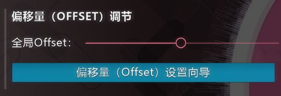

---
tags:
  - UO
  - global offset
  - 全局偏移量
---

# 全局偏移量

*对于其它用途，参见[偏移量](/wiki/Offset)。*\
*对于如何正确设置全局偏移量，请参见[如何使用偏移量设置向导](/wiki/Guides/How_to_use_the_Offset_Wizard)的分步指导。*

**全局偏移量 (Universal offset)**（或 **global offset**）是一项相对于所有[谱面](/wiki/Beatmap)音乐，移动[打击物件](/wiki/Gameplay/Hit_object)出现时机的[设置](/wiki/Client/Options)。这对于那些遇到音频和视觉延迟的玩家很有帮助。全局偏移量与[本地歌曲偏移量](/wiki/Offset/Local_offset)共同计算，得出总计的偏移量。

## 行为

全局偏移量针对所有的谱面，在歌曲与其它相关音效和图形间添加一个特定的延迟。与[本地偏移量](/wiki/Offset/Local_offset)或[在线偏移量](/wiki/Offset/Online_offset)不同，它作用于音频，而不是游戏元素，因此产生的效果相反：

- **正**值会使游戏元素**更早**出现。
- **负**值会使游戏元素**更晚**出现。

通常来说，请将全局偏移量保持在默认值 (`0`)。这是因为，错误的全局偏移量会导致所有谱面出现严重时间轴错误。然而，如果**所有的谱面**都存在同样的明显时间轴错误，使用其它值可能会有帮助。[^local-offset]每个玩家的最佳全局偏移量不同，这是由他们不同的系统环境所决定的。

## 控制

全局偏移量的值可以直接在[设置](/wiki/Client/Options)中调节。而另一种为当前系统环境量身定制的方式，则是使用[偏移量设置向导](/wiki/Client/Options/Offset_Wizard)。

## 提示和参考资料

[^local-offset]: 为防止单一谱面的时间轴问题，应改用[本地偏移量](/wiki/Offset/Local_offset)。
