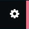
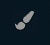
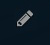

# Optionen

")

## Optionen

Starte osu! neu, falls etwas nicht wie beabsichtigt funktionieren sollte (Hintergrund-Dimmer ist meist der Auslöser). Klicke auf **Options** oder drücke `O` im Hauptmenü, um das Optionsmenü aufzurufen und um das Verhalten von osu! einzustellen.

Geben Sie einfach ein, wonach Sie suchen möchten. Der Text in der Suchleiste wird *zittern*, wenn Ihre Suche ungültig ist und verweigert Ihnen weitere ungültige Buchstaben einzugeben.

**Anmerkung:** b(Jahr)(Monat)(Tag).(Überarbeitung) = Public Build. Also, b20140323.3 bedeutet: Public Build vom 23. März 2014, dritte Überarbeitung. Man findet diese ganz am *Ende* des Optionsmenüs.

**Anmerkung2:** b(Jahr)(Monat)(Tag)cuttingedge = Test Build.

### Allgemein

#### Einloggen

##### Gast

| Name | Effekt |
| :-- | :-- |
| Benutzername | Geben Sie hier Ihren registrierten Benutzernamen ein |
| Passwort | Das Passwort zu Ihrem Benutzernamen. |
| Benutzername speichern | Lassen Sie Ihren Benutzernamen von osu! speichern.{Benutzername} |
| Passwort speichern | Lassen Sie Ihren Passwort von osu! speichern.{Benutzername}, um sich automatisch einzuloggen. |

Klicke auf **Einloggen**, um sich anzumelden oder klicke auf **Account erstellen**, falls Sie noch über keinen Account verfügen. Sobald Sie sich erfolgreich eingeloggt haben, wird es sich, wie unten angezeigt, ändern.

##### Benutzername

Als {Benutzername} anmeldet.

Klicke Sie darauf, um auf gewisse Funktionen zuzugreifen.

| Name | Effekt |
| :-- | :-- |
| 1. Profil anzeigen | Sehen Sie sich Ihren Profil auf der osu! Website an. |
| 2. Ausloggen | Loggen Sie sich aus dem Spiel aus. |
| 3. Avatar ändern | Ändern Sie Ihren Profilbild. |
| 4. Schließen | Schließen. |

#### Sprache

| Name | Effekt |
| :-- | :-- |
| Sprache wählen | Wählen Sie Ihre bevorzugte Sprache aus. osu! wird das Sprachpaket downloaden und zu der ausgewählten Sprache wechseln. Standard ist Englisch. Um dazu beizutragen: [Forum Link](https://osu.ppy.sh/community/forums/topics/104342/) (alter Link) |
| Metadaten in Originalsprache | Beatmaps, die über Unicode Metadaten verfügen, werden statt der üblichen ASCII Metadaten in der Originalsprache angezeigt. **Beispiel:** Wenn ausgewählt, wird sich der Titel der Beatmap von "Night of Feifan Brother" zu "非凡哥之夜" ändern, falls der Mapper Unicode Daten für seine/ihre Beatmap angegeben hat. Hier ist [Beatmap](https://osu.ppy.sh/beatmapsets/44443#osu/139221) aus dem Beispiel. |
| Alternative Schriftart im Chat | Wenn Sie die alte Schriftart (Tahoma) lieber als die derzeitige (Aller) im Chat verwenden möchten. |

#### Updates

| Name | Effekt |
| :-- | :-- |
| UpdatequelleUpdatequelle | **Stable:** Public build. ****Cutting Edge:** osu!test build (Multi nur als Supporter zugänglich). **Anmerkung:** Online Verbindung ist notwendig, um zwischen diesen zu wechseln. |
| osu!-Ordner öffnen | osu!-Ordner öffnen. |

### Grafik

#### Renderer

`Neustart erforderlich.`

| Name | Effekt |
| :-- | :-- |
| OpenGL | Benutze diesen, wenn Sie \[1\] keine Shaderunterstützung haben, \[2\] extreme Lags oder sehr niedrige FPS haben, \[3\] eine alte oder eine DirectX inkompatible Grafikkarte benutzen. |
| DirectX (Default) | Benutzt Shader, um die Performance zu verbessern, kann sich aber schlecht auf *sehr* alten Geräten auswirken. |
| Frame Limiter | 60fps (vsync), 60fps (low latency), 120fps \[Standard\], 240fps, Unbegrenzt (Gameplay), Unbegrenzt |

Anmerkung: Für Laptop Benutzer wird empfohlen die FPS zu limitieren, um Überhitzungen [wie in diesem Beitrag erwähnt](https://osu.ppy.sh/community/forums/topics/82605) vorzubeugen. Außerdem, achtet auf eure Stromrechnung.

- **FPS-Zähler:** Zeigt einen unaufdringlichen Frame-Pro-Sekunde Zähler am unteren, rechten Rand des Bildschirmes.

#### Bildschirmauflösung

##### Auflösung wählen:

| Eigenschaften | Auflösung im Fenstermodus | Auflösung im Vollbildmodus |
| :-- | :-- | :-- |
| Standard | 800 x 600, 1024 x 768 | 800 x 600, 1024 x 768 |
| Breitbild | 1024 x 600, _Ihre Bildschirmauflösung_ (Randlos) \[Standard\] | _Ihre Bildschirmauflösung_ (native) \[Standard\] |

- **Vollbildmodus** (osu! nimmt Ihren ganzen Bildschirm ein. Kann die Latenzzeit verringern.)

#### Grafikeinstellungen

| Name | Effekt |
| :-- | :-- |
| Animierte Slider | Slider von der Startposition aus aufklappen lassen, anstatt sie von Anfang an komplett anzuzeigen. Dies sollte keine Probleme bereiten, außer man besitzt einen schwachen PC. |
| Hintergrund Video | Aktiviert das Abspielen von Hintergrundvideos. Wenn Maps mit Videos für Sie unspielbar sind, deaktivieren Sie diese Option. Kann vorübergehend in den Visual Settings deaktiviert werden. |
| Storyboards | Zeige Storyboards im Hintergrund von Beatmaps. Sie enthalten meistens Storyelemente, Songtexte oder Spezialeffekte. Kann ebenfalls vorübergehend in den Visual Settings deaktiviert werden. |
| Combo Bilder | Wenn Sie besondere Combowerte erreicht haben, sehen Sie ein Bild von der Seite auf den Bildschirm springen! |
| Hit Lighting | Zeigt einen dezenten Leuchteffekt, wenn Sie Circle anklicken. Deaktiviert nicht das Leuchten während dem Kiai. |
| Shadereffekte | Aktiviert Shadereffekte im Spiel. Benötigt Pixel Shader 2.0. Wenn Ihre Grafikkarte dies nicht unterstützt, wird diese Option automatisch deaktiviert. |
| Unschärfefilter | Passt die "Shadereffekte" an, um sie weniger "grell" zu machen. |

##### Screenshot Format (Dateiformat von Screenshots)

| Name | Effekt |
| :-- | :-- |
| PNG (Verlustfrei) | Hohe Dateigröße, aber unkomprimierte Qualität. |
| JPEG (Web-geeignet) \[Default\] | Kompakte Dateigröße. Mühelos zu laden. Kann beim Reinzoomen verpixelt wirken. |

#### Hauptmenü

| Name | Effekt |
| :-- | :-- |
| Schneeanimation | Kleine Icons des derzeit ausgewählten Spielmodus fallen als Schnee Symbole im Hauptmenü vom Himmel. Erstellt für Weihnachten 2013 und Rückkehr dank großer Nachfrage. |
| Parallaxeneffekt | Der Bildschirm bewegt sich mit Ihrem osu!cursor mit. Funktioniert nicht während des Gameplays. |
| Tipps | Zeigt eine Menge interessanter Tipps an, jedes mal wenn man das Hauptmenü besucht. Diese befinden sich unter dem riesigen osu! Symbol. |
| Interface Stimmen | "Welcome to osu!"/"See you next time." osu! gegrüßt Sie beim Starten und verabschiedet sich beim Beenden. |
| osu!-Titelsong | osu! spielt "nekodex - welcome to osu!" im Menü anstelle von zufälligen Beatmaps ab. Es ist keine Beatmap und wird immer wieder wiederholt bis Sie den Song ändern. Sobald geändert, können Sie ihn nur wieder hören, indem Sie osu! erneut öffnen. |

#### Songauswahl

| Name | Effekt |
| :-- | :-- |
| Vorschaubilder | Zeigt eine Vorschau des Hintergrundbildes in der Songauswahl an. Voraussetzung ist ein kompatibler Skin (Version 2.2+). |

### Gameplay

#### Allgemein

| Name | Effekt |
| :-- | :-- |
| Hintergrund-Dimmer | Alle Beatmaps werden gezwungen den Wert des Dimmers anzunehmen. |
| Position der Fortschrittsleiste (stellt die Darstellung und die Position der Fortschrittsleiste fest) | Rechts oben (Kreis) \[Standard\], Top-Right (Balken), Rechts unten {Ähnlich wie bei osu!droid}, Unterer Bildschirmrand (langer Balken) {Ähnlich wie bei osu!stream} |
| Genauigkeitsmeter (stellt die Erscheinung des Genauigkeitsmessers am unteren Bildschirmrand fest). | **Aus:** Zeigt keinen Genauigkeitsmeter, **Farbe:** Zeigt voherige Hitwerte an (basiert an den Farben vom Standardskin für die 300/100/50/Miss), **Abweichung \[Standard\]:** Zeigt Ihnen präzise, wie akkurat Sie bei jedem Hit sind. Die Länge der einzelnen Bereiche hängen von der OD ab. Links - Mitte - Rechts = zu früh - Perfekt – zu spät |
| Genauigkeitsmetergröße | Passt die Größe der Genauigkeitsmeterangezeige an. |
| Tasten-Overlay | Immer das Tasten-Overlay anzeigen, selbst wenn Sie lokal spielen. Nützlich zum Aufnehmen oder Streamen. |
| Approach Circle des ersten Objektes beim Mod "Hidden" | Dies erlaubt Ihnen, den Approach Circle des ersten Hit-Objektes sehen zu können. |
| osu!mania-Scrollgeschwindigkeit anhand BPM skalieren | Die Scrollgeschwindigkeit wird proportional zur Grund-BPM der Beatmap eingestellt. Wenn Sie dies aktivieren, scrollen schnellere Beatmaps schneller. |
| osu!mania-Scrollgeschwindigkeit für jede Beatmap merken | Speichert die Scrollgeschwindigkeiten für jede Beatmap einzeln. |

### Audio

#### Lautstärke

The volume controls allow one to change the volume in-game.

- Allgemein: Allgemeiner Lautstärkeregler.
- Musik: Beeinflusst nur die Musik selbst.
- Effekte: Beeinflusst die Lautstärke der Hitsounds, sowie andere Soundeffekte.

| Name | Effekt |
| :-- | :-- |
| Beatmaps Hitsounds ignorieren | Hitsounds, die einer Beatmap beigefügt worden sind, werden ignoriert. |

#### Universeller Audio-Offset

Wenn Sie in jeder einzelnen Beatmaps eine Asynchronität feststellen sollten, dann sollten Sie Ýhren universaler Offset anpassen. Entweder klicken Sie auf die gewünschte Stelle vom Graphen oder ziehen den Zeiger auf die gewünschte Stelle. Versuchen Sie den Wert solange anzupassen, bis die Maps zum Lied sychron sind. Alternativ können Sie auch den Offset Assistent benutzen für eine bessere Veranschaulichung, in dem die Tick repräsentiert werden.

Jede Schwierigkeitsstufe besitzt zudem noch einen lokalen Offset, wodurch nur die Schwierigkeitsstufe davon betroffen ist. Wenn ein Online Offset vorhanden sein sollte, dann können Sie entweder \[1\] den Offset der jeweiligen Schwierigkeitsstufe, die Sie gerade spielen, manuell anpassen, indem Sie die Tasten "+" oder "-" benutzen (ändert den Offset in 5ms Schritten, wenn die Taste "Alt" währenddessen gehalten wird, wird der Offset in 1ms geändert) oder \[2\] Sie gehen in den Einstellungen und passen den universalen Offset an. Sie sollten daher nicht vergessen, es danach wieder auf den ursprünglichen Wert einzutellen.

##### Offset Assistent

Klicken Sie auf "Offset Assistent", um den universalen Offset mit einer bildlichen Veranschaulichung anzupassen.

Hinweis: Das derzeitig abgespielte Lied in der Jukebox wird dazu verwendet.

1. Zeigt den universalen Offset Millisekunden an.
2. Klickt auf den "Halber Tick", um die Anzahl an Ticks zu halbieren oder auf den "Doppelter Tick", um die Anzahl an Ticks zu verdoppeln.
3. Dies sind die Ticks. Sie werden durch den grün-leuchtenden, vertikalen Linie hindurchpassieren, wodruch ein Klang abgespielt wird, um den Tick zu repräsentieren.
4. Klick auf "zurück" oder die Taste "ESC", um zu den Einstellungen zurückzukehren. Dadurch wird der universale Offset aktualisiert.
5. Ihre Jukebox. Benutzt den BPM-Wert des aktuell abgespielten Songs als Tickrate.

### Skin

#### Skin

| Name | Effekt |
| :-- | :-- |
| (Bilder vom Skin) | Bilder vom Skin. Zeigt den Spinner nicht. **Set 1:** Hitcircleset, hit50.png, hit100.png, hit300.png, **Set 2:** hit0.png, hit100k.png, hit300g.png, **Set 3:** Combozahlen, **Set 4:** Scorezahlen |
| Skin auswählen | Zeigt den aktuell benutzten Skin an. Der Standardskin von osu! wird immer als erstes gelistet. |
| Skinordner öffnen | Schneller Zugriff auf den aktuellen Skin. Funktioniert jedoch nicht mit dem Standardskin von osu! |
| Als .osk exportieren | Exportiert den aktuell benutzten Skins als .osk Datei. Funktioniert jedoch nicht mit dem Standardskin von osu! |
| Alle Beatmap-Skins ignorieren | Falls aktiviert, wird nur Ihr aktuell benutzter Skin verwendet, die Skinelemente im Beatmap werden dann ignoriert. |
| Benutze Skin-Soundsamples | Falls dies nicht ausgewählt ist, werden die Standardsounds verwendet. |
| Benutze Taiko-Skin für den Taiko-Modus | Falls dies ausgewählt und der Taiko-Skin vorhanden ist, wird dieser im Taiko-Modus immer verwendet. |
| Benutze immer den Skincursor | Der Cursor des ausgewählten Skins wird alle anderen Beatmap-spezifischen Skins überschreiben. |
| Cursorgröße | Passe die Größe des Ingame-Cursors an. |
| Automatische Cursorgröße | Die Größe des Cursors wird entsprechend der [CS](/wiki/CS) (Circle Size) der aktuellen Beatmap angepasst.
| Combofarbe für Sliderball verwenden | Voraussetzung ist ein Skin, der diese Einstellung gesondert unterstützt. |

### Steuerung

#### Maus

| Name | Effekt |
| :-- | :-- |
| Mausgeschwindigkeit | Die Standardeinstellung entspricht der des Desktops. |
| Raw Input | Raw Input umgeht die Datenverarbeitung in Windows und fragt die Eingabedaten direkt von der Hardware ab. |
| Absoluten Raw Input aufs osu! Fenster abbilden | Eingabegeräte mit absoluter Positionierung, z.B. Tablets, betreffen normalerweise den kompletten Bildschirm. Diese Option erlaubt solch Geräten ausschließlich auf das osu! Fenster zu wirken. |
| Mausrad beim Spielen deaktivieren. | Während des Spiels können Sie die Lautstärke mit dem Mausrad ändern und/oder das Spiel pausieren. Diese Option deaktivert dies. |
| Maustasten beim Spielen deaktivieren. | Diese Option deaktiviert temporär alle Maustasten, während Sie spielen. Besonders geeignet für diejenigen, die die Tastatur zum Klicken benutzen. Außerhalb den Einstellungen mit der Taste F10 einstellbar. |
| Cursorwellen | Ein Welleneffekt wird angezeigt, wenn Sie klicken. |

#### Tastatur

##### osu!mania-Layout

Tasteneinstellung für die jeweilige Spalte. **Drück die Taste für die jeweilige Spalte.** Ansonsten wird die [Standardtasteneinstellung](/wiki/Game_Modes/osu!mania) für osu!mania verwendet.

| Name | Effekt |
| :-- | :-- |
| Tastenanzahl | Einstellungen für 1K - 10K. |
| Column Style \[nur 6K und 8K\] | **Normal:** `Z S X D C F` (6K), `Z S X D C F V G` (8K); **Right:** `Z S X D C *F*` (6K), `Z S X D C F V *LShift*` (8K); **Left:** `*Z* S X D C F` (6K), `*LShift* Z S X D C F V` (8K); |
| Vertikal gespiegeltes Spielfeld (DDR-Stil) | Das Spielfeld wird vertikal gespiegelt, wodurch die Tasten am oberen Bildschrirmrand sind und die Noten sich von unten nach oben bewegen. Das Design sowie die Tastenbelegung bleibt unverändert. |
| Zeige Urteilsbereich | Macht den Urteilsbereich etwas "heller". |

#### Sonstiges

| Name | Effekt |
| :-- | :-- |
| TabletPC-Unterstützung erzwingen | Aktiviere diese Option, wenn Sie einen Tablet-PC oder ein Grafiktablett benutzen und Probleme mit der Eingabe haben. |
| Joystick-Unterstück aktivieren | Aktiviere dies, wenn Sie osu!mania mit einem Joystick oder Controller spielen. |
| Wiimote-/TaTaCon-Unterstützung aktivieren | Aktiviert Unterstützung für den Wii-Taiko-Controller und Wiimote (noch nicht unterstützt). Stellen Sie sicher, dass Sie Ihren Wiimote mit Bluetooth verbunden haben, bevor Sie diese Option aktivieren! |

### Editor

#### Allgemein

| Name | Effekt |
| :-- | :-- |
| Hintergrundvideo | Hintergrundvideo im Editor zeigen. |
| Standardskin verwenden | Ignoriert benutzerdefinierte Skins im Editor. Der Standardskin wird für das Editieren empfohlen, um Überlappungen etc. zu vermeiden. |
| Rückgängig-Funktion deaktivieren | Beim Editieren von sehr langen Marathon-Maps kann das Speichern aller vorgenommenen Änderungen für die Rückgängig-/Wiederholen-Funktion die Perfomance beeinträchtigen. Diese Option ist nur für solche Randfälle gedacht. Benutzung auf eigene Gefahr. |

### Online

#### Meldungen und Privatsphäre

| Name | Effekt |
| :-- | :-- |
| Chat Ticker | Neue Chatnachrichten werden am unteren Bildschirmrand angezeigt, wenn das Chatfenster ausgeblendet ist. |
| Chat automatisch ausblenden | Wenn aktiviert, wird der Chat während des Spielens automatisch ausgeblendet. Er wird dann nur noch während den Pausen, dem Intro und dem Outro angezeigt. |
| Bei Highlight Hinweis-Popup anzeigen | Eine Nachricht wird am unteren Teil deines Bildschirms erscheinen (auch während des Spielens), wenn jemand Ihren Namen oder ein Highlight-Wort im Chat erwähnt. |
| Deinen Standort für andere anzeigen | Standardmäßig können andere Benutzer nur Ihr Land sehen. Wird diese Option aktiviert, wird auch Ihre Stadt für andere sichtbar sein. In der Regel kann diese ziemlich genau ermittelt werden. |
| Zuschauer-Liste während des Spielens anzeigen | Eine Liste von Zuschauern ist oben links während des Spielens sichtbar. Wenn Sie dies ausschalten, werden Sie nicht mehr wissen, ob Ihnen jemand zuschaut. |
| Hinweis-Popups im Spiel anzeigen | Wenn aktiviert, werden Hinweis-Popups im unteren Teil des Bildschirm während des Spielens angezeigt. Wenn deaktiviert, werden Hinweis-Popups nur in Pausen angezeigt. |
| Hinweis-Popup, wenn Freunde ihren Status ändern | Wenn einer Ihrer Freunde online oder offline geht, wird ein Hinweis-Popup angezeigt. |
| Mehrspieler-Einladungen von jedem erlauben | Deaktiviere dies, um nur von Freunden Einladungen erhalten zu können. |

#### Integration

| Name | Effekt |
| :-- | :-- |
| In die Yahoo-Statusanzeige integrieren | Dein Yahoo Messenger wird den Song anzeigen, den Sie gerade hören oder spielst. |
| In die MSN-Live-Statusanzeige integrieren | Dein Windows Live Messenger wird den Song anzeigen, den Sie gerade spielen oder hören. |
| osu!direct-Downloads automatisch starten | osu!supporter wird zum Aktivieren vom osu!direct benötigt. Im Multiplayer oder beim Zuschauen werden Beatmaps automatisch heruntergeladen. |

#### In-Game Chat

| Name | Effekt |
| :-- | :-- |
| Anstößige Wörter filtern | Versucht Wörter zu entfernen, die für bestimmte Kulturen oder jüngere Personen anstößig sein könnten. |
| Ausländische Zeichen filtern | Entfernt alle Zeichen außerhalb der Standard-ASCII-Zeichenkodierung (Englisch). Nützlich, wenn diese Zeichen Ruckeln verursachen. |
| Private Nachrichten automatisch speichern | Wenn Sie dies aktiveren, werden Ihre privaten Gespräche automatisch im "Chat"-Ordner im txt-Format gespeichert. |
| Private Nachrichten nur von Freunden | Wenn Sie dies aktivieren, können Sie nur noch von Freunden private Nachrichten empfangen. Um es per Chat Konsole zu aktivieren/deaktivieren, tipp "/nopm" ein. |
| Ignorierliste (leerzeichengetrennt) | Der Spieler wird dann permanent ignoriert. Indem Sie ein @ gefolgt von einem c, h oder p an einen Namen anhängen, können Sie jeweils Nachrichten, Highlights und/oder private Nachrichten ignorieren. Wenn ein Name ein Leerzeichen enthält, ersetzen Sie es durch einen Unterstrich - so könnte "GG Time" zu "GG_Time" werden. |
| Highlight-Wörter (leerzeichengetrennt) | Du wirst benachrichtigt, wenn jemanden die von dir genannten Hightlight-Wörter schreibt. Standardmäßig zählt dein voller Benutzername auch darunter. |

### Wartung

#### Allgemein

| Name | Effekt |
| :-- | :-- |
| Alle nicht gerankten Maps löschen | Lösche alle nicht gerankten Maps aus dem Song-Ordner. osu! wird Ihnen danach mitteilen, wie viele Maps gelöscht werden, bevor Sie die Anfrage akzeptieren. |
| Ordnerberechtigungen erzwingen | Erzwingt die Ordnerberechtigungen für osu!s Ordnern. Useful for Vista users with User Account Control (UAC) enabled. |
| Alle Maps als "Gespielt" markieren | Markiert alle Maps als "Gespielt". Nicht für Spieler empfohlen, die noch wissen wollen, welche Maps sie noch nicht gespielt haben. |
| osu!-Updater starten | Schließt osu! und öffnet einen externen osu!-Updater (früher bekannt als osume!), um nach Updates zu suchen. |

- b(Jahr)(Monat)(Tag).(Überarbeitung) = Public Build. Also, b20140323.3 bedeutet: Public Build vom 23. März 2014, dritte Überarbeitung.
