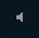
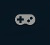

# Option du jeu

")

Le menu d'options d'osu! vous donne l'accès à un large panel d'options. Chaque option sera expliquée en détail sur cette page. Vous aurez à les fouiller si osu! rame sur votre ordinateur ou si certains éléments s'affichent mal.

Cliquez sur le bouton d'options (ou pressez la touche O) pour accéder au panel d'options (screen ci-contre).

Vous pouvez entrer ici l'option de votre choix dans la barre de recherche si vous savez précisément ce que vous recherchez.

## Options

*Redémarrez osu! si quelque chose ne marche pas comme prévu.*

Cliquez sur **Options** ou pressez `O` sur l'écran d'introduction pour accéder aux options:

### Général

#### Connexion

##### Invité

| Nom | Effet |
| :-- | :-- |
| Pseudo | Inscrivez votre pseudo ici |
| Mot de passe | Inscrivez votre mot de passe |
| Se souvenir du pseudo | Se souvenir de votre pseudo osu!. |
| Se souvenir du mot de passe | Se souvenir de votre mot de passe et vous connecte automatiquement. |

#### Langue

| Nom | Effet |
| :-- | :-- |
| Sélection de la langue | Modifie la langue principale du jeu. osu! téléchargera le fichier de langue choisi. La langue par défaut est l'anglais. |
| Métadonnées des maps dans leur langue d'origine | Les noms des musiques des beatmaps (et leurs données affiliées) seront écrits avec les caractères de leur langue originelle si vous cochez cette option. |
| Utiliser la police de caractères Tahoma dans le Chat | Utilisation de l'ancienne police de caractères ([Tahoma](https://fr.wikipedia.org/wiki/Tahoma)) à la place de la police actuelle ([Aller](https://www.daltonmaag.com/about/aller.html)) dans le [Chat](/wiki/Chat_Console). |

### Graphismes

#### Rendu

Un redémarrage sera probablement requis pour appliquer les modifications apportées par ces options.

| Nom | Effet |
| :-- | :-- |
| OpenGL | Cochez cette option si vous: N'avez pas de carte graphique supportant les shaders, Subissez des lags intenses en cours de jeu, Utilisez une carte graphique ne supportant pas DirectX. |
| DirectX (Par défaut) | Utilise les shaders pour améliorer grandement les graphismes et les effets visuels, mais peut ne pas fonctionner sur d'anciennes machines. |

- Limiteur de FPS: (contrôle le nombre d'images maximales par seconde):
  - 60fps (VSync)
  - 60fps (latence lente)
  - 120fps [Par défaut]
  - Illimité (en cours de jeu)
  - Illimité

Note: Pour les possesseurs d'ordinateurs portables, il est recommandé de limiter le nombre de FPS pour prévenir les surchauffes et la consommation excessive de la batterie comme mentionné sur [ce topic](https://osu.ppy.sh/community/forums/topics/82605) (en anglais).

- **Affiche le compteur de FPS**: Affiche un compteur de FPS en bas à droite de l'écran.

#### Résolution de l'écran

Selectionne une résolution:

| Propriété | Taille de la fenêtre | Taille du plein écran |
| :-- | :-- | :-- |
| Standard | 800 x 600 \[Défaut\] | 800 x 600 |
| Standard | 1024 x 768 (Sans bordure) | 1024 x 768 \[Défaut\] |
| Écran large | 1024 x 600 | *Votre taille d'écran* (natif) |

- Mode plein écran (la fenêtre d'osu! va prendre tout l'écran)

#### Options détaillées

| Nom | Effet |
| :-- | :-- |
| Sliders progressifs | Les sliders se déroulent lentement depuis leur point de départ. A utiliser si vous jouez sur une machine relativement lente. |
| Vidéo | Bloque le lancement des vidéos de fond sur toutes les beatmaps. Une désactivation par beatmap est possible dans les [options visuelles](/wiki/Visual_Settings). |
| Storyboards | Bloque le lancement des storyboards sur toutes les beatmaps. Une désactivation par beatmap est possible dans les [options visuelles](/wiki/Visual_Settings). |
| Effets de combo "Combo Bursts" | Autorise l'affichage d'un effet visuel lorsqu'un palier sur le nombre de notes réussies d'affilée est dépassé. |
| Lueur d'arrière plans | Ajoute une lueur qui éclaire la surface du jeu après avoir cliqué sur une note. Ne le désactive pas pendant le Kiai Time. |
| Effets spéciaux | Active des effets graphiques sympathiques durant les parties. |
| Filtre adoucissant | Ajuste les "Effets spéciaux" pour qu'ils soit moins vifs. |
| Format des captures d'écran (format graphique des images). | **PNG (Sans perte):** Taille du fichier importante mais aucune perte de qualité, **JPEG (Plus léger) \[Default\]:** Fichier plus léger mais moins qualitatif. |

#### Menu principal

| Nom | Effet |
| :-- | :-- |
| De la neige au menu principal | De la neige de la forme du mode actuellement sélectionné tombera du ciel dans le menu principal. Créé à l'occasion du Noël 2013 suite à de nombreuses demandes. |
| Trucs et astuces | Le menu principal affichera des conseils sur les façons de tirer le meilleur parti d'osu!. |

### Gameplay

#### Général

| Nom | Effet |
| :-- | :-- |
| Assombrir l'arrière-plan | L'ajuster va forcer le jeu (y compris l'éditeur de Beatmap) à assombrir l'arrière-plan. Mettez-le à 0% si vous faites des Storyboards dans l'onglet Design de l'éditeur. |
| Barre de progression (pour configurer où et comment la barre de prog. va s'afficher) | \[1\] En haut à droite (disque) \[Défaut\], \[2\] En haut à droite (barre), \[3\] En bas à droite \[Similaire à osu!droid\], \[4\] En bas (large) \[Similaire à osu!stream\] |
| Indicateur de performance (configure l'indicateur qui apparaît en bas de l'écran). | **Aucun \[Défaut\]:** Ne montre pas l'indicateur de performance, **Couleur:** Affiche l'historique des valeurs de clics (basé sur les couleur du skin par défaut 300/100/50/Miss), **Erreur de clics:** Montre exactement votre précision sur chaque note. La barre de jugement s'ajuste en fonction de "l'OD" (Overall Difficulty, soit la difficulté générale de la beatmap). Gauche - Centre - Droite = Trop tôt - Parfait - Trop tard |
| Taille de l'indicateur de performance | Règle la taille de l'indicateur de performance. Par défaut : 1.00x. Les tailles peuvent varier entre 0.50x et 2.00x. |
| Touches de jeu toujours affichées | Toujours afficher sur le côté droit de l'écran le touches que vous utilisez pour jouer, même pendant les parties. Utile si vous comptez faire des captures vidéo ou du streaming. |

### Skins

#### Skin

Cliquez sur la barre "Sélectionner un skin" pour accéder a l'interface de sélection de skin

| Nom | Effet |
| :-- | :-- |
| Ignorer les skins intégrés aux beatmaps | Si cette option est cochée, votre skin prendra toujours le dessus pendant les parties. |
| Activer les bruitages du skin choisi | Si cette option n'est pas cochée, les bruitages par défaut d'osu! seront utilisés. |
| Toujours utiliser le skin Taiko (mode Taiko) | Si cette option est cochée, [le skin Taiko de LuigiHann](https://osu.ppy.sh/community/forums/topics/662) sera toujours utilisé durant les parties de Taiko (vous devez l'avoir téléchargé et il doit être dans le dossier Skin).
| Toujours utiliser le curseur du skin choisi | Si cette option est cochée, le jeu ignorera les curseurs intégrés aux beatmaps. |
| Utiliser la disposition et les animations du nouveau format de skin | **Désactivé:** Aucun changement. Les comportements de l'ancien skin. **Activé:** Force le jeu à utiliser des texture en HD. Peut entraîner le remplacement de certains éléments du skin remplacée par le nouveau skin par défaut. |
| Utiliser les couleurs des combos comme couleur des slider balls | Ceci prend effet que si le skin utilisé est compatible |

#### Sélecteur de skins

Les skins permettent la personnalisation de nombreux éléments visuels d'osu!. Pour accéder à ce panel, cliquez sur la barre avec le nom de votre skin actuel dans le menu d'options. Sur ce panel, vous pouvez prévisualiser un skin et en choisir un parmi ceux que vous avez téléchargés.

1. Cette zone sur le côté droit de l'écran liste les skins que vous avez téléchargés et placés dans le sous-dossier Skins d'osu!. Pour changer de skin, cliquez simplement sur l'un d'eux.
2. Au centre, un aperçu du skin sélectionné est affiché. L'intelligence artificielle est programmée pour faire des erreurs afin que vous puissiez voir le plus d'éléments possibles.
3. Cliquer sur "Plus de skins" vous redirigera vers [la catégorie Skins du Forum](https://osu.ppy.sh/community/forums/109), où vous pourrez télécharger plus de skins pour personnaliser le design d'osu! à votre goût.
   1. Pour une liste de skins (en anglais):[Original](https://osu.ppy.sh/community/forums/topics/23820), [Mis à jour](https://osu.ppy.sh/community/forums/topics/180864), [version](https://osu.ppy.sh/community/forums/topics/136163).
4. Cliquer sur "Beatmap aléatoire" va charger une beatmap au hasard parmi votre liste de beatmaps avec le skin sélectionné.
5. Cliquez sur "Back" ou pressez Echap pour retourner à la catégorie Skins du menu d'options.

### Audio

#### Volume

Le contrôleur de volume permet de modifier le volume du jeu.

- Le contrôleur "Général" affecte tous les sons.
- Le contrôleur "Musique" affecte seulement la musique.
- Le contrôleur "Bruitages" affecte seulement les bruitages, comme ceux produits lorsque vous cliquez sur un cercle en jeu.
- Notez que le contrôleur "Général" peut être modifié avec les touches directionnelles Haut et Bas de votre clavier.

| Nom | Effet |
| :-- | :-- |
| Ignorer les bruitages intégrés | Si cette option est activée, les bruitages des skins intégrés aux beatmaps seront ignorés et les bruitages de votre skin seront utilisés à la place. |

#### Ajustement audio

Si, dans toutes les beatmaps que vous jouez, vous entendez des effets sonores qui ne sont pas en rythme, vous devriez ajuster cette valeur. Cliquez et maintenez le bouton, puis faites-le glisser vers la gauche ou vers la droite. Vous pouvez aussi cliquer sur le bouton et le faire bouger avec les touches directionnelles de votre clavier. Continuez à ajuster jusqu'à trouver la position idéale aux conditions de jeu d'osu!. Vous pouvez aussi lancer l'assistant d'ajustement audio pour une précision accrue grâce à la représentation graphique des ticks (voir plus bas).

Contrairement à l'ajustement audio local (spécifique à une beatmap), cet ajustement affectera toutes les beatmaps auxquelles vous jouerez. Vous pouvez toujours ajuster l'audio par beatmap en appuyant sur Plus ou Moins (+/-) en jeu pour augmenter ou diminuer le décalage de 5 millisecondes. Si vous appuyez sur Alt en même temps, le décalage ne sera que d'une milliseconde.

##### Assistant d'ajustement audio

Cliquez sur "Démarrer l'assistant" pour lancer l'assistant en question qui vous permettra de décaler de façon plus précise grâce à la représentation graphique des ticks.

Notez que la musique que vous écouterez lorsque vous lancerez l'assistant sera utilisée.

1. L'assistant affiche votre décalage actuel en millisecondes.
2. Cliquer sur "BPM /2" va ralentir la musique, "BPM x2" va l'accélérer.
3. Ce que vous voyez et entendez sont des ticks. Ils défilent en rythme sur la barre verte au milieu de l'écran.
4. Cliquer sur Back ou appuyer sur Echap va vous faire revenir à l'accueil. Les modifications seront sauvegardées.

### Périphériques

#### Souris

| Nom | Effet |
| :-- | :-- |
| Sensibilité de la souris | Ajuste la sensibilité de votre curseur. Entre x0.40 et x6, par défaut sur 1. |
| Contourner le pilote de la souris | (Ajouté depuis Février 2014) Détecte la position du curseur directement depuis le périphérique, sans aucun post-traitement par le pilote de ce dernier. [Cliquez ici pour plus d'informations](https://osu.ppy.sh/community/forums/topics/187785). A propos du "Polling Rate", reférez vous à cet [article sur howtogeek.com](http://howtogeek.com/182702/mouse-dpi-and-polling-rates-explained-do-they-matter-for-gaming/). |
| Molette de la souris désactivée pendant les parties | La molette de la souris est utilisée pour contrôler le volume. Activez cette option pour désactiver cette molette durant les parties. |
| Boutons de la souris désactivés pendant les parties | Désactive les boutons de la souris pendant les parties. Utile pour les joueurs utilisant leur clavier et leur souris pour jouer, s'ils ont tendance à agripper violemment leur souris. Peut être activée ou désactivée grâce à la touche F10. |
| Visualiser les clics | Affiche une ondulation subtile à chaque clic de souris. L'ondulation n'affecte pas le jeu. |

#### Clavier

##### Configuration d'osu!mania

Cette interface vous permet de modifier les contrôles du mode osu!mania. Par ailleurs, les [touches par défaut](/wiki/Game_Modes/osu!mania) seront paramétrées à la base. **Pour entrer vos contrôles, entrez simplement les lettres de votre choix.**

| Nom | Effet |
| :-- | :-- |
| Liste des clés | Paramètres de 4K à 8K. |
| Column Style \[6K et 8K seulement\] | Normal, Droit, Gauche |
| Défilement de bas en haut (Style DDR) | Déplace la zone de jugement et les clés en bas de l'écran vers le haut de l'écran. Le design des beatmaps et les touches restent comme elles sont. |
| Montre la ligne de jugement | Rend la ligne de jugement nettement plus visible. |

#### Autres

| Nom | Effet |
| :-- | :-- |
| Activer le support des Wiimotes/TataCon. | Activer le support des tambours Taiko pour Wii (TataCon) et des Wiimotes (pas encore fonctionnel). Vérifiez que vous avez bien relié votre Wiimote par Bluetooth avant d'activer cette option. |
| Activer le support des tablettes graphiques. | Activez cette option si vous utilisez une tablette graphique ou un écran tactile et que vos clics ne sont pas correctement gérés. |
| Activer le support des joysticks (osu!mania) | Activez cette option si vous utilisez un joystick ou un contrôleur spécial pour jouer à osu!mania. |

### Edition

#### Général

| Nom | Effet |
| :-- | :-- |
| Vidéos | Activez si vous souhaitez voir les vidéos en fond d'écran sur vos maps pendant que vous mappez. |
| Utiliser le skin original d'osu! | Force l'utilisation du skin par défaut en mode Edition. |
| Désactiver la fonction d'annulation | Désactive l'annulation et le rétablissement d'actions (Ctrl+Z et Ctrl+Y). Utilisez cette option à vos risques et périls. |

### Connexion

#### Notifications et vie privée

| Nom | Effet |
| :-- | :-- |
| Aff. instantanément les nouv. messages du chat | Les nouveaux messages du canal de discussion actuellement ouvert apparaîtront instantanément dans une barre en bas de l'écran si la fenêtre de chat n'est pas déployée. |
| Cacher automatiquement le chat pendant les parties | Si cette option est cochée, le chat se rétractera automatiquement durant les parties. Il apparaîtra tout de même pendant les pauses, l'introduction et la fin de la musique. |
| Afficher une notification si votre nom est mentionné | Un message apparaîtra en bas à droite de l'écran lorsque quelqu'un mentionne votre pseudo dans le chat (même durant une partie). |
| Jouer un son lorsque votre nom est mentionné | Un son retentira si quelqu'un mentionne votre pseudo dans le chat. |
| Partager la ville avec les autres joueurs | Par défaut, les joueurs ne peuvent voir que le pays dans lequel vous résidez. Activer cette option leur permettra également de voir votre ville à travers la commande « !where pseudo » dans le chat. La géolocalisation est basée sur votre adresse IP et est généralement assez précise. |
| Afficher la liste des spectateurs pendant les parties | Une liste de vos spectateurs actuels apparaîtra en haut à gauche de l'écran pendant le jeu. Si cette option est désactivée, vous ne saurez plus si des joueurs vous regardent. |
| Aff. les notifications sans délai pdt les parties. | Si cette option est cochée, les notifications apparaîtront même pendant que vous jouez. Si cette option est décochée, elles apparaîtront uniquement lors de la prochaine pause. |
| Notifier en cas de connexion / déconnexion d'un ami. | Une notification apparaîtra si l'un de vos amis se connecte ou déconnecte. |
| Autoriser toutes les invitations pour jeu en multi. | Décochez cette option pour autoriser uniquement les invitations de vos amis. |

#### Intégration

| Nom | Effet |
| :-- | :-- |
| Intégrer au message perso MSN. | La musique que vous êtes en train d'écouter ou de jouer sera affichée dans votre message perso sur MSN/Windows Live Messenger. |
| Intégrer au statut Yahoo! Messenger. | La musique que vous êtes en train d'écouter ou de jouer sera affichée dans votre statut sur Yahoo! Messenger. |
| Téléchargements osu!direct automatiques | Commence immédiatement le téléchargement d'une map après l'avoir sélectionnée sur osu!direct (supporters uniquement) |

#### Chat

| Nom | Effet |
| :-- | :-- |
| Filtrer les termes offensants | Remplace les termes offensifs par un "*beep*". Si cette option n'est pas sélectionnée, les termes seront visibles. |
| Filtrer les caractères étrangers | Supprime tout caractère ne correspondant pas au standard ASCII (alphabet). Très utile si ces derniers vous occasionnent des lags. |
| Enregistrer automatiquement les messages privés | Activer cette option va sauvegarder tous les messages privés que vous envoyez/recevez sur le chat. Ils seront stockés sous format .txt dans le dossier "Chat". |
| Bloquer les messages privés des non-amis | Si activé, vous ne pourrez recevoir de messages privés que de vos amis. Peut être activé/desactivé en tapant "/nopm" dans la console de chat. |
| Liste d'ignore du chat (liste dont les termes sont séparés par des espaces) | Une liste permettant d'ignorer des personnes indésirables. En ajoutant un @ suivi des lettres c, h et/ou p, vous pourrez les ignorer dans le chat, ne pas recevoir leurs notifications (highlights), ou encore leurs MPs. **Example:** peppy@h BanchoBot (peppy ne pourra pas vous notifier, et les messages de Banchobot ne se trouveront pas dans votre console de chat, mais eux pourront cependant toujours voir vos messages.) |
| Mots à notifications (liste dont les termes sont séparés par des espaces) | Vous serez notifiés quand quelqu'un écrira les mots que vous aurez entrés dans ce champ. Si vous n'en entrez aucun, seul votre pseudo pourra vous notifier (aussi appellé HL, pour highlight). |

### Onglet Maintenance

Cliquez sur l'onglet Maintenance de l'écran d'Options pour accéder aux paramètres de maintenance.

| Nom | Effet |
| :-- | :-- |
| Supprimer toutes les beatmaps non classées | Supprime toutes les beatmaps non classées du dossier Songs. Une demande de confirmation comportant le nombre de beatmaps vous sera envoyé. |
| Forcer les droits d'accès sur les dossiers. | Donne les droits de lecture et d'écriture à osu! dans les dossiers du jeu. Utile pour les utilisateurs de Vista avec le contrôle des comptes utilisateurs (UAC) activé. |
| Marquer toutes les beatmaps comme étant jouées. | Marque toutes les beatmaps comme "jouées", pas recommandé pour les joueurs souhaitant savoir quelles beatmaps ils n'ont pas encore joué. |
| Lancer le logiciel de mise à jour. | Ferme osu! et lance le logiciel externe de mise à jour (anciennement connu sous le nom d'osu!me) pour chercher la version la plus récente du jeu. |
