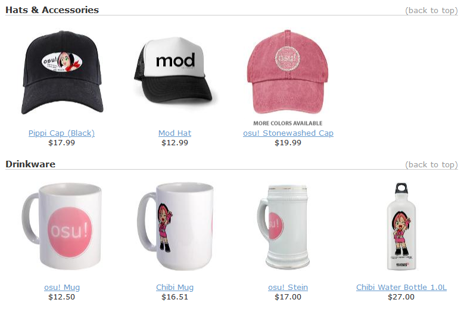
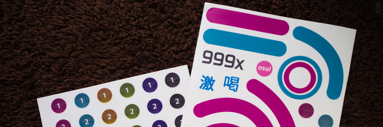
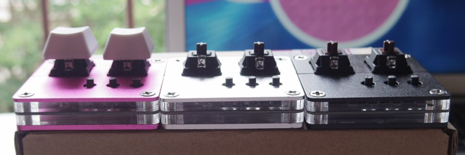

---
tags:
  - store
  - merchandise
  - legacy
---

# Past osu!store items

This article lists various items that were once available at the [osu!store](https://osu.ppy.sh/store/listing) but are no longer in production or for sale.

## osu! goods

The **osu! goods** were a collection of official osu!-branded merchandise sold through the online retailer [CafePress](https://en.wikipedia.org/wiki/CafePress) from 2009 – 2012. All items in this collection were printed and produced by CafePress, with a portion of the sales being used to [support the development of the game](https://osu.ppy.sh/store/listing).

The collection featured a range of products such as:

### Shirts

- [osu! Mod Shirt](https://web.archive.org/web/20120702093250/http://www.cafepress.com/osume.289786473)
- [osu! Lite T-Shirt](https://web.archive.org/web/20120702093250/http://www.cafepress.com/osume.288837174)
- [Cookie Munch T-Shirt](https://web.archive.org/web/20120702093250/http://www.cafepress.com/osume.288838261)
- [osu! Girly T-Shirt](https://web.archive.org/web/20120702093250/http://www.cafepress.com/osume.288831390)
- [Organic Men's Fitted T-Shirt](https://web.archive.org/web/20120702093250/http://www.cafepress.com/osume.439576382)
- [Organic Women's Fitted T-Shirt](https://web.archive.org/web/20120702093250/http://www.cafepress.com/osume.439576381)
- [osu! Hoodie](https://web.archive.org/web/20120702093250/http://www.cafepress.com/osume.295758604)
- [osu! Cookie Jacket](https://web.archive.org/web/20120702093250/http://www.cafepress.com/osume.394638201)

### Hats and accessories

- [Mod Hat](https://web.archive.org/web/20120702093250/http://www.cafepress.com/osume.394644859)
- [Pippi Cap](https://web.archive.org/web/20120702093250/http://www.cafepress.com/osume.394644101)
- [osu! Stonewashed Cap](https://web.archive.org/web/20120702093250/http://www.cafepress.com/osume.394643336)

### Drinkware

- [osu! Mug](https://web.archive.org/web/20120702093250/http://www.cafepress.com/osume.288419419)
- [Chibi Mug](https://web.archive.org/web/20120702093250/http://www.cafepress.com/osume.288434609)
- [osu! Stein](https://web.archive.org/web/20120702093250/http://www.cafepress.com/osume.288717098)
- [Chibi Water Bottle 1.0 L](https://web.archive.org/web/20120702093250/http://www.cafepress.com/osume.394641818)

### Home and office appliances

- [osu! Teddy Bear](https://web.archive.org/web/20120702093250/http://www.cafepress.com/osume.288839612)
- [osu! Clock](https://web.archive.org/web/20120702093250/http://www.cafepress.com/osume.288700999)
- [osu! Postcards 8-Pack](https://web.archive.org/web/20120702093250/http://www.cafepress.com/osume.288843371)

### Buttons and magnets

- [osu! Cookie Pin](https://web.archive.org/web/20120702093250/http://www.cafepress.com/osume.288416528)
- [osu! Cookie Magnet](https://web.archive.org/web/20120702093250/http://www.cafepress.com/osume.288429391)
- [osu! Promo Pin 10-Pack](https://web.archive.org/web/20120702093250/http://www.cafepress.com/osume.288439599)
- [2.25" Magnet 10-Pack](https://web.archive.org/web/20120702093250/http://www.cafepress.com/osume.470631859)
- [Chibi Munch Magnet](https://web.archive.org/web/20120702093250/http://www.cafepress.com/osume.394642312)
- [osu! Cookie Mini Pin](https://web.archive.org/web/20120702093250/http://www.cafepress.com/osume.288416527)
- [Mini Button 10-Pack](https://web.archive.org/web/20120702093250/http://www.cafepress.com/osume.470631599)
- [Mini Button 100-Pack](https://web.archive.org/web/20120702093250/http://www.cafepress.com/osume.510679895)
- [Jumbo osu! Cookie Pin](https://web.archive.org/web/20120702093250/http://www.cafepress.com/osume.288429392)

### Stickers and signs

- [Pippi Sticker](https://web.archive.org/web/20120702093250/http://www.cafepress.com/osume.394644102)
- [osu! Large Stickers 40-Pack](https://web.archive.org/web/20120702093250/http://www.cafepress.com/osume.288841446)

## osu!tablet

*See also: [osu!tablet official thread](https://osu.ppy.sh/community/forums/topics/169139)*\
*For troubleshooting steps related to the product, see: [Store archive § osu!tablet](/wiki/Help_centre/Store/Store_archive#osu-tablet)*

The **osu!tablet** was an official osu!-branded graphic tablet made in partnership with the electronics company [HUION](https://www.huion.com/). It was designed by ::{ flag=MY }:: [flyte](https://osu.ppy.sh/users/3103765) and was released as an affordable alternative for those who wanted to purchase a graphic tablet simply to play osu!.

The product ran for two versions: the original "[osu!tablet v1](https://www.youtube.com/watch?v=27RkPY5lWBw)", which was first sold in 2013, and the updated [osu!tablet v2](/wiki/Guides/Tablet_purchase#osu!store) in 2016 before it was discontinued in 2017 citing [a shift in development focus](https://twitter.com/ppy/status/846190076853870592).

## osu! beatmap blueprints

*For the news post, see: [osu! Beatmap Blueprints Available & Contest Details](https://osu.ppy.sh/home/news/2015-03-20-osu-beatmap-blueprints-available-contest)*

The **osu! beatmap blueprints** were reusable sticker sets featuring various elements of the game such as hitcircles, sliders, approach circles, [hit judgements](/wiki/Gameplay/Judgement/osu!), and the osu! logo itself. The product was sold in 2015 as a means for users to create "life-sized beatmaps in real life".

Alongside its release, a special [Beatmap Blueprint Contest](https://osu.ppy.sh/community/forums/topics/312138?n=1) was briefly held before later abandoned due to the low number of entries.

## osu!keyboard

*For the news post, see: [osu!weekly #12](https://osu.ppy.sh/home/news/2015-05-30-osuweekly-12)*\
*For troubleshooting steps related to the product, see: [Store archive § osu!keyboard](/wiki/Help_centre/Store/Store_archive#osu!keyboard)*

The **osu!keyboard**, also known as the **osu!nono**, was a two-buttoned mechanical keyboard specifically designed for osu! play. Each purchase of the osu!keyboard came along with [a pair of osu!-branded keycaps](http://puu.sh/jnEsK/1153c92c10.png).

The product was first sold in 2015 before it was discontinued in 2017 citing [a shift in development focus](https://twitter.com/ppy/status/846190076853870592).

## osu!go

*For the news post, see: [osu!weekly #48](https://osu.ppy.sh/home/news/2016-02-16-osuweekly-48)*\
*For troubleshooting steps related to the product, see: [Store archive § osu!go](/wiki/Help_centre/Store/Store_archive#osu!go)*

The **osu!go** was a robust USB stick pre-loaded with the osu! client. It boasted a transfer speed that was close to that of SSDs and was designed for players who wanted to play osu! on-the-go (hence its name).

The product was sold in 2016 along with the osu!mug.

## osu!mug

*For the news post, see: [osu!weekly #48](https://osu.ppy.sh/home/news/2016-02-16-osuweekly-48)*

The **osu!mug** was a special edition multi-purpose drinkware adorned by illustrations of [pippi](/wiki/Mascots#pippi). The product was sold in 2016 along with the osu!go.

## Limited edition osu! plushies

*For the news post, see: [Makeship x osu!: Limited Edition Plushies](https://osu.ppy.sh/home/news/2022-12-10-makeship-x-osu-plushies) and [osu! cookie and pippi plushies are back for round 2!](https://osu.ppy.sh/home/news/2024-11-28-another-batch-of-osu-plushies)*

The **limited edition osu! plushies** were a trio of plush dolls each featuring [pippi](/wiki/Mascots#pippi), [Taikonator](/wiki/Mascots#taikonator), and the [osu! cookie](/wiki/Client/Interface/Cookie). The product was sold in early 2023 through pre-orders and was made in partnership with the crowdfunding platform [Makeship](https://www.makeship.com/).

Due to popular demand, a second batch of plushies featuring [pippi](https://www.makeship.com/products/pippi-2-0-plushie) and the [osu!cookie](https://www.makeship.com/products/osu-cookie-2-0-plushie) was later made available for purchase for a limited time in November 2024.
