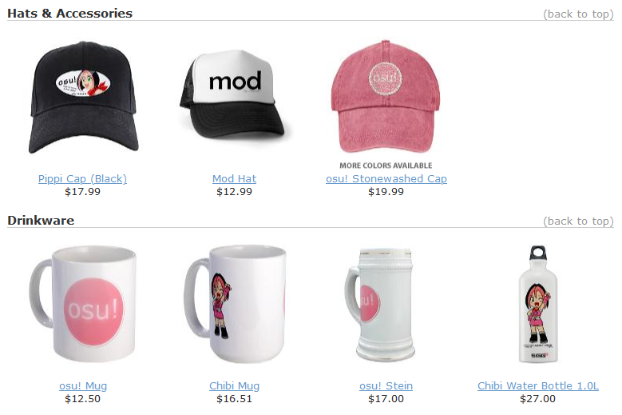
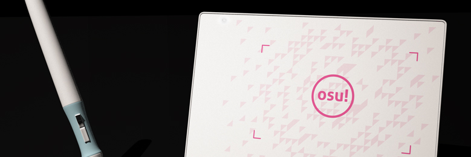
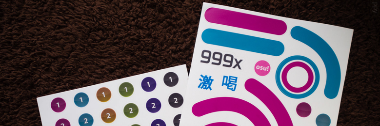
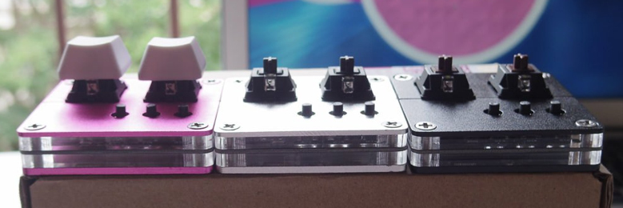
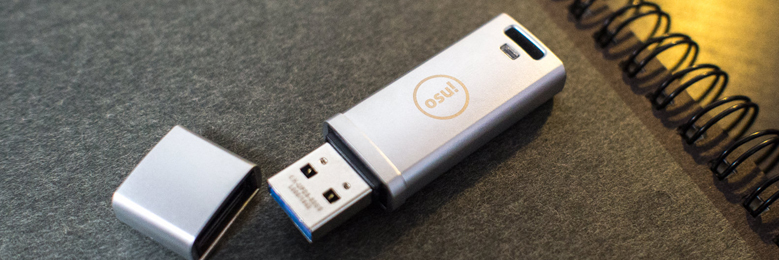
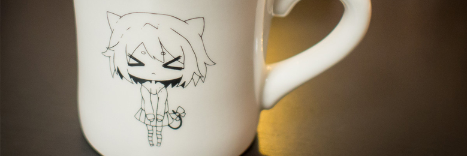
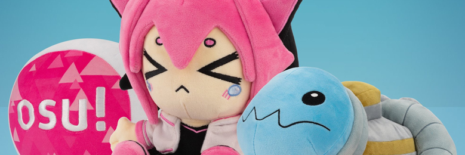

---
tags:
  - store
  - merchandise
  - legacy
  - tienda
  - mercancía
  - legado
---

# Productos anteriores de la osu!store

Este artículo enumera varios productos que estuvieron disponibles en la [osu!store](https://osu.ppy.sh/store/listing) pero que ya no se fabrican ni están a la venta.

## osu! goods

Los **osu! goods** eran una colección de productos oficiales de la marca osu! vendidos a través del minorista en línea [CafePress](https://en.wikipedia.org/wiki/CafePress) de 2009 a 2012. Todos los productos de esta colección fueron impresos y producidos por CafePress, y una parte de las ventas se destinó a [apoyar el desarrollo del juego](https://osu.ppy.sh/store/listing).

La colección presentaba una variedad de productos como:

### Camisetas

- [Camiseta osu! Mod](https://web.archive.org/web/20120702093250/http://www.cafepress.com/osume.289786473)
- [Camiseta osu! Lite](https://web.archive.org/web/20120702093250/http://www.cafepress.com/osume.288837174)
- [Camiseta con la galleta masticada](https://web.archive.org/web/20120702093250/http://www.cafepress.com/osume.288838261)
- [Camiseta de osu! para mujer](https://web.archive.org/web/20120702093250/http://www.cafepress.com/osume.288831390)
- [Camiseta orgánica ajustada para hombre](https://web.archive.org/web/20120702093250/http://www.cafepress.com/osume.439576382)
- [Camiseta orgánica ajustada para mujer](https://web.archive.org/web/20120702093250/http://www.cafepress.com/osume.439576381)
- [Sudadera con capucha de osu!](https://web.archive.org/web/20120702093250/http://www.cafepress.com/osume.295758604)
- [Chaqueta osu! cookie](https://web.archive.org/web/20120702093250/http://www.cafepress.com/osume.394638201)

### Gorras y accesorios

- [Gorra de mod](https://web.archive.org/web/20120702093250/http://www.cafepress.com/osume.394644859)
- [Gorra de pippi](https://web.archive.org/web/20120702093250/http://www.cafepress.com/osume.394644101)
- [Gorra de osu!](https://web.archive.org/web/20120702093250/http://www.cafepress.com/osume.394643336)

### Vasos

- [osu! Mug](https://web.archive.org/web/20120702093250/http://www.cafepress.com/osume.288419419)
- [Taza chibi](https://web.archive.org/web/20120702093250/http://www.cafepress.com/osume.288434609)
- [osu! Stein](https://web.archive.org/web/20120702093250/http://www.cafepress.com/osume.288717098)
- [Botella de agua chibi de 1 L](https://web.archive.org/web/20120702093250/http://www.cafepress.com/osume.394641818)

### Productos para el hogar y la oficina

- [Oso de peluche de osu!](https://web.archive.org/web/20120702093250/http://www.cafepress.com/osume.288839612)
- [Reloj de osu!](https://web.archive.org/web/20120702093250/http://www.cafepress.com/osume.288700999)
- [Paquete de 8 postales de osu!](https://web.archive.org/web/20120702093250/http://www.cafepress.com/osume.288843371)

### Botones e imanes

- [Pin de la osu! cookie](https://web.archive.org/web/20120702093250/http://www.cafepress.com/osume.288416528)
- [Imán de la osu! cookie](https://web.archive.org/web/20120702093250/http://www.cafepress.com/osume.288429391)
- [Promoción de un paquete de 10 pins de osu!](https://web.archive.org/web/20120702093250/http://www.cafepress.com/osume.288439599)
- [Paquete de 10 imanes de 2,25 pulgadas](https://web.archive.org/web/20120702093250/http://www.cafepress.com/osume.470631859)
- [Imán de un chibi mordiendo](https://web.archive.org/web/20120702093250/http://www.cafepress.com/osume.394642312)
- [Pins pequeños de la osu! cookie](https://web.archive.org/web/20120702093250/http://www.cafepress.com/osume.288416527)
- [Paquete de 10 botones pequeños](https://web.archive.org/web/20120702093250/http://www.cafepress.com/osume.470631599)
- [Paquete de 100 botones pequeños](https://web.archive.org/web/20120702093250/http://www.cafepress.com/osume.510679895)
- [Pin grande de la osu! cookie](https://web.archive.org/web/20120702093250/http://www.cafepress.com/osume.288429392)

### Pegatinas y carteles

- [Pegatina de pippi](https://web.archive.org/web/20120702093250/http://www.cafepress.com/osume.394644102)
- [Paquete de 40 pegatinas grandes de osu!](https://web.archive.org/web/20120702093250/http://www.cafepress.com/osume.288841446)

## osu!tablet

*Véase también: [osu!tablet official thread](https://osu.ppy.sh/community/forums/topics/169139)*\
*Para conocer los pasos a seguir para solucionar los problemas relacionados con el producto, véase: [Archivo de la osu!store § osu!tablet](/wiki/Help_centre/Store/Store_archive#osu-tablet)*

La **osu!tablet** era una tableta gráfica oficial de la marca osu! fabricada en colaboración con la empresa de electrónica [HUION](https://www.huion.com/). Fue diseñada por ::{ flag=MY }:: [flyte](https://osu.ppy.sh/users/3103765) y se lanzó como una alternativa económica para aquellos que querían comprar una tableta gráfica simplemente para jugar a osu!.

El producto tuvo dos versiones: la original «[osu!tablet v1](https://www.youtube.com/watch?v=27RkPY5lWBw)», que salió a la venta por primera vez en 2013, y la actualizada [osu!tablet v2](/wiki/Guides/Tablet_purchase#osu!store) en 2016 antes de dejar de comercializarse en 2017 citando [un cambio en el enfoque de desarrollo](https://twitter.com/ppy/status/846190076853870592).

## Planos para crear beatmaps de osu!

*Para leer la noticia, véase: [osu! Beatmap Blueprints Available & Contest Details](https://osu.ppy.sh/home/news/2015-03-20-osu-beatmap-blueprints-available-contest)*

Los **planos para crear beatmaps de osu!** eran un conjunto de pegatinas reutilizables con varios elementos del juego, como círculos, sliders, círculos de aproximación, [juicios](/wiki/Gameplay/Judgement/osu!) y el propio logo de osu!. El producto se vendió en 2015 como un medio para que los usuarios crearan «beatmaps a tamaño real en la vida real».

Al mismo tiempo que su lanzamiento, se organizó el [Beatmap Blueprint Contest](https://osu.ppy.sh/community/forums/topics/312138?n=1), que luego se abandonó debido al escaso número de participantes.

## osu!keyboard

*Para leer la noticia, véase: [osu!weekly #12](https://osu.ppy.sh/home/news/2015-05-30-osuweekly-12)*\
*Para conocer los pasos a seguir para solucionar los problemas relacionados con el producto, véase: [Archivo de la osu!store § osu!keyboard](/wiki/Help_centre/Store/Store_archive#osu!keyboard)*

El **osu!keyboard**, también conocido como **osu!nono**, era un teclado mecánico de dos botones diseñado específicamente para jugar a osu!. Cada compra del osu!keyboard venía acompañada de [un par de teclas de osu!](http://puu.sh/jnEsK/1153c92c10.png).

El producto se vendió por primera vez en 2015 antes de dejar de comercializarse en 2017 citando [un cambio en el enfoque de desarrollo](https://twitter.com/ppy/status/846190076853870592).

## osu!go

*Para leer la noticia, véase: [osu!weekly #48](https://osu.ppy.sh/home/news/2016-02-16-osuweekly-48)*\
*Para conocer los pasos a seguir para solucionar los problemas relacionados con el producto, véase: [Archivo de la osu!store § osu!go](/wiki/Help_centre/Store/Store_archive#osu!go)*

El **osu!go** era una robusta memoria USB precargada con el cliente de osu!. Presumía de una velocidad de transferencia cercana a la de las SSD y se diseñó para los jugadores que querían jugar a osu! en cualquier lugar (de ahí su nombre).

El producto se vendió en 2016 junto con la osu!mug.

## osu!mug

*Para leer la noticia, véase: [osu!weekly #48](https://osu.ppy.sh/home/news/2016-02-16-osuweekly-48)*

La **osu!mug** era un vaso multiusos de edición especial adornado con ilustraciones de [pippi](/wiki/Mascots#pippi). El producto se vendió en 2016 junto con el osu!go.

## Peluches de edición limitada de osu!

*Para leer las noticias, véase: [Makeship x osu!: Limited Edition Plushies](https://osu.ppy.sh/home/news/2022-12-10-makeship-x-osu-plushies) y [osu! cookie and pippi plushies are back for round 2!](https://osu.ppy.sh/home/news/2024-11-28-another-batch-of-osu-plushies)*

Los **peluches de edición limitada de osu!** eran un trío de muñecos de peluche con [pippi](/wiki/Mascots#pippi), [Taikonator](/wiki/Mascots#taikonator) y la [osu! cookie](/wiki/Client/Interface/Cookie). El producto se vendió a principios de 2023 a través de pedidos anticipados y se realizó en colaboración con la plataforma de financiación colectiva [Makeship](https://www.makeship.com/).

Debido a la demanda popular, en noviembre de 2024 se puso a la venta por tiempo limitado un segundo lote de peluches que incluían a [pippi](https://www.makeship.com/products/pippi-2-0-plushie) y a la [osu!cookie](https://www.makeship.com/products/osu-cookie-2-0-plushie).
