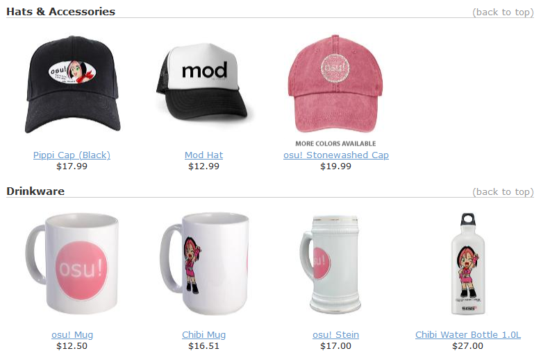
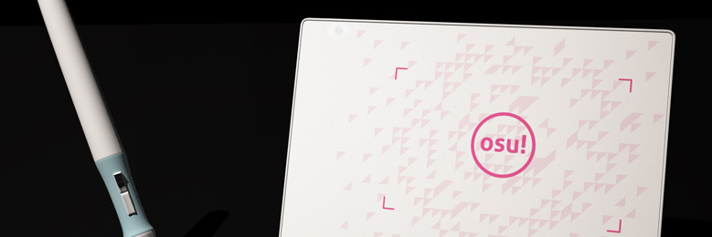
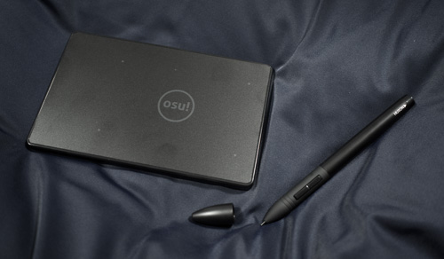
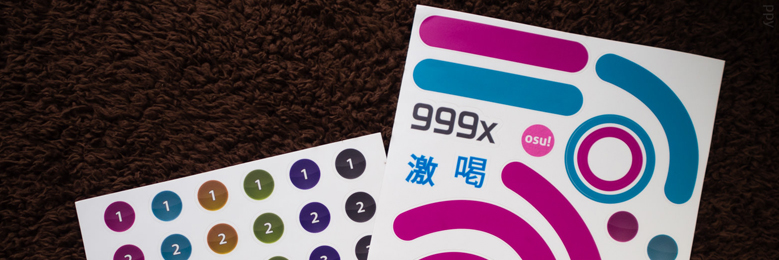
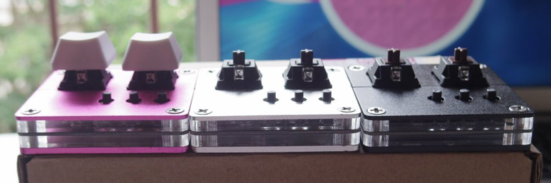
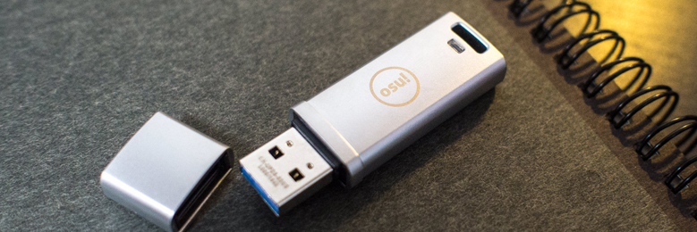
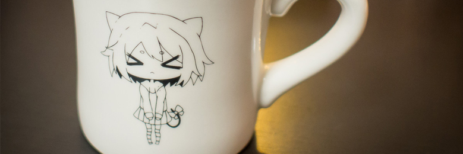
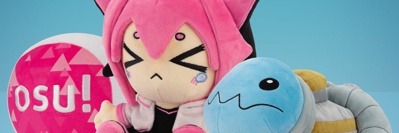

---
tags:
  - store
  - merchandise
  - legacy
---

# ไอเทม osu!store ในอดีต

บทความนี้รวบรวมไอเทมต่าง ๆ ที่เคยมีขายใน [osu!store](https://osu.ppy.sh/store/listing) แต่ไม่ได้ผลิตหรือวางขายแล้ว

## osu! goods

**osu! goods** คือคอลเลกชัน merchandise official แบรนด์ osu! ที่ขายผ่านร้านออนไลน์ [CafePress](https://en.wikipedia.org/wiki/CafePress) ตั้งแต่ปี 2009 - 2012 ไอเทมทั้งหมดในคอลเลกชันนี้ถูกพิมพ์และผลิตโดย CafePress โดยรายได้ส่วนหนึ่งถูกนำไปใช้[สนับสนุนการพัฒนาเกม](https://osu.ppy.sh/store/listing)

คอลเลกชันนี้มีสินค้าหลากหลาย เช่น:

### Shirts

- [osu! Mod Shirt](https://web.archive.org/web/20120702093250/http://www.cafepress.com/osume.289786473)
- [osu! Lite T-Shirt](https://web.archive.org/web/20120702093250/http://www.cafepress.com/osume.288837174)
- [Cookie Munch T-Shirt](https://web.archive.org/web/20120702093250/http://www.cafepress.com/osume.288838261)
- [osu! Girly T-Shirt](https://web.archive.org/web/20120702093250/http://www.cafepress.com/osume.288831390)
- [Organic Men's Fitted T-Shirt](https://web.archive.org/web/20120702093250/http://www.cafepress.com/osume.439576382)
- [Organic Women's Fitted T-Shirt](https://web.archive.org/web/20120702093250/http://www.cafepress.com/osume.439576381)
- [osu! Hoodie](https://web.archive.org/web/20120702093250/http://www.cafepress.com/osume.295758604)
- [osu! Cookie Jacket](https://web.archive.org/web/20120702093250/http://www.cafepress.com/osume.394638201)

### Hats and accessories

- [Mod Hat](https://web.archive.org/web/20120702093250/http://www.cafepress.com/osume.394644859)
- [Pippi Cap](https://web.archive.org/web/20120702093250/http://www.cafepress.com/osume.394644101)
- [osu! Stonewashed Cap](https://web.archive.org/web/20120702093250/http://www.cafepress.com/osume.394643336)

### Drinkware

- [osu! Mug](https://web.archive.org/web/20120702093250/http://www.cafepress.com/osume.288419419)
- [Chibi Mug](https://web.archive.org/web/20120702093250/http://www.cafepress.com/osume.288434609)
- [osu! Stein](https://web.archive.org/web/20120702093250/http://www.cafepress.com/osume.288717098)
- [Chibi Water Bottle 1.0 L](https://web.archive.org/web/20120702093250/http://www.cafepress.com/osume.394641818)

### Home and office appliances

- [osu! Teddy Bear](https://web.archive.org/web/20120702093250/http://www.cafepress.com/osume.288839612)
- [osu! Clock](https://web.archive.org/web/20120702093250/http://www.cafepress.com/osume.288700999)
- [osu! Postcards 8-Pack](https://web.archive.org/web/20120702093250/http://www.cafepress.com/osume.288843371)

### Buttons and magnets

- [osu! Cookie Pin](https://web.archive.org/web/20120702093250/http://www.cafepress.com/osume.288416528)
- [osu! Cookie Magnet](https://web.archive.org/web/20120702093250/http://www.cafepress.com/osume.288429391)
- [osu! Promo Pin 10-Pack](https://web.archive.org/web/20120702093250/http://www.cafepress.com/osume.288439599)
- [2.25" Magnet 10-Pack](https://web.archive.org/web/20120702093250/http://www.cafepress.com/osume.470631859)
- [Chibi Munch Magnet](https://web.archive.org/web/20120702093250/http://www.cafepress.com/osume.394642312)
- [osu! Cookie Mini Pin](https://web.archive.org/web/20120702093250/http://www.cafepress.com/osume.288416527)
- [Mini Button 10-Pack](https://web.archive.org/web/20120702093250/http://www.cafepress.com/osume.470631599)
- [Mini Button 100-Pack](https://web.archive.org/web/20120702093250/http://www.cafepress.com/osume.510679895)
- [Jumbo osu! Cookie Pin](https://web.archive.org/web/20120702093250/http://www.cafepress.com/osume.288429392)

### Stickers and signs

- [Pippi Sticker](https://web.archive.org/web/20120702093250/http://www.cafepress.com/osume.394644102)
- [osu! Large Stickers 40-Pack](https://web.archive.org/web/20120702093250/http://www.cafepress.com/osume.288841446)

## osu!tablet

*ดูเพิ่ม: [osu!tablet official thread](https://osu.ppy.sh/community/forums/topics/169139)*\
*สำหรับขั้นตอนแก้ปัญหาที่เกี่ยวข้องกับผลิตภัณฑ์ ดูที่: [Store archive § osu!tablet](/wiki/Help_centre/Store/Store_archive#osu-tablet)*

**osu!tablet** เป็น graphic tablet official แบรนด์ osu! ที่ทำร่วมกับบริษัทอิเล็กทรอนิกส์ [HUION](https://www.huion.com/) ออกแบบโดย ::{ flag=MY }:: [flyte](https://osu.ppy.sh/users/3103765) และวางขายในฐานะทางเลือกที่ราคาเข้าถึงง่ายสำหรับคนที่อยากซื้อ graphic tablet มาเล่น osu! โดยเฉพาะ

ผลิตภัณฑ์นี้มีสองเวอร์ชัน: "[osu!tablet v1](https://www.youtube.com/watch?v=27RkPY5lWBw)" รุ่นแรกที่เริ่มขายในปี 2013 และ [osu!tablet v2](https://twitter.com/ppy/status/744778218524160000) รุ่นปรับปรุงในปี 2016 ก่อนถูกยกเลิกในปี 2017 โดยอ้างถึง[การเปลี่ยน focus ของการพัฒนา](https://twitter.com/ppy/status/846190076853870592)

เวอร์ชันแรกในปี 2013 มี osu!tablet (สีขาว), pen พร้อม nib, nib สำรอง 3 ชิ้น แต่ต้องใช้ถ่าน AA สำหรับ pen (มีมาให้ แต่จะเพิ่มน้ำหนักให้ pen) เวอร์ชันที่สองในปี 2016 มี osu!tablet (สีดำ), pen พร้อม nib, nib สำรอง 3 ชิ้น แต่ pen ต้องชาร์จผ่าน USB (มีมาให้)

## osu! beatmap blueprints

*สำหรับ news post ดูที่: [osu! Beatmap Blueprints Available & Contest Details](https://osu.ppy.sh/home/news/2015-03-20-osu-beatmap-blueprints-available-contest)*

**osu! beatmap blueprints** เป็น sticker set ที่ใช้ซ้ำได้ โดยมี element ต่าง ๆ ของเกม เช่น hitcircle, slider, approach circle, [hit judgement](/wiki/Gameplay/Judgement/osu!) และโลโก้ osu! เอง สินค้านี้ขายในปี 2015 เพื่อให้ผู้ใช้สร้าง "บีตแมปขนาดเท่าจริงในชีวิตจริง"

พร้อมกับการวางขาย มีการจัด [Beatmap Blueprint Contest](https://osu.ppy.sh/community/forums/topics/312138?n=1) แบบสั้น ๆ ก่อนจะถูกยกเลิกในภายหลังเพราะมีจำนวน entry น้อย

## osu!keyboard

*สำหรับ news post ดูที่: [osu!weekly #12](https://osu.ppy.sh/home/news/2015-05-30-osuweekly-12)*\
*สำหรับขั้นตอนแก้ปัญหาที่เกี่ยวข้องกับผลิตภัณฑ์ ดูที่: [Store archive § osu!keyboard](/wiki/Help_centre/Store/Store_archive#osu!keyboard)*

**osu!keyboard** หรือที่รู้จักกันในชื่อ **osu!nono** เป็น mechanical keyboard สองปุ่มที่ออกแบบมาเพื่อการเล่น osu! โดยเฉพาะ การซื้อ osu!keyboard แต่ละครั้งจะมาพร้อม [keycap แบรนด์ osu! หนึ่งคู่](http://puu.sh/jnEsK/1153c92c10.png)

ผลิตภัณฑ์นี้เริ่มขายครั้งแรกในปี 2015 ก่อนถูกยกเลิกในปี 2017 โดยอ้างถึง[การเปลี่ยน focus ของการพัฒนา](https://twitter.com/ppy/status/846190076853870592)

## osu!go

*สำหรับ news post ดูที่: [osu!weekly #48](https://osu.ppy.sh/home/news/2016-02-16-osuweekly-48)*\
*สำหรับขั้นตอนแก้ปัญหาที่เกี่ยวข้องกับผลิตภัณฑ์ ดูที่: [Store archive § osu!go](/wiki/Help_centre/Store/Store_archive#osu!go)*

**osu!go** เป็น USB stick แข็งแรงที่ preload osu! client ไว้แล้ว มันมี transfer speed ใกล้เคียง SSD และออกแบบมาสำหรับผู้เล่นที่อยากเล่น osu! แบบพกพา (ตามชื่อของมัน)

ผลิตภัณฑ์นี้ขายในปี 2016 พร้อมกับ osu!mug

## osu!mug

*สำหรับ news post ดูที่: [osu!weekly #48](https://osu.ppy.sh/home/news/2016-02-16-osuweekly-48)*

**osu!mug** เป็น drinkware อเนกประสงค์รุ่นพิเศษที่ตกแต่งด้วยภาพประกอบของ [pippi](/wiki/Mascots#pippi) สินค้านี้ขายในปี 2016 พร้อมกับ osu!go

## Limited edition osu! plushies

*สำหรับ news post ดูที่: [Makeship x osu!: Limited Edition Plushies](https://osu.ppy.sh/home/news/2022-12-10-makeship-x-osu-plushies) และ [osu! cookie and pippi plushies are back for round 2!](https://osu.ppy.sh/home/news/2024-11-28-another-batch-of-osu-plushies)*

**limited edition osu! plushies** เป็นตุ๊กตาผ้าสามตัวที่มี [pippi](/wiki/Mascots#pippi), [Taikonator](/wiki/Mascots#taikonator) และ [osu! cookie](/wiki/Client/Interface/Cookie) สินค้านี้ขายในต้นปี 2023 ผ่าน pre-order และทำร่วมกับแพลตฟอร์ม crowdfunding [Makeship](https://www.makeship.com/)

เนื่องจากได้รับความนิยมสูง จึงมี plushies ชุดที่สองที่มี [pippi](https://www.makeship.com/products/pippi-2-0-plushie) และ [osu!cookie](https://www.makeship.com/products/osu-cookie-2-0-plushie) เปิดขายแบบจำกัดเวลาในเดือนพฤศจิกายน 2024 ในภายหลัง
